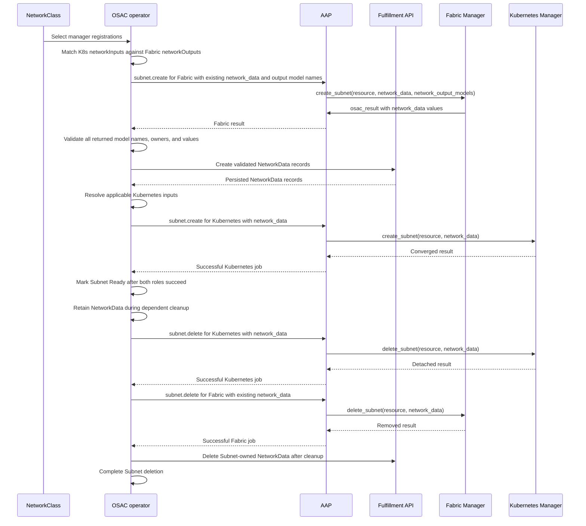

# OSAC Network Manager Integration Contract

| Field | Value |
|-------|-------|
| Author(s) | Dan Manor (dmanor@redhat.com) |
| Jira | https://redhat.atlassian.net/browse/OSAC-1433 |
| PRD | [Network Manager Integration Contract PRD](prd.md) |
| Date | 2026-10-07 |

## Contents

- [1. Overview](#1-overview)
- [2. Goals and Non-Goals](#2-goals-and-non-goals)
- [3. Motivation / Background](#3-motivation--background)
- [4. Design](#4-design)
  - [4.1 Architecture and Manager Roles](#41-architecture-and-manager-roles)
  - [4.2 NetworkDataModel and NetworkManager Registration](#42-networkdatamodel-and-networkmanager-registration)
    - [East-West capability boundary](#east-west-capability-boundary)
  - [4.3 API and Operation Contract](#43-api-and-operation-contract)
    - [Fulfillment-service API operations](#fulfillment-service-api-operations)
    - [NetworkData API and resource-scoped exchange](#networkdata-api-and-resource-scoped-exchange)
    - [Common AAP input](#common-aap-input)
    - [Workload attachment policy input](#workload-attachment-policy-input)
    - [Fixed operation and target table](#fixed-operation-and-target-table)
    - [Operation result envelope](#operation-result-envelope)
  - [4.4 Operation Ordering and NetworkData Lifecycle](#44-operation-ordering-and-networkdata-lifecycle)
  - [4.5 Scalability and Performance](#45-scalability-and-performance)
  - [4.6 Security Considerations](#46-security-considerations)
  - [4.7 Failure Handling and Recovery](#47-failure-handling-and-recovery)
  - [4.8 RBAC and Tenancy](#48-rbac-and-tenancy)
  - [4.9 Extensibility and Future-Proofing](#49-extensibility-and-future-proofing)
  - [4.10 Risks and Mitigations](#410-risks-and-mitigations)
  - [4.11 Drawbacks](#411-drawbacks)
- [5. Interface Changes](#5-interface-changes)
- [6. Alternatives Considered](#6-alternatives-considered)
- [7. Observability and Monitoring](#7-observability-and-monitoring)
- [8. Impact and Compatibility](#8-impact-and-compatibility)
- [Test Plan](testplan.md)

## 1. Overview

A Fabric Manager configures the provider's physical network fabric for OSAC. A Kubernetes Manager connects Kubernetes-hosted workloads to that fabric. NetworkClass selects one implementation for each configured role. NetworkDataModel defines one value's meaning, owner scope, and JSON Schema; NetworkData stores one validated value for a model and owner; NetworkManager registers an implementation and its model inputs or outputs.

This design defines the source-neutral role contract, registration APIs, Ansible Automation Platform (AAP) task interface, and OSAC-owned exchange between managers. In the proposed contract, a manager reports successful work through a structured AAP job artifact named `osac_result`; this is a manager response, not an OSAC API resource. Ansible publishes it with `set_stats`, AAP exposes it under the completed job's `artifacts` field, and the OSAC operator reads it. The result identifies the dispatched operation, resource UID, and observed specification generation, and can carry Fabric-produced NetworkData values. OSAC validates the result before treating the operation as complete and validates and stores Fabric values through the NetworkData API before starting a consumer manager. `dhcp_lease.query` instead returns a `leases` artifact. Section 4.3 defines the exact fields and handling. OSAC coordinates both roles, and one manager does not call another directly. After generic OSAC support exists, onboarding an implementation requires NetworkManager and NetworkDataModel resources plus Ansible content, with no implementation-specific Go code. See the [Network Manager Integration Contract PRD](prd.md) for the outcomes this design supports and the [Unified Networking Design](/enhancements/OSAC-1433-unified-networking/design.md) for the shared tenant-resource semantics.

## 2. Goals and Non-Goals

### 2.1 Goals

- Specify the complete implementation contract for each manager role, including registration, NetworkDataModel definitions, operations, task inputs, results, and retries.
- Let OSAC validate selected manager combinations by matching the Kubernetes Manager's declared network inputs to outputs declared by the Fabric Manager.
- Pass only the required, schema-validated JSON values through a stable OSAC-owned interface with owner scope and lifetime.
- Allow a conforming implementation from any source to use the same tenant networking application programming interface (API) and OSAC dispatch behavior.
- Keep future manager onboarding within registration and Ansible content after generic OSAC contract support is implemented.

### 2.2 Non-Goals

- Change the meaning, fields, or lifecycle of tenant networking resources defined by Unified Networking.
- Require every Fabric Manager to work with every Kubernetes Manager.
- Define product-specific configuration for any backend.
- Let an implementation add resource kinds, operation identifiers, workload targets, or tenant API fields that OSAC does not understand.
- Migrate existing backend resources when a provider changes the manager selected by a NetworkClass.

## 3. Motivation / Background

The current operator discovers manager implementations and dispatches provider work through Ansible Automation Platform (AAP). Its manager parser does not yet implement the proposed implementation reference or generic input/output model declarations. The target contract adds first-class NetworkDataModel, NetworkManager, and NetworkData objects, schema-validated manager results, and an input resolver so selected managers exchange only the declared values they need. Current OSAC code does not yet enforce this generic contract; platform implementation work must add it.

A provider must be able to declare the data each implementation produces or needs, and OSAC must reject invalid object references and incompatible selections before a NetworkClass is persisted. The declarations establish a data boundary; they do not replace conformance to the shared networking behavior. Managers remain separate implementations.

## 4. Design

### 4.1 Architecture and Manager Roles

A Fabric Manager implements the shared networking resource operations and physical workload attachment operations assigned to that role. It configures the provider's network fabric for VirtualNetworks, Subnets, external address pools and attachments, and network address translation gateways. It enforces SecurityGroup policy on physical interfaces, attaches bare-metal and CaaS worker interfaces to Subnets, and handles supported lease lookup targets.

A Kubernetes Manager implements Kubernetes-side Subnet networking and SecurityGroup enforcement for ComputeInstance VM overlays. It does not replace the Fabric Manager and does not implement shared networking-resource operations. Every NetworkClass selects one Fabric Manager. It may select one Kubernetes Manager when the deployment supports workloads that need Kubernetes-side networking.

OSAC coordinates the manager roles and orchestration order. Managers do not call one another or receive one another's credentials.

Every networking resource is infrastructure-agnostic: it retains the same meaning for virtual machines, managed clusters, and bare-metal servers. Every manager role is backend-agnostic: any implementation that fulfills its assigned contract can provide that behavior. The Unified Networking Design defines tenant resource semantics; this design defines the provider integration contract.

### 4.2 NetworkDataModel and NetworkManager Registration

A NetworkDataModel is a cluster-scoped OSAC API object that defines one reusable value exchanged between manager roles. Its Kubernetes `metadata.name` is the canonical name managers reference; the API has no second identifier field.

The name identifies the value's meaning and schema contract, so matching JSON types alone do not make two models interchangeable. For example, a VLAN ID and a VXLAN VNI are different models even when both are represented as integers. `metadata.name` follows the fulfillment-service RFC 1123 DNS-label rule: 1–63 lowercase letters, digits, or hyphens, with an alphanumeric first and last character. OSAC reserves the `osac-` prefix; providers use their own hyphenated prefix, such as `acme-`.

Kubernetes assigns `metadata.uid` to each projected OSAC resource in the networking hub. This is distinct from the resource's fulfillment-service `id`. A NetworkData owner UID is the hub object's `metadata.uid`; the operator resolves and verifies it from the live operation context before submitting a value. Manager declarations reference a model by its stable `metadata.name`. Each NetworkData object is keyed by one model name, owner kind, and owner UID; deleting and recreating an owner cannot inherit values from the previous object lifetime. The model name is the model reference, while the NetworkData object's own ID identifies that data resource. [Kubernetes names and UIDs](https://kubernetes.io/docs/concepts/overview/working-with-objects/names/).

The model's `spec.ownerScope` identifies the single OSAC resource that owns each value. OSAC stores one value for each `(model name, owner kind, owner UID)` key; a JSON array or object represents one value with multiple members. NetworkClass scope means a value is shared by resources using that provider profile; resource scope means each instance of that resource kind owns its own value. OSAC resolves values only from the operation resource and its available networking context. A model whose owner is not present in that context is not applicable to that operation. New resource kinds and operation contexts still require OSAC API and lifecycle support.

NetworkDataModel objects use API version `osac.openshift.io/v1alpha1` and are cluster-scoped. The fulfillment-service API stores the authoritative object in its database; the existing controller path projects it as a CRD in the networking hub for the operator. The OSAC installation supplies the common networking models through the API. Providers create additional model objects before creating managers that reference them.

| Field | Required | Meaning |
|---|---|---|
| metadata.name | Yes | Stable, unique RFC 1123 DNS label (1–63 lowercase letters, digits, or hyphens). Managers use this exact name as the reference. |
| spec.description | Yes | Human-readable meaning and intended use of the value. |
| spec.ownerScope | Yes | One supported data owner: NetworkClass, VirtualNetwork, or Subnet. Adding another owner kind requires OSAC resource-context support. |
| spec.schema | Yes | Inline JSON Schema Draft 2020-12 object for the value. It may describe a JSON scalar, array, or object. The CRD preserves this nested object, including `$schema`; that keyword is data inside `spec.schema`, not a top-level CRD field. The root `$schema` must be `https://json-schema.org/draft/2020-12/schema`; only same-document references and supported standard vocabularies are accepted. |

The NetworkDataModel name, meaning, owner scope, and schema are immutable. Provider-facing actions are Create, Read/List, and Delete; Update and Patch are rejected. A change to meaning, owner scope, or schema requires a new resource name. A NetworkDataModel contains only the reusable contract; each NetworkData object contains one concrete value for that model and one owner UID. The model registry contains no runtime values, credentials, or secrets.

For example, this provider-defined model carries an object with two fields:

~~~yaml
apiVersion: osac.openshift.io/v1alpha1
kind: NetworkDataModel
metadata:
  name: acme-networking-subnet-segment
spec:
  description: Provider segment identity consumed by a Kubernetes Manager.
  ownerScope: Subnet
  schema:
    $schema: https://json-schema.org/draft/2020-12/schema
    type: object
    properties:
      fabric:
        type: string
        minLength: 1
      segment:
        type: integer
        minimum: 1
    required: [fabric, segment]
    additionalProperties: false
~~~

Providers submit each schema inline in `NetworkDataModel.spec.schema`; this is content, not a schema URL or reference to a remote document.

In this example, `additionalProperties: false` makes the JSON value closed: only the `fabric` and `segment` keys declared in `properties` are allowed. A misspelled or undocumented key therefore fails NetworkData value validation. Without this keyword, unmatched properties are unrestricted by default. Each model author chooses whether to close the object; a model that intentionally permits extension fields can omit the keyword or provide a schema for additional fields. It applies to the JSON value validated by the fulfillment service, not to the Kubernetes CRD's fields. See the [Draft 2020-12 specification](https://json-schema.org/draft/2020-12/json-schema-core#section-10.3.2.3).

The NetworkDataModel CRD declares the outer `spec.schema` field as an object and sets `x-kubernetes-preserve-unknown-fields: true` on that object. This focused excerpt is from the CRD's `openAPIV3Schema`:

```yaml
type: object
properties:
  spec:
    type: object
    properties:
      schema:
        type: object
        x-kubernetes-preserve-unknown-fields: true
```

The Kubernetes API server validates the fields the CRD defines, including that `spec.schema` is an object. It preserves arbitrary JSON members within that object instead of pruning keys such as `type`, `properties`, and `$schema`. In the NetworkDataModel example, `$schema` is the nested JSON key `.spec.schema.$schema`; it is not a top-level Kubernetes field. The API server does not interpret those JSON Schema keywords. The fulfillment service separately validates the preserved object as JSON Schema Draft 2020-12. See the [Kubernetes CRD schema documentation](https://kubernetes.io/docs/tasks/extend-kubernetes/custom-resources/custom-resource-definitions/#specifying-a-structural-schema).

| NetworkDataModel name | Owner scope | JSON Schema assertions | Meaning and additional conformance |
|---|---|---|---|
| osac-networking-virtual-network-vxlan-l3-vni | VirtualNetwork | Integer from 1 through 16,777,215. | Identifies the VirtualNetwork Layer 3 VXLAN domain. It may be allocated during the first Subnet operation but remains owned by the VirtualNetwork. [RFC 7348](https://www.rfc-editor.org/rfc/rfc7348.html) |
| osac-networking-subnet-vxlan-l2-vni | Subnet | Integer from 1 through 16,777,215. | Identifies the Subnet's VXLAN Layer 2 segment. [RFC 7348](https://www.rfc-editor.org/rfc/rfc7348.html) |
| osac-networking-subnet-vlan-id | Subnet | Integer from 1 through 4094. | Identifies the Subnet's IEEE 802.1Q VLAN segment. [RFC 2674](https://www.rfc-editor.org/rfc/rfc2674.html) |
| osac-networking-subnet-reserved-ipv4-cidrs | Subnet | JSON array, possibly empty, whose items are strings. | Each value is an IPv4 CIDR reserved by the fabric and contained within the Subnet. Managers validate this resource-relative meaning; an overlay IP address manager excludes every listed range from workload allocation. |

A NetworkData is a cluster-scoped OSAC API object that stores one validated JSON value for one NetworkDataModel and one owner resource. Its immutable `spec.modelName` references the model by `metadata.name`; `spec.owner.kind` and `spec.owner.uid` identify the single live hub object whose lifetime governs the value. `spec.owner.uid` is that object's Kubernetes `metadata.uid`, not its fulfillment-service `id` or `metadata.name`. It is an OSAC-managed runtime record, not a tenant configuration object. The same model may have many NetworkData objects when different owners produce separate values.

The `NetworkData` protobuf object uses the standard resource `id` and `Metadata`, plus a `NetworkDataSpec` containing `model_name`, `owner`, and `value`. `id` identifies this NetworkData resource, not its model. The fulfillment service generates its Kubernetes object name. The unique key is `(model_name, owner.kind, owner.uid)`; a second value for the same key is rejected unless it is an identical retry, in which case the existing object is returned. NetworkData has no independent readiness or status: a successful Create means the value has passed model and owner validation.

The NetworkData CRD preserves the dynamic `value` JSON tree without interpreting it:

```yaml
spec:
  value:
    x-kubernetes-preserve-unknown-fields: true
```

The value schema cannot be embedded in the CRD because it is selected by `spec.modelName` from a separate NetworkDataModel. The fulfillment service validates the value against that registered schema before committing its authoritative database record. Its controller later projects that record as the hub CRD. Kubernetes callers and AAP manager jobs cannot write NetworkData CRDs directly, so they cannot bypass this cross-resource validation. See the [Kubernetes CRD schema documentation](https://kubernetes.io/docs/tasks/extend-kubernetes/custom-resources/custom-resource-definitions/#field-pruning).

The fulfillment-service proto exposes the new object data without generating model-specific fields:

```protobuf
import "google/protobuf/struct.proto";

message NetworkDataModel {
  string id = 1;
  Metadata metadata = 2;
  NetworkDataModelSpec spec = 3;
}

message NetworkDataModelSpec {
  string description = 1;
  string owner_scope = 2;
  google.protobuf.Struct schema = 3;
}

message NetworkManager {
  string id = 1;
  Metadata metadata = 2;
  NetworkManagerSpec spec = 3;
}

message NetworkManagerSpec {
  string manager_name = 1;
  NetworkManagerRole role = 2;
  string implementation_ref = 3;
  repeated string network_outputs = 4;
  repeated string network_inputs = 5;
  optional string description = 6;
}

enum NetworkManagerRole {
  NETWORK_MANAGER_ROLE_UNSPECIFIED = 0;
  NETWORK_MANAGER_ROLE_FABRIC = 1;
  NETWORK_MANAGER_ROLE_KUBERNETES = 2;
}

message NetworkData {
  string id = 1;
  Metadata metadata = 2;
  NetworkDataSpec spec = 3;
}

message NetworkDataSpec {
  string model_name = 1;
  NetworkDataOwner owner = 2;
  google.protobuf.Value value = 3;
}

message NetworkDataOwner {
  string kind = 1;
  string uid = 2;
}
```

The provider APIs expose Create/Get/List/Delete for NetworkDataModel and NetworkManager. The operator-facing NetworkData API exposes the same object shape, but authorization restricts Create and Delete to OSAC lifecycle code. NetworkData has no status field because it has no asynchronous readiness state; API creation itself means schema and owner validation succeeded. `NetworkData.id` is the record's own fulfillment-service identity; `NetworkData.spec.model_name` references the definition by name, not a separate model UUID.

`google.protobuf.Struct` carries the JSON object that defines a schema, including its nested `$schema` key. `google.protobuf.Value` carries one runtime JSON value: null, boolean, number, string, object, or array. In Go, the fulfillment service uses the generic `structpb.Struct` and `structpb.Value` representations; it converts schemas and values to JSON and validates them with a Draft 2020-12 validator rather than generating message types for provider models. Because both types encode JSON numbers as IEEE-754 doubles, schema keywords and values that need exact integers outside the safely representable range must use strings. The standard OSAC VNI and VLAN identifiers are within the exact range. See [Protocol Buffers well-known types](https://protobuf.dev/reference/protobuf/google.protobuf/).

OSAC accepts only the exact Draft 2020-12 `$schema` dialect identifier, validates the submitted schema against a locally bundled meta-schema, and never fetches a schema or meta-schema over the network. All schema reference keywords, including `$ref` and `$dynamicRef`, must resolve to fragments in the same document. Remote and file references, schema-level `$id` values, unsupported vocabularies and owner scopes, malformed schemas, and duplicate NetworkDataModel names are rejected with a fulfillment-service validation error naming the object and invalid field. Because schemas are provider input, OSAC enforces finite schema-size, nesting, and validation-work limits through the fulfillment-service API on Create. The service converts the schema `Struct` to JSON, validates it against the bundled meta-schema, and compiles a Draft 2020-12 validator with network and filesystem resolution disabled. It caches the compiled validator by immutable `NetworkDataModel.id`; managers still reference the model by `metadata.name`. On NetworkData Create, the service converts the `Value` to JSON and runs that validator before committing the authoritative database row; the existing controller path later projects the row as a CRD. JSON Schema validates structure, types, and expressible constraints; it does not prove that a manager configured its backend correctly or that a value satisfies a relationship with other OSAC resources unless that relationship is encoded in a generic OSAC rule. Managers remain responsible for resource-relative semantics, and conformance verifies they honor the model description and shared networking behavior.

A NetworkManager is a cluster-scoped OSAC API object that registers one Fabric or Kubernetes Manager implementation. It uses API version osac.openshift.io/v1alpha1. Its `spec.managerName` is the immutable logical name selected by NetworkClass; `metadata.name` is the separate DNS-safe Kubernetes object name. `spec.implementationRef` identifies the fully qualified Ansible collection role AAP invokes. The logical name and implementation reference are independent.

| Field | Required | Meaning |
|---|---|---|
| metadata.name | Yes | DNS-safe Kubernetes object name, unique across NetworkManager objects. It need not match the logical manager name. |
| spec.managerName | Yes | Immutable logical name referenced by NetworkClass; unique within its role. Existing names may contain underscores. |
| spec.role | Yes | Exactly Fabric or Kubernetes. |
| spec.implementationRef | Yes | Fully qualified Ansible collection role name, such as acme.networking.fabric_manager; the role must be installed in the AAP execution environment. |
| spec.networkOutputs | Fabric only | List, possibly empty, of model names this Fabric Manager can produce. |
| spec.networkInputs | Kubernetes only | List, possibly empty, of model names this Kubernetes Manager requires whenever the model owner is present for one of its assigned operations. |
| spec.description | No | Human-readable description for provider administration. |

A Fabric Manager may populate `networkOutputs` and must leave `networkInputs` empty; a Kubernetes Manager may populate `networkInputs` and must leave `networkOutputs` empty. Omitted and empty repeated fields have the same meaning in the protobuf API. Each listed name must identify an existing NetworkDataModel; duplicate and unknown names are rejected. An empty list means the manager has no declarations for that direction. The fulfillment-service API validates these fields and references before committing the record; Kubernetes schema validation enforces field types and immutability on its CRD projection.

The pair (spec.role, spec.managerName) must be unique across NetworkManager objects. The fulfillment-service API rejects duplicate pairs when creating a manager so each NetworkClass reference resolves to exactly one registration. Kubernetes already requires metadata.name to be unique across all NetworkManager objects.

~~~yaml
apiVersion: osac.openshift.io/v1alpha1
kind: NetworkManager
metadata:
  name: netris-manager
spec:
  managerName: netris
  role: Fabric
  implementationRef: acme.networking.fabric_manager
  description: Fabric integration
  networkOutputs:
    - osac-networking-virtual-network-vxlan-l3-vni
    - osac-networking-subnet-vxlan-l2-vni
    - osac-networking-subnet-reserved-ipv4-cidrs
~~~

~~~yaml
apiVersion: osac.openshift.io/v1alpha1
kind: NetworkManager
metadata:
  name: cudn-evpn
spec:
  managerName: cudn_evpn
  role: Kubernetes
  implementationRef: acme.networking.vm_overlay
  description: Kubernetes VM overlay integration
  networkInputs:
    - osac-networking-virtual-network-vxlan-l3-vni
    - osac-networking-subnet-vxlan-l2-vni
    - osac-networking-subnet-reserved-ipv4-cidrs
~~~

The selection sequence is NetworkDataModel objects, then NetworkManager objects, then NetworkClass. NetworkClass continues to store the existing logical manager names. On NetworkClass Create, the fulfillment service resolves each name against the authoritative NetworkManager records by role and `spec.managerName`, then checks that every NetworkDataModel name in the Kubernetes Manager's inputs appears in the selected Fabric Manager's outputs. IPv4 is the fixed address-family contract for all managers; no registration-time family negotiation is needed. If the fulfillment-service registry records cannot be read, NetworkClass creation fails closed. An invalid or incompatible selection is rejected before NetworkClass is persisted; no tenant networking resource or AAP job can use it.

The comparison uses exact model names, not only JSON shape, because identity, meaning, and owner scope are part of the contract. A matching declaration establishes that the selected implementation advertises required data; it does not prove that either manager preserves the shared VirtualNetwork L3, Subnet L2, attachment, or SecurityGroup behavior. The conformance harness must verify each implementation against every operation and target in the fixed role table before the provider uses it. Registry validation checks declared data compatibility; it cannot infer behavioral conformance from a schema or implementation reference. OSAC does not contain a manager-name compatibility table.

| Fabric Manager | Kubernetes Manager | Result |
|---|---|---|
| netris outputs VXLAN L3 VNI, VXLAN L2 VNI, and reserved IPv4 CIDRs | cudn_evpn requires those same model names | Accepted |
| agentless_net outputs the Subnet VLAN ID | A Kubernetes Manager requires VXLAN VNIs and reserved IPv4 CIDRs | Rejected because the required model names are absent |
| agentless_net outputs the Subnet VLAN ID | A future LocalNet Manager requires the Subnet VLAN ID | Accepted by the data contract; this does not claim LocalNet support in the current CUDN proposal |

A provider-defined model uses the same path. The Fabric Manager lists its model name in `networkOutputs`, and the Kubernetes Manager lists the same NetworkDataModel name in `networkInputs`. The Fabric task returns the JSON value in `osac_result.data.network_data`; OSAC validates and stores it as NetworkData, then passes the matching entry to the consumer. The consumer's Ansible role interprets the documented fields and maps them to its backend API. OSAC does not need a Go type or branch for a provider-defined model; the provider still supplies both managers' Ansible behavior and conformance evidence.

Manager and data model specs are immutable. Providers may Create, Read/List, and Delete NetworkDataModel and NetworkManager objects; OSAC rejects Update and Patch. A manager deletion is blocked while a NetworkClass selects its role and `spec.managerName`. A model deletion is blocked while any NetworkManager or NetworkData references its name. To replace manager configuration, remove dependent tenant resources and the NetworkClass as required by the Unified Networking lifecycle, delete the old NetworkManager, then create the replacement. A change to a model's meaning, owner scope, or JSON Schema requires a new model name.

#### East-West capability boundary

`NetworkManager` has no generic capability field. Its role and
`implementationRef` identify the implementation contract it must fulfill;
`networkInputs` and `networkOutputs` declare the named data it needs or
produces. This avoids treating manager compatibility as a provider-asserted
feature list. `IPv4` is fixed by the shared networking contract, and manager
behavior is verified through conformance rather than inferred from capability
metadata.

`NetworkClass.spec.east_west_capabilities` is a separate, fixed OSAC API
declaration for deployment-level FabricDomain behavior. Fulfillment-service
validates those fields and their required east-west configuration; the
[Unified Networking Design](/enhancements/OSAC-1433-unified-networking/design.md)
and [Multi-Fabric East-West Networking
Design](/enhancements/OSAC-1382-multi-fabric-east-west-networking/design.md)
define their functional effects and errors. East-west declarations do not
participate in manager-pair compatibility.

When NetworkClass is created, fulfillment-service resolves the selected
NetworkManager objects by role and logical name and compares their declared
data models. Each input model name required by the Kubernetes Manager must
also appear in the selected Fabric Manager's output names. A missing model,
wrong role, or unresolved manager rejects NetworkClass before persistence.
Exact model-name matching validates declared data availability; it does not
prove that either implementation honors the shared networking behavior.
Conformance tests validate that behavior. OSAC does not maintain a
manager-name compatibility matrix.

### 4.3 API and Operation Contract

#### Fulfillment-service API operations

The fulfillment service exposes `NetworkDataModels` and `NetworkManagers` with `Create`, `List`, `Get`, and `Delete` operations. Cloud Infrastructure Admins may manage these immutable provider registrations; tenant users cannot read or modify them. The fulfillment-service database is authoritative. Its existing controller path asynchronously projects each object as a cluster-scoped CRD in the networking hub for the operator to watch. OSAC installation bootstraps built-in registrations through the API; providers use the same API for provider-defined objects. `NetworkData` is also exposed by the fulfillment service, but it is a system-managed runtime value rather than a provider registration.

A successful registry API write commits before its hub CRD projection is guaranteed to be visible. If reconciliation cannot yet find a referenced NetworkDataModel or NetworkManager projection, the operator performs no AAP dispatch and retries when the projection becomes available. Runtime NetworkData reads and writes use the authoritative fulfillment-service API, so manager input resolution does not wait for the NetworkData CRD projection.

| Resource | Create | List/Get | Delete | Update/Patch |
|---|---|---|---|---|
| NetworkDataModel | Validate name, scope, description, and schema, then commit the authoritative record. The controller projects its CRD. | Return the stored definition. | Reject while a manager or NetworkData value references it. | Rejected. |
| NetworkManager | Validate role, implementation reference, and model references, then commit the authoritative record. The controller projects its CRD. | Return the stored registration. | Reject while a NetworkClass selects it. | Rejected. |
| NetworkData | OSAC-only: validate owner and value against the named model, then commit the authoritative record. The controller projects its CRD. | Authorized provider read and OSAC resolution return the stored value. | OSAC owner cleanup removes it after dependent manager work succeeds. | Rejected. |

The fulfillment service also checks that manager names are unique within their role and that each NetworkData model/owner key is unique. Kubernetes CRD schemas enforce outer field shape and immutability on backing objects. If an API read or write fails, the service returns an error and does not report the operation as successful.

These APIs manage provider registrations and OSAC-managed runtime data. The existing NetworkClass API selects managers by logical name. The operation and target table below describes AAP backend reconciliation, not fulfillment-service CRUD operations.

#### NetworkData API and resource-scoped exchange

`NetworkData` is the durable runtime record for one model value and one owner. It is a distinct OSAC API object from `NetworkDataModel`: the model defines the value's meaning and schema; NetworkData stores the concrete value produced by a Fabric Manager. NetworkData records are immutable. The fulfillment service enforces uniqueness for `(model_name, owner.kind, owner.uid)`, returns the existing record for an identical retry, and rejects a different value for the same key. This lets one schema describe a composite JSON object when related fields share an owner and lifecycle, while values owned by different resources remain separate records. For example, a model may carry `{fabric, segment}` for one Subnet; separate VirtualNetwork and Subnet values use separate models because their owners and lifetimes differ.

The fulfillment service exposes NetworkData through its internal API. Its database is authoritative, and its existing controller path projects each record as a cluster-scoped `NetworkData` CRD into the networking hub. `Get` and `List` are available to authorized Cloud Infrastructure Admins and OSAC components. Only the operator's authenticated service identity may `Create` values from manager results; only OSAC owner cleanup may `Delete` them. Provider callers cannot create, update, patch, or directly delete runtime values. OSAC resolves values from the fulfillment-service API and passes them in AAP job variables; manager roles do not read or write the CRDs directly. Every operation is scoped to a model and owner UID. For tenant-owned VirtualNetwork and Subnet records, OSAC copies the tenant and owner-reference annotations from the owner; NetworkClass-scoped records are provider-owned.

On `Create`, the fulfillment service verifies that the model exists, the owner kind matches `NetworkDataModel.spec.ownerScope`, the caller is authorized for that owner, and the JSON value validates against the registered schema. Before calling the service, the OSAC operator verifies that the owner UID is the live hub object's `metadata.uid` and validates the complete manager result: every requested output is present exactly once, no undeclared model or owner is returned, and every value matches its schema. The fulfillment service enforces uniqueness for the model/owner key and treats an identical retry as success while rejecting a different value for the same key. Kubernetes validates the NetworkData CRD's outer fields and preserves the arbitrary JSON `value`; the fulfillment service performs the cross-resource schema validation. NetworkDataModel deletion is blocked while either a NetworkManager or a NetworkData object references the model. An owner cleanup removes its NetworkData only after all manager operations that may consume it have succeeded.

For a Fabric create or reconcile operation, OSAC derives `network_output_models` from the selected Fabric Manager's declared `networkOutputs`, the model owner scopes present in the operation context, and values that do not yet exist. This requests every declared output applicable to the operation, including values used by the Fabric Manager itself. The Fabric Manager also receives existing NetworkData values in that context, so retries and delete tasks can reuse the identifiers allocated for the same owners. Delete operations receive existing values for cleanup and do not request new outputs. The Fabric task does not write to Kubernetes or call the fulfillment API. It returns output values in the standard `osac_result` envelope:

```yaml
osac_result:
  operation: subnet.create
  resourceUID: "<subnet-uid>"
  observedGeneration: 3
  data:
    network_data:
      - model_name: osac-networking-virtual-network-vxlan-l3-vni
        owner: {kind: VirtualNetwork, uid: "<virtual-network-uid>"}
        value: 4020
      - model_name: osac-networking-subnet-vxlan-l2-vni
        owner: {kind: Subnet, uid: "<subnet-uid>"}
        value: 40120
      - model_name: osac-networking-subnet-reserved-ipv4-cidrs
        owner: {kind: Subnet, uid: "<subnet-uid>"}
        value: ["192.0.2.0/28", "192.0.2.32/27"]
```

The Fabric Manager may return only model names in `network_output_models` and owner kinds and UIDs available in the operation context. It may return at most one value for each `(model_name, owner.kind, owner.uid)` key. The result's resource UID and generation must match the dispatched Subnet even when an output belongs to its parent VirtualNetwork or NetworkClass. OSAC validates the complete result envelope and every output before writing any value, then creates one NetworkData object per `(model_name, owner)` through the fulfillment service API. It does not start the Kubernetes stage until all requested NetworkData database records have been created successfully. The operator resolves those authoritative values for AAP job inputs; CRD projection is handled by the fulfillment service's existing controller path. If persistence fails partway through, a retry reuses identical records; a changed value for an existing key fails rather than replacing it.

For example, the stored Subnet-scoped value is a first-class API object:

```yaml
apiVersion: osac.openshift.io/v1alpha1
kind: NetworkData
metadata:
  name: "<generated-by-fulfillment-service>"
  annotations:
    osac.openshift.io/tenant: "<tenant-id>"
    osac.openshift.io/owner-reference: "<subnet-uid>"
spec:
  modelName: osac-networking-subnet-vxlan-l2-vni
  owner:
    kind: Subnet
    uid: "<subnet-uid>"
  value: 40120
```

Before dispatching a Kubernetes operation, OSAC resolves the selected manager's `networkInputs` from the operation resource and its available context. A model applies when its owner scope is represented in that context; OSAC requires exactly one valid NetworkData record for each applicable declared input and fails before dispatch if a value is missing or invalid. It passes only those records in `osac_job_vars.network_data`. A Subnet operation may receive NetworkClass-, VirtualNetwork-, and Subnet-owned values. A workload-attachment operation may receive values owned by the attached Subnet, its parent VirtualNetwork, and NetworkClass. For example:

```yaml
osac_job_vars:
  network_data:
    - model_name: osac-networking-virtual-network-vxlan-l3-vni
      resource_kind: VirtualNetwork
      resource_uid: "<virtual-network-uid>"
      value: 4020
    - model_name: osac-networking-subnet-vxlan-l2-vni
      resource_kind: Subnet
      resource_uid: "<subnet-uid>"
      value: 40120
    - model_name: osac-networking-subnet-reserved-ipv4-cidrs
      resource_kind: Subnet
      resource_uid: "<subnet-uid>"
      value: ["192.0.2.0/28", "192.0.2.32/27"]
```

The Kubernetes Manager receives only values whose model names it declared and whose owner scopes apply to the operation. Its Ansible role maps the JSON value to its backend API fields; it cannot write NetworkData or alter the registered value. The Fabric Manager's implementation details and credentials are not passed to the Kubernetes Manager. NetworkData remains available during create retries and consumer cleanup. OSAC deletes each record after its owner is being removed and every dependent manager operation that could consume it has succeeded.

#### Common AAP input

OSAC passes a common job envelope in the `osac_job_vars` variable. The task-specific resource is the OSAC resource being reconciled. The `manager.name` field carries the selected NetworkManager's `spec.managerName`; `metadata.name` identifies the Kubernetes object only. The manager reference selects the collection role, while the operation names one fixed task from the operation table. `manager.role` is normalized by OSAC to exactly `fabric` or `kubernetes`; a collection cannot choose or override it. A Fabric task receives existing `network_data` values owned by resources in its operation context and a `network_output_models` list naming required values not yet stored. A Kubernetes task receives only applicable NetworkData values whose model names appear in its `networkInputs`; this list is empty when no declared owner scope applies to the operation.

```yaml
osac_job_vars:
  operation: subnet.create
  manager:
    name: netris
    role: fabric
    implementationRef: acme.networking.fabric_manager
  network_data: []
  resource:
    apiVersion: osac.openshift.io/v1alpha1
    kind: Subnet
    metadata: {}
    spec: {}
```

For example, when CUDN declares the three model names below as inputs and none of these values has already been stored, the Fabric `subnet.create` task receives those names in `network_output_models`. OSAC computes the list from the registered NetworkDataModels and operation context; the manager registration does not hard-code an operation-to-model mapping. A paired Kubernetes task receives the corresponding `network_data` entries shown above:

```yaml
osac_job_vars:
  operation: subnet.create
  network_output_models:
    - {model_name: osac-networking-virtual-network-vxlan-l3-vni, owner_kind: VirtualNetwork, owner_uid: "<virtual-network-uid>"}
    - {model_name: osac-networking-subnet-vxlan-l2-vni, owner_kind: Subnet, owner_uid: "<subnet-uid>"}
    - {model_name: osac-networking-subnet-reserved-ipv4-cidrs, owner_kind: Subnet, owner_uid: "<subnet-uid>"}
```

The Fabric task returns those values inside `osac_result.data.network_data`; it has no fulfillment-service or Kubernetes write credential. The operator validates the complete result before it calls the fulfillment-service NetworkData API. The Kubernetes task receives validated values in `osac_job_vars.network_data`, not Fabric credentials, and cannot change OSAC resource semantics. A successful task means that the backend has converged to the requested state unless the operation defines another result below.

#### Workload attachment policy input

SecurityGroup is an immutable OSAC rule resource, not a separately provisioned
backend object. When a workload selects one or more groups, OSAC resolves the
attachment's ready Subnet and groups and sends the complete normalized policy
with `workload_attachment.apply`. A group contains ingress and egress rules;
each rule carries `protocol`, optional TCP/UDP `port_from` and `port_to`, and
an IPv4 `ipv4_cidr`. The payload preserves each group's UID and the complete
rule arrays so managers can remove only policy owned by that workload.
Protocols are `TCP`, `UDP`, `ICMP`, and `ALL`. TCP/UDP require a port range
from 1 through 65535 with `port_to >= port_from`; ICMP and ALL omit port
fields. Ingress CIDRs match sources and egress CIDRs match destinations. The
legacy IPv6 field is omitted because the API rejects non-empty IPv6 values.

The `workload_attachment` object is a sibling of `resource` in
`osac_job_vars`. `resource` remains the owning ComputeInstance, Cluster, or
BaremetalInstance, so the standard result UID and generation identify the
workload. Its normalized fields are:

| Field | Meaning |
|-------|---------|
| `subnet` | Resolved Subnet UID, name, IPv4 CIDR, and its parent VirtualNetwork UID and name. |
| `interfaces` | One or more resolved interface descriptors with `type` and `name`. ComputeInstance uses `{type: overlay, name: primary}`; BaremetalInstance uses the selected physical port; Cluster provides each node-set name and its resolved `fabric_interface` as a physical interface. |
| `security_groups` | Entries containing group UID, name, and complete immutable `ingress` and `egress` rules. Rule order does not affect behavior; attached groups' allow rules combine as a union. |

OSAC validates that the Subnet and all selected SecurityGroups are Ready and
belong to the same VirtualNetwork before dispatch. `workload_attachment.apply`
must establish the Subnet connection and install the effective stateful rules
before workload traffic is enabled. Unmatched new traffic is denied and
established reply traffic is allowed. `workload_attachment.delete` removes the
workload-owned policy and detaches the interface (restoring the provisioning
network for physical ports). Both operations are idempotent by workload UID
and interface. Policy failure keeps the workload non-ready and traffic
unavailable; delete failure retains the workload finalizer and retries before
teardown. The task receives the same normalized attachment on apply and delete.

For ComputeInstance, OSAC routes these operations to the Kubernetes Manager.
For BaremetalInstance and Cluster workers, OSAC routes them to the Fabric
Manager. Managers do not call one another; the cluster's resolved physical
interfaces and policy are part of the Fabric Manager input.

```yaml
osac_job_vars:
  operation: workload_attachment.apply
  manager:
    name: cudn_evpn
    role: kubernetes
    implementationRef: acme.networking.vm_overlay
  resource:
    apiVersion: osac.openshift.io/v1alpha1
    kind: ComputeInstance
    metadata: {uid: "<workload UID>", generation: 3}
    spec: {}
  workload_attachment:
    subnet:
      uid: "<subnet UID>"
      name: app-subnet
      ipv4_cidr: 192.0.2.0/24
      virtual_network: {uid: "<VirtualNetwork UID>", name: app-network}
    interfaces:
      - {type: overlay, name: primary}
    security_groups:
      - uid: "<group UID>"
        name: web
        ingress:
          - {protocol: TCP, port_from: 443, port_to: 443, ipv4_cidr: 0.0.0.0/0}
        egress: []
```

#### Fixed operation and target table

| Operation | Assigned role and order | Workload target | Fixed task entry point | Required behavior and result |
|-----------|-------------------------|-----------------|-------------------------|------------------------------|
| `virtual_network.create` / `virtual_network.delete` | Fabric | N/A | `create_virtual_network` / `delete_virtual_network` | Create or remove the isolated VirtualNetwork routing domain and associated allocation. Subnets in the same VirtualNetwork are L3-routable to one another; separate VirtualNetworks remain isolated. |
| `subnet.create` / `subnet.delete` | Create: Fabric, then Kubernetes when configured. Delete: Kubernetes, then Fabric. | N/A | `create_subnet` / `delete_subnet` | Fabric creates/removes one L2 broadcast domain for the Subnet and returns declared values for their NetworkClass, VirtualNetwork, or Subnet owners. OSAC persists validated values as NetworkData. Both managers receive the same applicable values on delete that they used on create. Kubernetes receives only its declared, matched inputs, which may include parent VirtualNetwork and current Subnet values. Workloads in one Subnet share that L2 domain and are L3-routable within their parent VirtualNetwork. OSAC removes Subnet NetworkData after consumer cleanup and Fabric deletion; parent-VirtualNetwork values persist through individual Subnet deletion. The Subnet CIDR belongs to its parent VirtualNetwork and cannot overlap a sibling Subnet. |
| `workload_attachment.apply` / `workload_attachment.delete` | Kubernetes Manager for `compute_instance`; Fabric Manager for `cluster` and `baremetal_instance` | `compute_instance`, `cluster`, `baremetal_instance` | `apply_workload_attachment` / `delete_workload_attachment` | Connect the resolved interface to its Subnet and enforce the complete effective stateful SecurityGroup rules before enabling traffic. On delete, remove policy and detach the interface before workload teardown. For CaaS, Fabric receives each node-set interface. |
| `external_ip_pool.create` / `external_ip_pool.delete` | Fabric | N/A | `create_external_ip_pool` / `delete_external_ip_pool` | Register or remove the provider address pool. The pool has one canonical IPv4 Classless Inter-Domain Routing (CIDR) prefix; OSAC owns API capacity counters. |
| `external_ip.allocate` / `external_ip.release` | Fabric | N/A | `create_external_ip` / `delete_external_ip` | Reserve or release one address from the selected pool. After durable allocation, the task writes the address to `osac.openshift.io/allocated-address`. Repeated allocation for the same resource unique identifier returns the same address. |
| `external_ip_attachment.create` / `external_ip_attachment.delete` | Fabric | `compute_instance`, `cluster`, `baremetal_instance` | `attach_external_ip` / `detach_external_ip` | Add or remove inbound translation for the resource target or configured Cluster endpoint. Remove the attachment before releasing its ExternalIP. |
| `nat_gateway.create` / `nat_gateway.delete` | Fabric | N/A | `create_nat_gateway` / `delete_nat_gateway` | Add or remove outbound source network address translation (SNAT) for the VirtualNetwork using its ExternalIP. It does not provide inbound access. |
| `dhcp_lease.query` | Fabric | `cluster`, `baremetal_instance` | `query_dhcp_lease` | Return the Dynamic Host Configuration Protocol (DHCP) lease matching each requested network attachment as the AAP artifact `leases`. |

Every implementation must provide the complete operation and workload-target combinations assigned to its role. A registration does not select an operation subset. A manager with a different internal model must translate the fixed OSAC operation into that model; it cannot route the operation to the other manager role.

The `leases` artifact contains entries with `subnet_ref`, `interface`, `ip_address`, and `mac_address`. A missing or ambiguous lease match is a task failure. OSAC owns API resource phase, conditions, and provisioning job history.

#### Operation result envelope

Every successful operation except `dhcp_lease.query` returns an AAP artifact named `osac_result` with this fixed shape. The `resourceUID` field identifies the Kubernetes object's unique identifier (UID); `observedGeneration` identifies the version of its specification that the manager processed. The example's empty `network_data` list is used when that operation has no requested output values; a Fabric operation that publishes values returns them in this list.

```yaml
- name: Return operation result to OSAC
  ansible.builtin.set_stats:
    data:
      osac_result:
        operation: subnet.create
        resourceUID: "<resource UID>"
        observedGeneration: 3
        data:
          network_data: []
```

AAP exposes the `osac_result` stat in the completed job's `artifacts` field (`artifacts.osac_result`), which the OSAC operator reads. This artifact is transport, not durable NetworkData storage: manager playbooks do not write NetworkData or call the fulfillment-service API. The operator validates the result and each output, creates the corresponding NetworkData records through the fulfillment-service API, and starts a consuming Kubernetes Manager only after those writes succeed. `operation`, `resourceUID`, and `observedGeneration` must match the operation OSAC dispatched and the resource version it dispatched. `data.network_data` is an optional list of manager-produced values, present only when the operation publishes values declared in `network_output_models`; each entry identifies its model, owner, and JSON value. ExternalIP allocation reports its address through the guarded `osac.openshift.io/allocated-address` annotation, not in `data`. `dhcp_lease.query` returns the `leases` artifact instead of `osac_result`. The envelope has no version field; changes to its fields or result data require a coordinated OSAC and manager contract update. See the [Ansible `set_stats` documentation](https://docs.ansible.com/projects/ansible/latest/collections/ansible/builtin/set_stats_module.html) and [AAP step outputs documentation](https://docs.redhat.com/en/documentation/automation_orchestrator/2026.8/develop-understand_inputs_and_outputs_for_aap_steps).

OSAC validates the artifact name and all required fields before accepting task success. A missing, malformed, stale, or mismatched envelope is a failed operation and cannot advance resource readiness or release capacity. A manager must not report a successful operation with an envelope for a different operation, resource UID, or generation.

Ansible supports role inclusion by a variable role name and the `tasks_from` selector. The fully qualified collection role must be installed in the AAP execution environment. See [Ansible Core include_role documentation](https://docs.ansible.com/projects/ansible-core/2.17/collections/ansible/builtin/include_role_module.html) and [using collection roles by FQCN](https://docs.ansible.com/projects/ansible/latest/collections_guide/collections_using_playbooks.html). [Research: §1]

### 4.4 Operation Ordering and NetworkData Lifecycle

For create, OSAC runs Fabric first. The role returns its `osac_result`, then OSAC validates the complete result and stores each value as a NetworkData resource through the fulfillment service before starting Kubernetes. A Subnet operation may create a value owned by its parent VirtualNetwork or NetworkClass, even when the value is first allocated during Subnet creation. During delete, OSAC passes the same stored values to Kubernetes cleanup, waits for it to succeed, then passes them to Fabric cleanup. OSAC deletes each NetworkData record after its owner enters cleanup and every dependent manager operation that can consume it has succeeded.



#### Workload attachment policy lifecycle

The workload attachment operation carries the complete normalized attachment
to the manager that owns its interface. That manager connects the interface
only after it has installed the selected stateful SecurityGroup rules. During
deletion, OSAC waits for policy removal and interface detachment before the
workload controller removes the VM, server, or cluster attachment.

```mermaid
sequenceDiagram
    participant Workload as Workload provisioning controller
    participant OSAC as OSAC dispatcher
    participant Manager as Interface owner manager
    participant Target as Workload interface

    Workload->>OSAC: Ready Subnet and resolved SecurityGroups
    OSAC->>Manager: workload_attachment.apply(resource, normalized attachment)
    Manager->>Target: Install deny-by-default stateful policy
    Manager->>Target: Connect interface to Subnet
    Manager-->>OSAC: Successful osac_result
    OSAC-->>Workload: Attachment complete; workload may become Ready
    Workload->>OSAC: Delete workload
    OSAC->>Manager: workload_attachment.delete(same attachment)
    Manager->>Target: Remove policy and detach or restore provisioning network
    Manager-->>OSAC: Successful osac_result
    OSAC-->>Workload: Attachment cleanup complete; continue teardown
```

OSAC routes ComputeInstance attachments to the Kubernetes Manager and routes
BaremetalInstance and CaaS worker attachments to the Fabric Manager. A failed
apply leaves the workload non-ready with no workload traffic; a failed delete
retains its finalizer and blocks teardown until retry succeeds.

The current OSAC implementation does not yet provide the proposed NetworkDataModel registrations, schema validator, NetworkData API, or input resolver. Generic lifecycle support must validate Fabric result values against registered schemas before persisting NetworkData or dispatching Kubernetes work, preserve each owner scope through retries, and order consumer cleanup before removing values. Each manager task remains independently implemented and idempotent; OSAC owns matching, validation, persistence, ordering, and retries.

### 4.5 Scalability and Performance

NetworkManager and NetworkDataModel objects contain small declarations and schemas that OSAC reads during API and NetworkClass validation. Schemas are loaded once and reused to validate runtime values. Each NetworkData record contains one small value and owner reference in the existing fulfillment-service database; the existing controller path projects it as a hub CRD, so the design adds no separate database. NetworkData creation adds a fulfillment-service write after the Fabric job, and Subnet provisioning adds an ordered Kubernetes stage when that role is configured, so readiness waits for both manager stages and value persistence to succeed.

### 4.6 Security Considerations

NetworkManager and NetworkDataModel objects contain implementation references, declarations, and schemas, not credentials. Cluster-scoped RBAC limits their administration to Cloud Infrastructure Admins. The fulfillment service serves the provider registry APIs; the operator reads registrations for manager resolution and dispatch. AAP jobs cannot modify registry objects or NetworkData CRDs. A Fabric AAP job returns values only in its result artifact; the OSAC operator submits them through the fulfillment-service API, which checks model, owner, tenant, and schema before committing the database record. The fulfillment service's existing controller path projects the record as a CRD. The Kubernetes Manager receives validated values, not fulfillment-service credentials. Model values are JSON data and must not contain credentials or secrets. Ansible job artifacts and logs must not disclose secrets. Manager tasks act only on the tenant-scoped resources OSAC passes and must preserve existing tenant and owner-reference boundaries.

### 4.7 Failure Handling and Recovery

- **Invalid registry object:** The fulfillment-service API rejects a NetworkDataModel or NetworkManager with a diagnostic naming the object and invalid field or model name. Kubernetes enforces the outer CRD shape and preserves the raw schema object; the fulfillment service validates its JSON Schema semantics.
- **Invalid NetworkClass selection:** Fulfillment-service validation rejects unresolved manager names, role mismatches, unsatisfied Kubernetes inputs before persisting the profile.
- **Registry lookup failure:** NetworkClass creation fails closed if OSAC cannot read the referenced NetworkManager objects. It does not persist the profile or start provider work.
- **Registry projection delay:** A successful registration may not yet be visible in the networking hub. The operator does not dispatch against a partial registry view; it retries reconciliation after the referenced NetworkDataModel and NetworkManager projections arrive.
- **Unmatched manager input:** NetworkClass creation reports the model name required by the Kubernetes Manager but absent from the Fabric Manager outputs; no NetworkClass is persisted and no AAP job can start.
- **Missing collection role or task:** AAP fails with the missing fully qualified collection role or task name. The diagnostic names the registration or task.
- **Missing or malformed Fabric outputs:** A missing result, unknown or duplicate model name, owner outside the operation context, wrong owner scope, or value that fails the registered JSON Schema prevents NetworkData creation and Kubernetes dispatch. OSAC reports the invalid model and owner UID.
- **NetworkData persistence failure:** The operator does not start Kubernetes work until every required value is stored. It retries identical NetworkData creates idempotently; a different value for an existing model/owner key fails and is never written as an update.
- **Kubernetes create failure after Fabric success:** OSAC retains NetworkData records and retries the Kubernetes stage with the same values. The Fabric task receives existing values on retry and must reuse them. The Subnet is not Ready until the Kubernetes stage succeeds.
- **Kubernetes delete failure:** OSAC does not start Fabric deletion or remove NetworkData, so Kubernetes cleanup can retry using the same values.
- **Fabric delete failure after Kubernetes detach:** OSAC retains job state and retries Fabric cleanup. The Kubernetes target is already detached; repeated Fabric deletion of absent state succeeds.
- **Backend timeout or transient error:** The AAP task returns a diagnostic and a non-success result. Existing OSAC job retry/backoff behavior retries the operation. All create/apply and delete tasks are idempotent by resource UID.
- **Workload attachment policy apply failure:** The manager keeps traffic unavailable; OSAC does not report the workload Ready and retries the same normalized attachment. Policy delete failure retains the workload finalizer and blocks teardown until cleanup succeeds.
- **Invalid operation result:** A missing, malformed, stale, or mismatched result fails the operation; OSAC does not advance readiness or release capacity.
- **Invalid ExternalIP or lease result:** Missing allocated-address output or malformed/ambiguous lease output fails the task; OSAC does not report allocation or lease discovery as successful.

### 4.8 RBAC and Tenancy

No tenant-facing RBAC changes are required. Cloud Infrastructure Admins manage NetworkDataModel and NetworkManager registrations and may inspect NetworkData values. Only the OSAC operator identity may create NetworkData from validated manager results; owner cleanup deletes values through the fulfillment service. The operator reads registrations and values for manager resolution and dispatch. AAP jobs have no write access to NetworkData or registry CRDs. Tenant-owned values inherit the owner's tenant annotation, and managers receive only data and resource context authorized for the requested tenant.

### 4.9 Extensibility and Future-Proofing

A new manager is onboarded by creating any provider-defined NetworkDataModel objects first, creating a NetworkManager object that references those models, installing its collection into the AAP execution environment, and selecting the manager in NetworkClass. During reconciliation, its Fabric task returns generic JSON values and OSAC validates and stores them as NetworkData; the selected Kubernetes Manager receives its declared inputs. After OSAC ships the generic CRDs, fulfillment-service APIs, fulfillment-service API validation, JSON Schema validator, owner-scope resolver, and manager contract, adding a model or manager requires provider objects and Ansible content only; it does not require manager-specific Go changes. Adding an OSAC resource kind, manager role, operation, or workload target requires platform support. A model name, meaning, scope, and schema remain a provider-level contract and do not require a new OSAC manager integration.

### 4.10 Risks and Mitigations

- **Matching declarations may not preserve the shared network and policy semantics.** Treat input/output matching as necessary but not sufficient; require each manager and selected network path to pass conformance for VirtualNetwork L3 routing, Subnet L2 broadcast behavior, and workload attachment policy.
- **The generic protobuf `Value` number representation cannot preserve every integer.** Restrict numeric schema values to the exactly representable range and require providers to model larger integer identifiers as strings; current OSAC VNI and VLAN values fit that range.
- **Policy installation failure could expose a workload without its requested rules.** Require deny-by-default behavior until policy is installed, keep the workload non-ready on failure, and retain the deletion finalizer until policy cleanup and detachment succeed.
- **A manager may receive rules for a different tenant or attachment.** OSAC validates tenant ownership and the Subnet/SecurityGroup relationship before dispatch; the task is scoped to the workload UID and interface and receives no cross-tenant lookup authority.
- **The normalized operation may grow as OSAC adds rule types or attachment targets.** Treat new rule fields and targets as contract changes and require both OSAC and manager conformance updates before dispatching them.

### 4.11 Drawbacks

Each manager must implement OSAC's complete role-specific operation set and
match its SecurityGroup semantics, which increases provider integration and
conformance work. Workload readiness and teardown also depend on manager
availability while an attachment is applied or removed. The fixed normalized
rule model does not expose backend-specific ACL features to tenants. These
costs keep the tenant API consistent and allow providers to replace manager
implementations without changing workload attachment behavior.

## 5. Interface Changes

### IC-1: Immutable manager and model registry APIs

**Requirements:** FR-1, FR-2, FR-3, FR-5, FR-6

OSAC adds cluster-scoped NetworkDataModel and NetworkManager registration objects and a system-managed NetworkData runtime object. Model schemas and scopes are validated when NetworkDataModel objects are created; manager role declarations and references to existing models are validated when NetworkManager objects are created. Provider-facing operations for registrations are Create, Read/List, and Delete only; Update and Patch are rejected. Providers may inspect NetworkData but cannot create, modify, or delete it directly. Deletes are blocked while dependents reference the object. Section 4.2 defines the object fields, API validation rules, examples, and dependency order.

### IC-2: Generic AAP task invocation

**Requirements:** FR-1, FR-2, FR-3

AAP playbooks resolve the role from the selected NetworkManager object's fully qualified implementation reference and pass the fixed operation envelope in Section 4.3. Each manager collection provides the complete task set for its role.

### IC-3: Network data matching and fixed role dispatch

**Requirements:** FR-2, FR-3, FR-4, FR-6

NetworkClass creation requires a Fabric Manager and validates that its declared outputs cover every input declared by a selected Kubernetes Manager. An invalid selection is rejected before NetworkClass persistence with a diagnostic naming unresolved references or unsatisfied model names. OSAC routes each operation only to its contract-assigned role.

### IC-4: Operation results and retry behavior

**Requirements:** FR-2

Manager tasks follow the operation, target, artifact, idempotency, and error rules in Section 4.3 and Section 4.7, including ExternalIP allocation and DHCP lease results.

### IC-5: Resource-scoped Fabric-to-Kubernetes data exchange

**Requirements:** FR-1, FR-2, FR-3, FR-4

The Fabric Manager returns JSON values for declared models and registered owner resources in its AAP result. OSAC validates each value against its registered model schema and owner scope, stores it as NetworkData, then passes only applicable Kubernetes Manager inputs on dependent operations. Section 4.3 defines the result and AAP schemas; Section 4.4 defines NetworkData lifetime and ordering.

### IC-6: Workload attachment and SecurityGroup enforcement

**Requirements:** FR-2, FR-3

OSAC sends the resolved workload attachment and complete SecurityGroup rules to the manager that owns its interface. The Kubernetes Manager handles ComputeInstance overlays; the Fabric Manager handles BaremetalInstance and CaaS worker interfaces. Apply and delete ordering, payload fields, stateful rule semantics, and failure behavior are specified in Sections 4.3 and 4.4.

### IC-7: Provider-installed network data model registry

**Requirements:** FR-5, FR-6

Providers register stable model names, meanings, supported owner scopes, and JSON Schemas as NetworkDataModel objects. OSAC validates registry entries and runtime values through the generic model mechanism, independent of manager names or backend implementation. A provider-defined model may use any JSON value shape supported by its schema and existing OSAC resource context.

## 6. Alternatives Considered

### Fetch the schema from a URL

A URL keeps the NetworkDataModel small but makes schema validation and value validation depend on an external service. Fetching a provider-controlled URL would also give an OSAC component a path to cluster-internal or otherwise restricted endpoints, and remote content could change without changing the immutable registration. OSAC therefore accepts schema content inline and performs no network or filesystem resolution.

### Store the model schema in a separate ConfigMap

A ConfigMap reference avoids outbound URL fetching, but splits one immutable model definition across two objects and introduces another lookup, permission, and lifecycle dependency. Inline schema content keeps the name, meaning, scope, and validation rules together in the NetworkDataModel that OSAC validates.

### Keep runtime values in owner-scoped ConfigMaps

An owner-scoped ConfigMap can hold several values in one JSON document, but managers would need write access to a Kubernetes object and OSAC would have to parse, validate, and manage that untyped document separately from the fulfillment API. First-class NetworkData objects let the fulfillment service validate each model/owner/value tuple, enforce uniqueness and immutable values, and provide one consistent read path to the operator. A manager therefore returns values in AAP results and never writes Kubernetes objects directly.

### Keep a hard-coded manager-pair table in Go

A central pair table gives OSAC direct control over every combination, but requires a Go change whenever a provider adds a manager or a new pairing. Matching input and output model names from provider-registered NetworkDataModels lets the generic validator assess new implementations without a vendor-specific pair table.

### Let managers call each other directly

Direct calls can pass segment data without OSAC persistence. They couple managers to one another's APIs and credentials, bypass OSAC job tracking, and make retries and partial failure depend on vendor-specific coordination. OSAC-owned sequencing preserves separate manager implementations and one audited handoff.

### Keep the manager jobs independent

Independent jobs cannot guarantee that a Kubernetes Manager receives values published by Fabric, and they can report partial readiness. The ordered create and delete stages ensure NetworkData is persisted before consumption and retained through retries and cleanup.

### Derive the implementation from the logical manager name

Name-derived collection roles match the current built-in role convention. An independently maintained implementation would need to extend or replace the OSAC collection. An explicit fully qualified role reference keeps the selection source-neutral while operation names and payloads remain OSAC-defined.

### Pass an opaque vendor-specific artifact

An opaque vendor map would let each Fabric Manager return its own schema, but the Kubernetes Manager and OSAC could not validate the data before use. Registered model names, JSON Schemas, and owner scopes let providers extend the data vocabulary while keeping validation generic and backend-only identifiers inside the Fabric Manager.

## 7. Observability and Monitoring

No new metrics are required. Existing NetworkClass state/message, resource conditions, events, AAP job history, and reconciliation logs report registry validation, profile validation, NetworkData validation and persistence, operation, and backend errors. Diagnostics identify the NetworkManager, NetworkDataModel, or NetworkData object, manager role and logical name, operation stage, model name, owner resource UID, and schema or scope failure. Logs do not include credential values.

## 8. Impact and Compatibility

This is the target contract; the current operator and AAP implementation do not yet enforce all of it. Generic OSAC implementation work adds the NetworkDataModel, NetworkManager, and NetworkData CRDs; fulfillment-service APIs; write and read validation; read-only registry resolution for NetworkClass creation; dependency-safe deletion; JSON Schema validation; owner-scope resolution; AAP result parsing; NetworkData publication and input resolution; generic collection-role invocation; and value-lifetime handling. Existing ConfigMap registrations must be migrated to equivalent NetworkManager objects before ConfigMap discovery is removed. Once this generic support ships, a provider can add models and conforming managers through registry objects plus Ansible content; no manager-specific Go changes are required.

During rollout, install the NetworkDataModel, NetworkManager, and NetworkData CRDs and built-in model objects; convert existing model and manager ConfigMaps to their API-object forms; and verify each NetworkClass passes preflight validation before disabling ConfigMap discovery. Existing flat Subnet output must migrate to schema-validated NetworkData records. The manager contract adds no tenant-facing networking configuration fields. An unmatched required input or invalid runtime value prevents dependent dispatch with a diagnostic.

Changing manager names in NetworkClass does not automatically migrate backend state for existing resources. Providers must follow an explicit migration or resource replacement procedure before switching manager assignments. This contract guarantees common API behavior for newly reconciled resources, not transparent state transfer between different backends.

---

## Provenance

Authored: draft @ design 0.11.3 - 2bd6607, workspace main @ 1f3b63b82 (52 behind origin/main)
Final: revise @ design 0.11.3 - 2bd6607, workspace main @ 1f3b63b82 (99 behind origin/main, dirty)

> Context changed between draft and revise.

<!-- ai-workflow-provenance:{"schema_version":1,"provenance_kind":"session","workflow":"design","workflow_version":"0.11.3","ai_workflows":"2bd6607","source_repo":"1f3b63b82 (dirty)","source_repo_branch":"main","commits_behind_main":99,"commits_ahead_main":0,"main_ref":"main","phases":["draft","revise","revise","revise","revise","revise","revise","revise","revise","revise","revise","revise","revise","revise","revise","revise","revise","revise","revise","revise","revise","revise","revise","revise","revise","revise","revise","revise","revise","revise","revise","revise","revise","revise","revise","revise","revise","revise","revise","revise","revise","revise","revise","revise","revise"],"authoring_modes":["skill"],"context_changed":true,"origin_untracked":false} -->
