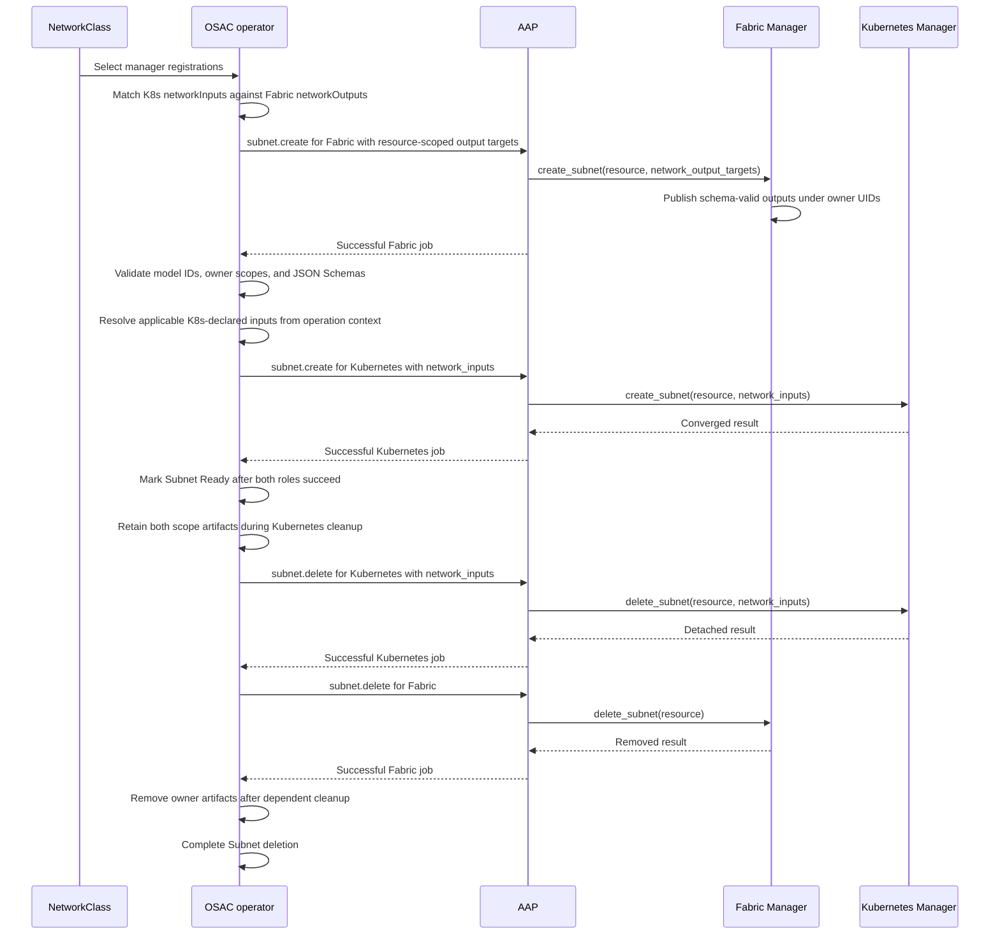

# OSAC Network Manager Integration Contract

| Field | Value |
|-------|-------|
| Author(s) | Dan Manor (dmanor@redhat.com) |
| Jira | https://redhat.atlassian.net/browse/OSAC-1433 |
| PRD | [Network Manager Integration Contract PRD](prd.md) |
| Date | 2026-10-07 |

## Contents

- [1. Overview](#1-overview)
- [2. Goals and Non-Goals](#2-goals-and-non-goals)
- [3. Motivation / Background](#3-motivation--background)
- [4. Design](#4-design)
  - [4.1 Architecture and Manager Roles](#41-architecture-and-manager-roles)
  - [4.2 Network Data Model Catalog and Manager Registration](#42-network-data-model-catalog-and-manager-registration)
  - [4.3 API and Operation Contract](#43-api-and-operation-contract)
    - [Resource-scoped network outputs and inputs](#resource-scoped-network-outputs-and-inputs)
    - [Common AAP input](#common-aap-input)
    - [Workload attachment policy input](#workload-attachment-policy-input)
    - [Fixed operation and target table](#fixed-operation-and-target-table)
    - [Operation result envelope](#operation-result-envelope)
  - [4.4 Subnet Orchestration and Network Data Lifecycle](#44-subnet-orchestration-and-network-data-lifecycle)
  - [4.5 Scalability and Performance](#45-scalability-and-performance)
  - [4.6 Security Considerations](#46-security-considerations)
  - [4.7 Failure Handling and Recovery](#47-failure-handling-and-recovery)
  - [4.8 RBAC and Tenancy](#48-rbac-and-tenancy)
  - [4.9 Extensibility and Future-Proofing](#49-extensibility-and-future-proofing)
  - [4.10 Risks and Mitigations](#410-risks-and-mitigations)
  - [4.11 Drawbacks](#411-drawbacks)
- [5. Interface Changes](#5-interface-changes)
- [6. Alternatives Considered](#6-alternatives-considered)
- [7. Observability and Monitoring](#7-observability-and-monitoring)
- [8. Impact and Compatibility](#8-impact-and-compatibility)
- [Test Plan](testplan.md)

## 1. Overview

A **Fabric Manager** is the provider-selected implementation that configures the provider's physical network fabric for OSAC. A **Kubernetes Manager** is the provider-selected implementation that connects Kubernetes-hosted workloads to that fabric. A **NetworkClass** is the provider-managed OSAC resource that selects one manager for each configured role. A **manager registration** is the role-labelled Kubernetes ConfigMap through which OSAC discovers an implementation. A **network data model** gives a stable identity, meaning, owner scope, and machine-readable schema to a value one manager produces and another may consume. Fabric Managers publish model values and Kubernetes Managers declare the model values they need. Every networking resource is infrastructure-agnostic: it keeps the same meaning for virtual machine (VM), managed-cluster, and bare-metal workloads. Every manager role is backend-agnostic: any implementation that fulfills this contract can provide its assigned behavior. The [Unified Networking Design](../OSAC-1433-unified-networking/design.md) defines the shared resource semantics.

This design defines source-neutral manager registration, the network data model catalog, the Ansible Automation Platform (AAP) task interface, and the OSAC-owned exchange between managers. A Fabric Manager publishes only the declared model values needed by a selected Kubernetes Manager; OSAC validates schemas and owner scopes before passing matching values to the consumer. OSAC coordinates both roles, and one manager does not call another directly. Once OSAC implements the generic catalog and manager contract, onboarding another conforming implementation requires model/manager registrations and Ansible content, with no implementation-specific Go code. See the [PRD](prd.md) for goals and user outcomes.

## 2. Goals and Non-Goals

### 2.1 Goals

- Specify the complete implementation contract for each manager role, including registration, the network data model catalog, operations, task inputs, results, and retries.
- Let OSAC validate selected manager combinations by matching the Kubernetes Manager's declared network inputs to outputs declared by the Fabric Manager.
- Pass only the required, schema-validated JSON values through a stable OSAC-owned interface with owner scope and lifetime.
- Allow a conforming implementation from any source to use the same tenant networking application programming interface (API) and OSAC dispatch behavior.
- Keep future manager onboarding within registration and Ansible content after generic OSAC contract support is implemented.

### 2.2 Non-Goals

- Change the meaning, fields, or lifecycle of tenant networking resources defined by Unified Networking.
- Require every Fabric Manager to work with every Kubernetes Manager.
- Define product-specific configuration for any backend.
- Let an implementation add resource kinds, operation identifiers, workload targets, or tenant API fields that OSAC does not understand.
- Migrate existing backend resources when a provider changes the manager selected by a NetworkClass.

## 3. Motivation / Background

The operator discovers managers from Kubernetes ConfigMaps and dispatches provider work through Ansible Automation Platform (AAP). The current manager registration parser does not implement the proposed `implementationRef`, `networkOutputs`, or `networkInputs` declarations. The target contract introduces a provider-installed model catalog, schema-validated owner-scoped output artifacts, and an input resolver so selected managers can share only the network values required by their integration. Current OSAC code does not yet enforce that generic contract; the implementation work must add it. [Codebase: osac-operator/pkg/networkmanager/types.go; osac-operator/pkg/dispatcher/dispatch.go; osac-operator/internal/controller/subnet_controller.go]

A provider must be able to declare the network data each implementation produces or needs, and OSAC must reject a selected combination when a required input is unavailable. The declarations establish a data boundary; they do not replace conformance to the shared networking behavior. Managers remain separate implementations. [User]

## 4. Design

### 4.1 Architecture and Manager Roles

A Fabric Manager implements the shared networking resource operations and physical workload attachment operations assigned to that role. It configures the provider's network fabric for VirtualNetworks, Subnets, external address pools and attachments, and network address translation (NAT) gateways. It enforces SecurityGroup policy on physical interfaces, attaches bare-metal and CaaS worker interfaces to Subnets, and handles the supported lease lookup targets.

A Kubernetes Manager implements Kubernetes-side Subnet networking and SecurityGroup enforcement for ComputeInstance VM overlays. It does not replace the Fabric Manager and does not implement the shared networking-resource operations. A NetworkClass always selects one Fabric Manager. It may select one Kubernetes Manager when the deployment supports workloads that need Kubernetes-side networking.

The OSAC operator resolves the registrations selected by NetworkClass, validates their required fields and declared network input/output matching, dispatches each operation to its assigned role through Ansible Automation Platform (AAP), and records readiness and job state. Managers remain separate implementations: one manager does not call another or receive its credentials. OSAC owns the integration boundary and orchestration order.

Every networking resource is infrastructure-agnostic: it retains the same meaning for virtual machines, managed clusters, and bare-metal servers. Every manager role is backend-agnostic: any implementation that fulfills its assigned contract can provide that behavior. The [Unified Networking Design](../OSAC-1433-unified-networking/design.md) defines tenant resource semantics; this design defines the provider integration contract.

### 4.2 Network Data Model Catalog and Manager Registration

A **network data model** defines one reusable value exchanged between manager roles. Each model has a stable `id`, a human-readable description of its meaning, one `ownerScope`, and a JSON Schema that describes valid values. The model ID identifies both the data's meaning and its schema contract; matching JSON types alone do not make two models interchangeable. For example, a VLAN ID and a VXLAN VNI are different models even when both are represented as integers.

The `ownerScope` identifies the single OSAC resource that owns each value. OSAC stores one value for each model ID and owner UID; a JSON array or object represents a value with multiple members. `NetworkClass` scope means a value is shared by resources using that provider profile; resource scope means each instance of that resource kind owns its own value. OSAC resolves values only from the operation resource and its available networking context. A model whose owner is not present in that context is not applicable to that operation. New resource kinds and operation contexts still require OSAC API and lifecycle support.

OSAC reads a **network data model catalog** from provider-installed ConfigMaps in the operator namespace. Each ConfigMap registers one model with the `osac.openshift.io/network-data-model: "true"` label and these keys. The operator watches catalog changes, reloads definitions, and revalidates affected manager registrations and NetworkClasses before dispatch:

| Key | Required | Meaning |
|---|---|---|
| `id` | Yes | Stable, unique within the OSAC installation's network data model catalog, lowercase, dot-separated model ID. Use a provider-controlled namespace; `osac.` is reserved for models shipped by OSAC. |
| `description` | Yes | Human-readable meaning and intended use of the value. |
| `ownerScope` | Yes | One currently supported data owner: `NetworkClass`, `VirtualNetwork`, or `Subnet`. Adding another owner kind requires OSAC resource-context support. |
| `schema.json` | Yes | JSON Schema Draft 2020-12 for the JSON value. Local schema references may be used; remote references and unknown schema vocabularies are rejected. |

The model identity, meaning, owner scope, and schema are immutable once published. A change to meaning, scope, or incompatible value shape uses a new ID. Manager registrations do not add a `contractVersion` field. A schema may describe any JSON value: null, boolean, number, string, array, or object. Data exchanged through this interface must be JSON-serializable and fit the existing ConfigMap and AAP payload limits; binary data and credentials use their existing separate channels.

For example, this provider-defined model carries an object with two fields. It requires no OSAC-specific Go type or manager-name entry:

```yaml
apiVersion: v1
kind: ConfigMap
metadata:
  name: network-data-model-acme-subnet-segment
  namespace: osac
  labels:
    osac.openshift.io/network-data-model: "true"
data:
  id: acme.networking.subnet.segment
  description: Provider segment identity consumed by a Kubernetes Manager.
  ownerScope: Subnet
  schema.json: |
    {
      "$schema": "https://json-schema.org/draft/2020-12/schema",
      "type": "object",
      "properties": {
        "fabric": {"type": "string", "minLength": 1},
        "segment": {"type": "integer", "minimum": 1}
      },
      "required": ["fabric", "segment"],
      "additionalProperties": false
    }
```

OSAC validates catalog IDs, owner scopes, and schemas when loading the catalog. Duplicate IDs, invalid schemas, unsupported schema dialects or vocabularies, remote references, or unsupported owner scopes make that ID invalid and produce an administrative diagnostic; a manager that references it cannot be selected. The OSAC distribution supplies the common networking models below through the same catalog mechanism; their registered schemas enforce the value shapes and ranges in the table. Providers may add models under their own namespace.

| Model ID | Owner scope | JSON Schema assertions | Meaning and additional conformance |
|---|---|---|---|
| `osac.networking.virtual-network.vxlan-l3-vni` | `VirtualNetwork` | Integer from 1 through 16,777,215. | Identifies the VirtualNetwork Layer 3 VXLAN domain. It may be allocated during the first Subnet operation but remains owned by the VirtualNetwork. [RFC 7348](https://www.rfc-editor.org/rfc/rfc7348.html) |
| `osac.networking.subnet.vxlan-l2-vni` | `Subnet` | Integer from 1 through 16,777,215. | Identifies the Subnet's VXLAN Layer 2 segment. [RFC 7348](https://www.rfc-editor.org/rfc/rfc7348.html) |
| `osac.networking.subnet.vlan-id` | `Subnet` | Integer from 1 through 4094. | Identifies the Subnet's IEEE 802.1Q VLAN segment. [RFC 2674](https://www.rfc-editor.org/rfc/rfc2674.html) |
| `osac.networking.subnet.reserved-ipv4-cidrs` | `Subnet` | JSON array, possibly empty, whose items are strings. | Each value is an IPv4 CIDR reserved by the fabric and contained within the Subnet. Managers validate this resource-relative meaning; an overlay IP address manager excludes every listed range from workload allocation. |

The registered JSON Schema validates JSON structure, types, and any constraints expressible in that schema. It does not prove that a manager configured its backend correctly or that a value satisfies a relationship with other OSAC resources unless the relationship is encoded in a generic OSAC rule. Managers remain responsible for resource-relative semantics, and conformance verifies that they honor the model description and shared networking behavior.

A **manager registration** is a role-labelled Kubernetes ConfigMap in the operator namespace. Its role label identifies a Fabric Manager or Kubernetes Manager. `data.name` is the unique logical name selected by NetworkClass; `implementationRef` names the Ansible collection role AAP invokes. The logical name and implementation reference are independent.

The registration fields are:

| Field | Required | Meaning |
|-------|----------|---------|
| Role label | Yes | Exactly one of `osac.openshift.io/network-fabric-manager: "true"` or `osac.openshift.io/network-k8s-manager: "true"`. |
| `name` | Yes | Unique logical name within the role, selected by NetworkClass. |
| `implementationRef` | Yes | Fully qualified Ansible collection role name, such as `acme.networking.fabric_manager`; it must be installed in the AAP execution environment. |
| `capabilities` | Yes | Comma-separated values from the OSAC-defined vocabulary. This proposal accepts exactly `ipv4`; missing `ipv4`, `ipv6`, `dualStack`, and unknown values are rejected. |
| `networkOutputs` | Yes on Fabric Manager registrations | Comma-separated IDs from the network data model catalog that this Fabric Manager can produce. An empty string means it publishes none. |
| `networkInputs` | Yes on Kubernetes Manager registrations | Comma-separated IDs from the network data model catalog that this Kubernetes Manager requires whenever the model owner is present for one of its assigned operations. OSAC supplies applicable values with their owner kind and UID; an empty string means the manager requires no Fabric-produced values. |
| `description` | No | Human-readable description for provider administration. |

OSAC rejects missing declaration fields, unknown or duplicate model IDs, and malformed comma-separated values. When NetworkClass selects both roles, every model ID in the Kubernetes Manager's `networkInputs` must also appear in the Fabric Manager's `networkOutputs`. OSAC compares the model ID, not just the JSON shape, because a model's meaning and scope are part of its contract. The Fabric Manager may declare additional outputs. A matching declaration establishes that the selected implementation advertises the required data; it does not prove that either manager preserves the shared VirtualNetwork L3, Subnet L2, attachment, or SecurityGroup behavior. Each implementation and the selected path must also pass conformance.

For example, Netris can declare the following outputs and CUDN EVPN the matching inputs. The values are scoped to their owner resources; a Subnet operation can produce both a parent-VirtualNetwork output and a Subnet output.

| Registration | Declaration |
|---|---|
| Fabric `netris` | `networkOutputs: "osac.networking.virtual-network.vxlan-l3-vni,osac.networking.subnet.vxlan-l2-vni,osac.networking.subnet.reserved-ipv4-cidrs"` |
| Kubernetes `cudn_evpn` | `networkInputs: "osac.networking.virtual-network.vxlan-l3-vni,osac.networking.subnet.vxlan-l2-vni,osac.networking.subnet.reserved-ipv4-cidrs"` |
| Fabric `agentless_net` | `networkOutputs: "osac.networking.subnet.vlan-id"` |
| Future VLAN LocalNet manager | `networkInputs: "osac.networking.subnet.vlan-id"` |

The Agentless VLAN to CUDN EVPN pair is rejected because CUDN's required VXLAN VNI models and reserved IPv4 CIDR model are absent from Agentless' declared outputs. A future LocalNet manager consuming the VLAN model is only an illustration; this does not claim LocalNet support in the current CUDN proposal. OSAC does not contain a manager-name compatibility table.

A provider-defined model is connected in the same way. The Fabric Manager lists `acme.networking.subnet.segment` in `networkOutputs`, and the Kubernetes Manager lists that same ID in `networkInputs`. OSAC places the value in an output artifact as `model_id` plus a JSON `value`, validates it against the model schema, and passes the matching entry to the consumer. The consumer's Ansible role interprets the documented fields and maps them to its backend API. OSAC does not need a Go type or branch for this model; the provider still supplies both managers' Ansible behavior and conformance evidence.

The Fabric Manager may declare outputs that a selected Kubernetes Manager does not consume. OSAC does not request or pass those values in that profile's data handoff. Its `network_output_targets` contain only matched input model IDs that apply to the operation context and do not already have a valid owner-scoped value.

A Fabric registration has this shape:

```yaml
apiVersion: v1
kind: ConfigMap
metadata:
  name: osac-network-fabric-manager-netris
  namespace: osac
  labels:
    osac.openshift.io/network-fabric-manager: "true"
data:
  name: netris
  implementationRef: acme.networking.fabric_manager
  capabilities: "ipv4"
  networkOutputs: "osac.networking.virtual-network.vxlan-l3-vni,osac.networking.subnet.vxlan-l2-vni,osac.networking.subnet.reserved-ipv4-cidrs"
  description: "Fabric integration"
```

#### NetworkClass capability behavior

Manager registrations declare capabilities from a fixed OSAC vocabulary; they cannot define custom capabilities. This proposal supports Internet Protocol version 4 (IPv4) only; Internet Protocol version 6 (IPv6) and dual-stack networking (IPv4 and IPv6 together) are unsupported. Every selected manager, including the Fabric Manager and any selected Kubernetes Manager, must declare `ipv4`. A missing declaration or unsupported value makes NetworkClass invalid and prevents provider dispatch. OSAC derives the read-only NetworkClass IP-family output from those declarations. The resulting API fields and behavior are:

| Registration capability | NetworkClass output | Behavior |
|--------------------------|---------------------|-----------------------|
| `ipv4` | `supportsIpv4` | Required from every selected role; every valid NetworkClass reports true and the networking API accepts IPv4 addresses and prefixes. |
| `ipv6` | `supportsIpv6` | Rejected in registrations; output is false and IPv6 inputs are rejected by the networking API. |
| `dualStack` | `supportsDualStack` | Rejected in registrations; output is false and dual-stack inputs are rejected by the networking API. |

These manager-derived fields are distinct from `NetworkClass.spec.east_west_capabilities`, which the provider declares to advertise supported FabricDomain types. East-west capability declaration and validation are defined by the Unified Networking and [Multi-Fabric East-West Networking designs](/enhancements/OSAC-1382-multi-fabric-east-west-networking/design.md); they are not part of manager registration or the manager intersection. Adding a manager capability that changes request behavior requires a platform contract update.

### 4.3 API and Operation Contract

This contract does not change the tenant-facing networking API. It defines the manager registration, common AAP input, required operations and targets, results, and the OSAC-owned exchange of declared network data. List and Get operations remain served by OSAC; the operations below cover provider backend reconciliation.

#### Resource-scoped network outputs and inputs

A Fabric Manager publishes its declared values through a durable, OSAC-owned ConfigMap in the networking hub namespace. OSAC creates each target ConfigMap before dispatch and supplies `network_output_targets`; each target identifies the owning resource kind and UID, the namespace, the OSAC-generated ConfigMap name, and the model IDs required at that scope for the operation. OSAC derives those IDs from the selected Kubernetes Manager's `networkInputs`, the model owner scopes available in the operation context, and values not already published. Thus a provider-defined model uses the same target generation and validation path as a model shipped by OSAC. There is one output artifact per owner resource UID, not one per manager pair or operation. The Fabric task writes the JSON document only to the targets OSAC provides and does not change tenant resource status.

```yaml
apiVersion: v1
kind: ConfigMap
metadata:
  name: network-output-<resource-uid>
  namespace: "<networking-hub-namespace>"
data:
  outputs.json: |
    {
      "resource_kind": "Subnet",
      "resource_uid": "<subnet-uid>",
      "outputs": [
        {"model_id": "osac.networking.subnet.vxlan-l2-vni", "value": 40120},
        {"model_id": "osac.networking.subnet.reserved-ipv4-cidrs", "value": ["192.0.2.0/28", "192.0.2.32/27"]}
      ]
    }
```

The resource kind and UID in the document must match the `network_output_targets` entry. Each `model_id` must be declared by the Fabric Manager, listed in that target's `model_ids`, and have an `ownerScope` matching the target resource kind. For a specific operation, `model_ids` lists the values required for that resource target; the Fabric task must publish each listed value. OSAC validates the JSON structure, model ID, owner scope, and value against the registered JSON Schema after the Fabric job succeeds. Unknown, duplicate, missing-required, wrong-scope, or schema-invalid outputs fail the operation and prevent the Kubernetes stage from starting. The producer may publish one parent-VirtualNetwork artifact and one Subnet artifact during `subnet.create`; a VNI allocated during this operation is still stored under the VirtualNetwork UID when the VirtualNetwork owns it.

OSAC serializes writes to the same owner artifact. After validation, it merges newly requested model values by ID and preserves other valid entries already stored for that owner. A manager cannot replace a value for the same model ID and owner UID during that owner's lifetime. Retries and later operations reuse the stored value; deleting an owner removes its values only after dependent cleanup succeeds.

Before dispatching a Kubernetes operation, OSAC resolves the selected manager's `networkInputs` from the operation resource and its available context. An input applies when its model's `ownerScope` is represented in that context; OSAC requires exactly one valid value for each applicable owner and fails before dispatch if a value is missing or invalid. It then passes the normalized entries inside `osac_job_vars.network_inputs`. A Subnet operation may receive values owned by the Subnet, its parent VirtualNetwork, and its NetworkClass. A workload-attachment operation may receive values owned by the attached Subnet, its parent VirtualNetwork, and the NetworkClass. The Fabric Manager's implementation details and credentials are not passed to the Kubernetes Manager. For example:

```yaml
osac_job_vars:
  network_inputs:
    - model_id: osac.networking.virtual-network.vxlan-l3-vni
      resource_kind: VirtualNetwork
      resource_uid: "<virtual-network-uid>"
      value: 4020
    - model_id: osac.networking.subnet.vxlan-l2-vni
      resource_kind: Subnet
      resource_uid: "<subnet-uid>"
      value: 40120
    - model_id: osac.networking.subnet.reserved-ipv4-cidrs
      resource_kind: Subnet
      resource_uid: "<subnet-uid>"
      value: ["192.0.2.0/28", "192.0.2.32/27"]
```

The Kubernetes Manager receives only values whose model IDs it declared and whose owner scopes apply to the operation. It validates and translates them into its native API fields; it must not allocate a replacement value or infer one model from another. Output artifacts remain available while any dependent create or delete operation may consume them. An artifact is removed only after its owner is deleted and all dependent manager cleanup that could consume it has succeeded. This applies to NetworkClass-scoped profile data as well as resource-scoped values.

#### Common AAP input

OSAC passes a common job envelope in the `osac_job_vars` variable. The task-specific resource is the OSAC resource being reconciled. The manager reference selects the collection role, while the operation names one fixed task from the operation table. `manager.role` is normalized by OSAC to exactly `fabric` or `kubernetes`; a collection cannot choose or override it. Fabric tasks receive `network_output_targets` for required, not-yet-published model values whose owners are available in the operation context. Kubernetes tasks receive applicable values for model IDs in their registration's `networkInputs`; that list is empty when the selected manager declares no cross-manager data dependency or no declared owner scope applies to the operation.

```yaml
osac_job_vars:
  operation: subnet.create
  manager:
    name: netris
    role: fabric
    implementationRef: acme.networking.fabric_manager
  resource:
    apiVersion: osac.openshift.io/v1alpha1
    kind: Subnet
    metadata: {}
    spec: {}
```

For example, when CUDN declares the three model IDs below as inputs and none of these values has already been published, the Fabric `subnet.create` task receives these output targets. OSAC computes the target list from the model catalog and operation context; the manager registration does not hard-code an operation-to-model mapping. A paired Kubernetes task receives the `network_inputs` entries shown above:

```yaml
osac_job_vars:
  operation: subnet.create
  network_output_targets:
    - namespace: "<networking-hub-namespace>"
      resource_kind: VirtualNetwork
      resource_uid: "<virtual-network-uid>"
      config_map_name: network-output-<virtual-network-uid>
      model_ids: [osac.networking.virtual-network.vxlan-l3-vni]
    - namespace: "<networking-hub-namespace>"
      resource_kind: Subnet
      resource_uid: "<subnet-uid>"
      config_map_name: network-output-<subnet-uid>
      model_ids:
        - osac.networking.subnet.vxlan-l2-vni
        - osac.networking.subnet.reserved-ipv4-cidrs
```

OSAC validates and resolves these values; the Kubernetes task must not read Fabric credentials, call the Fabric Manager directly, or change OSAC resource semantics. The Fabric task uses a separate, job-scoped credential to update only the pre-created output ConfigMaps named in `network_output_targets`. OSAC does not put this credential in `osac_job_vars` or pass it to the Kubernetes Manager. A successful task means that the backend has converged to the requested state unless the operation defines a result artifact below.

#### Workload attachment policy input

SecurityGroup is an immutable OSAC rule resource, not a separately provisioned
backend object. When a workload selects one or more groups, OSAC resolves the
attachment's ready Subnet and groups and sends the complete normalized policy
with `workload_attachment.apply`. A group contains ingress and egress rules;
each rule carries `protocol`, optional TCP/UDP `port_from` and `port_to`, and
an IPv4 `ipv4_cidr`. The payload preserves each group's UID and the complete
rule arrays so managers can remove only policy owned by that workload.
Protocols are `TCP`, `UDP`, `ICMP`, and `ALL`. TCP/UDP require a port range
from 1 through 65535 with `port_to >= port_from`; ICMP and ALL omit port
fields. Ingress CIDRs match sources and egress CIDRs match destinations. The
legacy IPv6 field is omitted because the API rejects non-empty IPv6 values.

The `workload_attachment` object is a sibling of `resource` in
`osac_job_vars`. `resource` remains the owning ComputeInstance, Cluster, or
BaremetalInstance, so the standard result UID and generation identify the
workload. Its normalized fields are:

| Field | Meaning |
|-------|---------|
| `subnet` | Resolved Subnet UID, name, IPv4 CIDR, and its parent VirtualNetwork UID and name. |
| `interfaces` | One or more resolved interface descriptors with `type` and `name`. ComputeInstance uses `{type: overlay, name: primary}`; BaremetalInstance uses the selected physical port; Cluster provides each node-set name and its resolved `fabric_interface` as a physical interface. |
| `security_groups` | Entries containing group UID, name, and complete immutable `ingress` and `egress` rules. Rule order does not affect behavior; attached groups' allow rules combine as a union. |

OSAC validates that the Subnet and all selected SecurityGroups are Ready and
belong to the same VirtualNetwork before dispatch. `workload_attachment.apply`
must establish the Subnet connection and install the effective stateful rules
before workload traffic is enabled. Unmatched new traffic is denied and
established reply traffic is allowed. `workload_attachment.delete` removes the
workload-owned policy and detaches the interface (restoring the provisioning
network for physical ports). Both operations are idempotent by workload UID
and interface. Policy failure keeps the workload non-ready and traffic
unavailable; delete failure retains the workload finalizer and retries before
teardown. The task receives the same normalized attachment on apply and delete.

For ComputeInstance, OSAC routes these operations to the Kubernetes Manager.
For BaremetalInstance and Cluster workers, OSAC routes them to the Fabric
Manager. Managers do not call one another; the cluster's resolved physical
interfaces and policy are part of the Fabric Manager input.

```yaml
osac_job_vars:
  operation: workload_attachment.apply
  manager:
    name: cudn_evpn
    role: kubernetes
    implementationRef: acme.networking.vm_overlay
  resource:
    apiVersion: osac.openshift.io/v1alpha1
    kind: ComputeInstance
    metadata: {uid: "<workload UID>", generation: 3}
    spec: {}
  workload_attachment:
    subnet:
      uid: "<subnet UID>"
      name: app-subnet
      ipv4_cidr: 192.0.2.0/24
      virtual_network: {uid: "<VirtualNetwork UID>", name: app-network}
    interfaces:
      - {type: overlay, name: primary}
    security_groups:
      - uid: "<group UID>"
        name: web
        ingress:
          - {protocol: TCP, port_from: 443, port_to: 443, ipv4_cidr: 0.0.0.0/0}
        egress: []
```

#### Fixed operation and target table

| Operation | Assigned role and order | Workload target | Fixed task entry point | Required behavior and result |
|-----------|-------------------------|-----------------|-------------------------|------------------------------|
| `virtual_network.create` / `virtual_network.delete` | Fabric | N/A | `create_virtual_network` / `delete_virtual_network` | Create or remove the isolated VirtualNetwork routing domain and associated allocation. Subnets in the same VirtualNetwork are L3-routable to one another; separate VirtualNetworks remain isolated. |
| `subnet.create` / `subnet.delete` | Create: Fabric, then Kubernetes when configured. Delete: Kubernetes, then Fabric. | N/A | `create_subnet` / `delete_subnet` | Fabric creates/removes one L2 broadcast domain for the Subnet and publishes declared output values into OSAC-provided artifacts for their owning resource scopes. Kubernetes receives only its declared, matched inputs, which may include the parent VirtualNetwork and current Subnet. Workloads in one Subnet share that L2 domain and are L3-routable within their parent VirtualNetwork. OSAC removes Subnet outputs after successful consumer cleanup and Fabric deletion; parent-VirtualNetwork outputs persist through individual Subnet deletion. The Subnet CIDR belongs to its parent VirtualNetwork and cannot overlap a sibling Subnet. |
| `workload_attachment.apply` / `workload_attachment.delete` | Kubernetes Manager for `compute_instance`; Fabric Manager for `cluster` and `baremetal_instance` | `compute_instance`, `cluster`, `baremetal_instance` | `apply_workload_attachment` / `delete_workload_attachment` | Connect the resolved interface to its Subnet and enforce the complete effective stateful SecurityGroup rules before enabling traffic. On delete, remove policy and detach the interface before workload teardown. For CaaS, Fabric receives each node-set interface. |
| `external_ip_pool.create` / `external_ip_pool.delete` | Fabric | N/A | `create_external_ip_pool` / `delete_external_ip_pool` | Register or remove the provider address pool. The pool has one canonical IPv4 Classless Inter-Domain Routing (CIDR) prefix; OSAC owns API capacity counters. |
| `external_ip.allocate` / `external_ip.release` | Fabric | N/A | `create_external_ip` / `delete_external_ip` | Reserve or release one address from the selected pool. After durable allocation, the task writes the address to `osac.openshift.io/allocated-address`. Repeated allocation for the same resource unique identifier returns the same address. |
| `external_ip_attachment.create` / `external_ip_attachment.delete` | Fabric | `compute_instance`, `cluster`, `baremetal_instance` | `attach_external_ip` / `detach_external_ip` | Add or remove inbound translation for the resource target or configured Cluster endpoint. Remove the attachment before releasing its ExternalIP. |
| `nat_gateway.create` / `nat_gateway.delete` | Fabric | N/A | `create_nat_gateway` / `delete_nat_gateway` | Add or remove outbound source network address translation (SNAT) for the VirtualNetwork using its ExternalIP. It does not provide inbound access. |
| `dhcp_lease.query` | Fabric | `cluster`, `baremetal_instance` | `query_dhcp_lease` | Return the Dynamic Host Configuration Protocol (DHCP) lease matching each requested network attachment as the AAP artifact `leases`. |

Every implementation must provide the complete operation and workload-target combinations assigned to its role. A registration does not select an operation subset. A manager with a different internal model must translate the fixed OSAC operation into that model; it cannot route the operation to the other manager role.

The `leases` artifact contains entries with `subnet_ref`, `interface`, `ip_address`, and `mac_address`. A missing or ambiguous lease match is a task failure. OSAC owns API resource phase, conditions, and provisioning job history.

#### Operation result envelope

Every successful operation except `dhcp_lease.query` returns an AAP artifact named `osac_result` with this fixed shape. The `resourceUID` field identifies the Kubernetes object's unique identifier (UID); `observedGeneration` identifies the version of its specification that the manager processed.

```yaml
osac_result:
  operation: subnet.create
  resourceUID: "<resource UID>"
  observedGeneration: 3
  data: {}
```

`operation`, `resourceUID`, and `observedGeneration` must match the operation OSAC dispatched and the resource version it dispatched. `data` is an empty object; operation-specific outputs use their separately defined channels. ExternalIP allocation reports its address through the guarded `osac.openshift.io/allocated-address` annotation, not in `data`. Network data outputs use the separate resource-scoped ConfigMaps defined above, not this envelope. `dhcp_lease.query` returns the `leases` artifact instead of `osac_result`. The envelope has no version field; changes to its fields or result data require a coordinated OSAC and manager contract update.

OSAC validates the artifact name and all required fields before accepting task success. A missing, malformed, stale, or mismatched envelope is a failed operation and cannot advance resource readiness or release capacity. A manager must not report a successful operation with an envelope for a different operation, resource UID, or generation.

Ansible supports role inclusion by a variable role name and the `tasks_from` selector. The fully qualified collection role must be installed in the AAP execution environment. See [Ansible Core include_role documentation](https://docs.ansible.com/projects/ansible-core/2.17/collections/ansible/builtin/include_role_module.html) and [using collection roles by FQCN](https://docs.ansible.com/projects/ansible/latest/collections_guide/collections_using_playbooks.html). [Research: §1]

### 4.4 Subnet Orchestration and Network Data Lifecycle

For create, OSAC runs Fabric first, validates each requested output against its registered model, then resolves the exact values required by the selected Kubernetes Manager. A Subnet operation may publish the parent's VirtualNetwork or NetworkClass output even when that value is first allocated while creating the Subnet. During delete, OSAC keeps those outputs available for Kubernetes cleanup and invokes Fabric deletion only after that cleanup succeeds. Each value remains until its owner and all dependent resources that can consume it have been deleted.



#### Workload attachment policy lifecycle

The workload attachment operation carries the complete normalized attachment
to the manager that owns its interface. That manager connects the interface
only after it has installed the selected stateful SecurityGroup rules. During
deletion, OSAC waits for policy removal and interface detachment before the
workload controller removes the VM, server, or cluster attachment.

```mermaid
sequenceDiagram
    participant Workload as Workload provisioning controller
    participant OSAC as OSAC dispatcher
    participant Manager as Interface owner manager
    participant Target as Workload interface

    Workload->>OSAC: Ready Subnet and resolved SecurityGroups
    OSAC->>Manager: workload_attachment.apply(resource, normalized attachment)
    Manager->>Target: Install deny-by-default stateful policy
    Manager->>Target: Connect interface to Subnet
    Manager-->>OSAC: Successful osac_result
    OSAC-->>Workload: Attachment complete; workload may become Ready
    Workload->>OSAC: Delete workload
    OSAC->>Manager: workload_attachment.delete(same attachment)
    Manager->>Target: Remove policy and detach or restore provisioning network
    Manager-->>OSAC: Successful osac_result
    OSAC-->>Workload: Attachment cleanup complete; continue teardown
```

OSAC routes ComputeInstance attachments to the Kubernetes Manager and routes
BaremetalInstance and CaaS worker attachments to the Fabric Manager. A failed
apply leaves the workload non-ready with no workload traffic; a failed delete
retains its finalizer and blocks teardown until retry succeeds.

The current OSAC implementation does not yet provide the proposed generic model catalog, schema validator, owner-scoped output resolver, or input envelope. Generic lifecycle support must validate Fabric output artifacts against registered schemas before Kubernetes dispatch, preserve each scope through retries, and order consumer cleanup before the owner removes its outputs. Each manager task remains independently implemented and idempotent; OSAC owns matching, validation, ordering, and retries.

### 4.5 Scalability and Performance

Manager registration declarations contain small lists of catalog model IDs and are read during manager discovery or NetworkClass validation. Model schemas are loaded once and reused to validate runtime values. The handoff uses small owner-scoped ConfigMaps and requires no new service or backend database. Subnet provisioning adds an ordered AAP stage when a Kubernetes Manager is configured, so readiness waits for both jobs to finish.

### 4.6 Security Considerations

Manager and data model ConfigMaps contain references and schemas, not credentials. Kubernetes role-based access control (RBAC) protects registrations in the operator namespace and output artifacts in the networking hub namespace. A Fabric AAP job receives a separate, job-scoped credential that permits updates only to the output ConfigMaps pre-created for that operation; provider backend credentials remain separate. The output targets are generated by OSAC, and managers cannot choose another namespace, name, resource scope, or model ID. OSAC validates the published resource kind and UID against the target and validates each value against the registered schema before accepting outputs. The Kubernetes Manager receives validated values, not the Fabric writer credential. Model values are JSON data and must not contain credentials or secrets. Ansible job artifacts and logs must not disclose secrets. Manager tasks act only on the tenant-scoped resources OSAC passes and must preserve existing tenant and owner-reference boundaries.

### 4.7 Failure Handling and Recovery

- **Missing or invalid registration:** NetworkClass validation reports the role, ConfigMap, and invalid field. OSAC does not dispatch resource work.
- **Unmatched manager input:** NetworkClass validation reports the model ID required by the Kubernetes Manager but absent from the Fabric Manager's `networkOutputs`. OSAC starts no AAP job for resources using that NetworkClass.
- **Missing collection role or task:** AAP fails with the missing fully qualified collection role or task name. The diagnostic names the registration or task.
- **Missing or malformed Fabric outputs:** A missing artifact, unknown or duplicate model ID, wrong owner scope, or value that fails the registered JSON Schema prevents the Kubernetes stage from starting. OSAC reports the invalid model ID and owner UID and retries/fails through the existing provisioning lifecycle.
- **Kubernetes create failure after Fabric success:** OSAC retains all output artifacts and retries the Kubernetes stage using the same values. Fabric create is idempotent. The Subnet is not Ready until the Kubernetes stage succeeds.
- **Kubernetes delete failure:** OSAC does not start Fabric deletion, so Subnet and parent-VirtualNetwork outputs remain available while Kubernetes cleanup retries.
- **Fabric delete failure after Kubernetes detach:** OSAC retains job state and retries Fabric cleanup. The Kubernetes target is already detached; repeated Fabric deletion of absent state succeeds.
- **Backend timeout or transient error:** The AAP task returns a diagnostic and a non-success result. Existing OSAC job retry/backoff behavior retries the operation. All create/apply and delete tasks are idempotent by resource UID.
- **Workload attachment policy apply failure:** The manager keeps traffic unavailable; OSAC does not report the workload Ready and retries the same normalized attachment. **Policy delete failure:** OSAC retains the workload finalizer and does not detach the Subnet or continue workload teardown until cleanup succeeds.
- **Invalid operation result:** A missing, malformed, stale, or mismatched `osac_result` fails the operation; OSAC does not advance readiness or release capacity.
- **Invalid ExternalIP or lease result:** Missing allocated-address output or malformed/ambiguous `leases` output fails the task; OSAC does not report allocation or lease discovery as successful.

### 4.8 RBAC and Tenancy

No tenant-facing RBAC changes are required. The fulfillment service continues to authorize tenant networking requests. Manager registrations and backend credentials remain provider-scoped. OSAC passes only the resource context authorized for the requested tenant; managers must not read or modify resources belonging to another tenant.

### 4.9 Extensibility and Future-Proofing

A new manager is onboarded by installing its collection into the AAP execution environment, registering any provider-defined data models in the catalog, registering the role with its capabilities and model IDs, and selecting it in NetworkClass. After OSAC has the generic catalog loader, JSON Schema validator, owner-scope resolver, and manager contract, adding a model or manager requires provider configuration and Ansible content only; it does not require manager-specific Go changes. Adding an OSAC resource kind, operation, workload target, capability with new behavior, or data handoff transport requires platform support. A model ID, meaning, scope, and schema remain a provider-level contract and do not require a new OSAC manager integration.

### 4.10 Risks and Mitigations

- **Matching declarations may not preserve the shared network and policy semantics.** Treat input/output matching as necessary but not sufficient; require each manager and selected network path to pass conformance for VirtualNetwork L3 routing, Subnet L2 broadcast behavior, and workload attachment policy.
- **Policy installation failure could expose a workload without its requested rules.** Require deny-by-default behavior until policy is installed, keep the workload non-ready on failure, and retain the deletion finalizer until policy cleanup and detachment succeed.
- **A manager may receive rules for a different tenant or attachment.** OSAC validates tenant ownership and the Subnet/SecurityGroup relationship before dispatch; the task is scoped to the workload UID and interface and receives no cross-tenant lookup authority.
- **The normalized operation may grow as OSAC adds rule types or attachment targets.** Treat new rule fields and targets as contract changes and require both OSAC and manager conformance updates before dispatching them.

### 4.11 Drawbacks

Each manager must implement OSAC's complete role-specific operation set and
match its SecurityGroup semantics, which increases provider integration and
conformance work. Workload readiness and teardown also depend on manager
availability while an attachment is applied or removed. The fixed normalized
rule model does not expose backend-specific ACL features to tenants. These
costs keep the tenant API consistent and allow providers to replace manager
implementations without changing workload attachment behavior.

## 5. Interface Changes

### IC-1: Manager registration and data declarations

**Requirements:** FR-1, FR-2, FR-3, FR-5, FR-6

Fabric and Kubernetes Manager ConfigMaps declare their outputs and required inputs by model ID. OSAC resolves each ID through the registered model catalog and rejects unknown or duplicate IDs and a selected pair when a Kubernetes input is not declared by the Fabric Manager. §4.2 specifies the data models and registration fields.

### IC-2: Generic AAP task invocation

**Requirements:** FR-1, FR-2, FR-3

AAP playbooks resolve the role from the registered fully qualified `implementationRef` and pass the fixed operation envelope in §4.3. Each manager collection provides the complete task set for its role.

### IC-3: Network data matching and fixed role dispatch

**Requirements:** FR-2, FR-3, FR-4

NetworkClass selection requires a Fabric Manager and checks that its declared outputs cover every input declared by a selected Kubernetes Manager. OSAC marks an invalid NetworkClass failed with a diagnostic naming unsatisfied model IDs, rejects it before AAP, and routes each operation only to its contract-assigned role.

### IC-4: Operation results and retry behavior

**Requirements:** FR-2

Manager tasks follow the operation, target, artifact, idempotency, and error rules in §4.3 and §4.7, including ExternalIP allocation and DHCP lease results.

### IC-5: Resource-scoped Fabric-to-Kubernetes data exchange

**Requirements:** FR-1, FR-2, FR-3, FR-4

The Fabric Manager publishes JSON values under the UIDs of their registered owner resources. OSAC validates each value against its catalog schema and owner scope, then passes only applicable Kubernetes Manager inputs on dependent operations. §4.3 defines the artifact and AAP schemas; §4.4 defines their lifetime and ordering.

### IC-6: Workload attachment and SecurityGroup enforcement

**Requirements:** FR-2, FR-3

OSAC sends the resolved workload attachment and complete SecurityGroup rules to the manager that owns its interface. The Kubernetes Manager handles ComputeInstance overlays; the Fabric Manager handles BaremetalInstance and CaaS worker interfaces. Apply and delete ordering, payload fields, stateful rule semantics, and failure behavior are specified in §4.3 and §4.4.

### IC-7: Provider-installed network data model catalog

**Requirements:** FR-5, FR-6

Providers register stable model IDs, meanings, supported owner scopes, and JSON Schemas. OSAC validates catalog entries and runtime values through the generic model mechanism, independent of manager names or backend implementation. A provider-defined model may use any JSON value shape supported by its schema and existing OSAC resource context.

## 6. Alternatives Considered

### Keep a hard-coded manager-pair table in Go

A central pair table gives OSAC direct control over every combination, but requires a Go change whenever a provider adds a manager or a new pairing. Matching input and output model IDs from the provider-installed catalog lets the generic validator assess new implementations without a vendor-specific pair table.

### Let managers call each other directly

Direct calls can pass segment data without OSAC persistence. They couple managers to one another's APIs and credentials, bypass OSAC job tracking, and make retries and partial failure depend on vendor-specific coordination. OSAC-owned sequencing preserves separate manager implementations and one audited handoff.

### Keep the manager jobs independent

Independent jobs cannot guarantee that a Kubernetes Manager receives values published by Fabric, and they can report partial readiness. The ordered create and delete stages provide the dependency and retain each resource-scoped output artifact for retries and cleanup.

### Derive the implementation from the logical manager name

Name-derived collection roles match the current built-in role convention. An independently maintained implementation would need to extend or replace the OSAC collection. An explicit fully qualified role reference keeps the selection source-neutral while operation names and payloads remain OSAC-defined.

### Pass an opaque vendor-specific artifact

An opaque vendor map would let each Fabric Manager return its own schema, but the Kubernetes Manager and OSAC could not validate the data before use. Registered model IDs, JSON Schemas, and owner scopes let providers extend the data vocabulary while keeping validation generic and backend-only identifiers inside the Fabric Manager.

## 7. Observability and Monitoring

No new metrics are required. Existing NetworkClass state/message, resource conditions, events, AAP job history, and reconciliation logs report manager registration, model catalog validation, operation, and backend errors. Diagnostics identify the manager role and logical name, operation stage, model ID, owner resource UID, and schema or scope failure. Logs do not include credential values.

## 8. Impact and Compatibility

This is the target contract; the current operator and AAP implementation do not yet enforce all of it. Generic OSAC implementation work is required to load and validate the model catalog, parse `implementationRef`, `networkOutputs`, and `networkInputs`, validate matching, validate JSON values against registered schemas, publish and resolve owner-scoped artifacts, invoke the registered collection role, and retain or remove outputs according to resource lifetime and consumer ordering. Once this generic support ships, a provider can add a model and conforming managers through catalog and manager registrations plus Ansible content; no manager-specific Go changes are required.

All deployed manager registrations must declare the required `networkOutputs` or `networkInputs` field before contract enforcement is enabled. The current parser does not yet validate the proposed `implementationRef` or data declarations, and the existing flat Subnet output must migrate to the schema-validated, owner-scoped format. The manager contract adds no tenant-facing resource or API fields. An unmatched required input or invalid runtime value prevents dependent dispatch with a diagnostic.

Changing manager names in NetworkClass does not automatically migrate backend state for existing resources. Providers must follow an explicit migration or resource replacement procedure before switching manager assignments. This contract guarantees common API behavior for newly reconciled resources, not transparent state transfer between different backends.

---

## Provenance

Authored: draft @ design 0.11.3 - 2bd6607, workspace main @ 1f3b63b82 (52 behind origin/main)
Final: revise @ design 0.11.3 - 2bd6607, workspace main @ 1f3b63b82 (99 behind origin/main, dirty)

> Context changed between draft and revise.

<!-- ai-workflow-provenance:{"schema_version":1,"provenance_kind":"session","workflow":"design","workflow_version":"0.11.3","ai_workflows":"2bd6607","source_repo":"1f3b63b82 (dirty)","source_repo_branch":"main","commits_behind_main":99,"commits_ahead_main":0,"main_ref":"main","phases":["draft","revise","revise","revise","revise","revise","revise","revise","revise","revise","revise"],"authoring_modes":["skill"],"context_changed":true,"origin_untracked":false} -->
