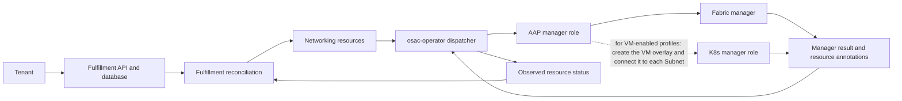

# Unified Networking API for VMaaS, CaaS, and BMaaS

| Field | Value |
|-------|-------|
| Jira | https://redhat.atlassian.net/browse/OSAC-1433 |
| Target release | OSAC 0.2 |
| PRD | [Unified Networking PRD](prd.md) |

## Contents

- [1. Summary](#1-summary)
- [2. Motivation: Goals and Non-Goals](#2-motivation-goals-and-non-goals)
  - [Goals](#21-goals)
  - [Non-Goals](#22-non-goals)
- [3. Background and Rationale](#3-background-and-rationale)
- [4. Proposal](#4-proposal)
  - [4.1 Architecture](#41-architecture)
    - [Manager Roles and Selection](#manager-roles-and-selection)
      - [Two Managers](#two-managers)
      - [Manager Contracts and Selection](#manager-contracts-and-selection)
      - [Why Two Managers?](#why-two-managers)
    - [How VMs Join the Fabric](#how-vms-join-the-fabric)
    - [Infrastructure and Backend Agnostic Resource Model](#infrastructure-and-backend-agnostic-resource-model)
    - [Dispatcher](#dispatcher-operator-composition-logic)
  - [4.2 Data Model and Schema Changes](#42-data-model-and-schema-changes)
    - [Resource API Meaning](#resource-api-meaning)
    - [Backend Effects and Completion Contract](#backend-effects-and-completion-contract)
    - [Manager Operation Contract](#manager-operation-contract)
    - [ExternalIPPool](#externalippool)
    - [API Extensions](#api-extensions)
      - [NetworkClass](#networkclass)
        - [Capabilities](#capabilities)
        - [Manager Registration (ConfigMap)](#manager-registration-configmap)
      - [ExternalIPPool](#externalippool-1)
      - [VirtualNetwork](#virtualnetwork)
      - [Subnet](#subnet)
      - [SecurityGroup](#securitygroup)
      - [ExternalIP](#externalip)
      - [Network Attachment Types](#network-attachment-types)
      - [Resource Status: Discovered IPs](#resource-status-discovered-ips)
      - [ExternalIPAttachment: Inbound Traffic (DNAT)](#externalipattachment-inbound-traffic-dnat)
      - [NATGateway: Outbound Traffic (SNAT)](#natgateway-outbound-traffic-snat)
    - [Resource Hierarchy](#resource-hierarchy)
  - [4.3 API Changes](#43-api-changes)
    - [Resource lifecycle enforcement](#resource-lifecycle-enforcement)
    - [API operation constraint](#api-operation-constraint)
    - [Implementation Details](#implementation-details)
    - [NetworkClass Examples](#networkclass-examples)
    - [UX Alignment](#ux-alignment)
    - [Workflow Description: End-to-End Flows](#workflow-description-end-to-end-flows)
    - [Auto-provisioning lifecycle](#auto-provisioning-lifecycle-auto_external_ip_attachment)
  - [4.4 Scalability and Performance](#44-scalability-and-performance)
  - [4.5 Security Considerations](#45-security-considerations)
  - [4.6 Failure Handling and Recovery](#46-failure-handling-and-recovery)
    - [Risks and Mitigations](#risks-and-mitigations)
    - [Provider Networking Control](#provider-networking-control)
  - [4.7 RBAC and Tenancy](#47-rbac-and-tenancy)
  - [4.8 Extensibility and Future-Proofing](#48-extensibility-and-future-proofing)
- [5. Interface Changes](#5-interface-changes)
  - [IC-1: Shared networking resource API](#ic-1-shared-networking-resource-api)
  - [IC-2: Workload network attachments](#ic-2-workload-network-attachments)
  - [IC-3: External access](#ic-3-external-access)
  - [IC-4: Provider manager configuration](#ic-4-provider-manager-configuration)
  - [IC-5: Provider networking control](#ic-5-provider-networking-control)
  - [IC-6: Unified networking UI and documentation](#ic-6-unified-networking-ui-and-documentation)
- [6. Alternatives Considered](#6-alternatives-considered)
  - [Drawbacks](#drawbacks)
- [7. Observability and Monitoring](#7-observability-and-monitoring)
- [8. Impact and Compatibility](#8-impact-and-compatibility)
  - [Current implementation alignment](#current-implementation-alignment)
  - [Upgrade and Downgrade Strategy](#upgrade-and-downgrade-strategy)
  - [Version Skew Strategy](#version-skew-strategy)
  - [Support Procedures](#support-procedures)
  - [Infrastructure Needed](#infrastructure-needed)
- [Test Plan](#test-plan)
  - [Unit and component tests (DEV)](#unit-and-component-tests-dev)
  - [Integration tests (DEV)](#integration-tests-dev)
  - [End-to-end release qualification (QE)](#end-to-end-release-qualification-qe)
- [Graduation Criteria](#graduation-criteria)
- [Support Boundaries](#support-boundaries)
  - [Deployment Support Boundary](#deployment-support-boundary)
  - [Networking Hub Support Boundary](#networking-hub-support-boundary)

## 1. Summary

This design defines one infrastructure- and backend-agnostic networking API for VMaaS, CaaS, and BMaaS. Fulfillment services store tenant intent; operator dispatch sends provider operations to implementations selected for the required manager role. Every conforming implementation uses the same role registration, operation, and status contract, while provider profiles declare supported operation-target pairs. The API fields and workflows below are the normative target; per-service provisioning details remain in the linked designs. See the [PRD](prd.md) for user needs and acceptance criteria.

## 2. Motivation: Goals and Non-Goals

### 2.1 Goals

- Reuse one networking resource model and lifecycle contract across VMaaS, CaaS, and BMaaS.
- Dispatch operations by manager role and profile capability; use the K8s Manager for VM overlays and only the explicitly assigned K8s-only fallback operations.
- Keep manager selection provider-owned and discoverable without adding tenant-facing backend choices.
- Enforce the IPv4 and single-attachment resource contract consistently at API and operator boundaries.

### 2.2 Non-Goals

- IPv6, dual-stack, or multiple tenant network attachments per workload.
- Tenant-managed DNS zones, VPC peering, load balancers, or Internet gateways.
- Advanced bare-metal interface configuration such as bonding or VLAN trunking.

## 3. Background and Rationale

The prior networking model was VM-focused, while CaaS and BMaaS used separate service-specific paths. The shared design brings VM overlays, cluster nodes, and bare-metal ports into a common fabric model so that tenant isolation, security policy, and external access have consistent contracts. Per-service provisioning details remain in the VMaaS, CaaS, and BMaaS networking proposals linked in the metadata.

## 4. Proposal

### 4.1 Architecture

The request path keeps tenant intent in fulfillment-service and uses operator reconciliation for provider changes. A fixed OSAC dispatch table assigns each operation to a manager role; validated manager registrations determine which implementations can serve that role. In a profile that supports VMs, the K8s manager creates the VM overlay on each applicable hosting cluster and connects it to the selected Subnet. The same tenant resources and API remain in use for VM, cluster, and bare-metal workloads.



OSAC runs VMs on OpenShift using KubeVirt, which encapsulates each VM in a
pod. Pod networking is managed by OVN-Kubernetes, meaning VMs live inside an
OVN overlay that is not directly visible on the physical fabric. The core
premise of this design is that **VMs are part of the fabric**. Through a
[K8s manager](#how-vms-join-the-fabric) that bridges the OVN overlay to the
physical network, VMs become first-class participants in the fabric alongside
bare-metal servers and cluster nodes in profiles that support VM workloads.
The shared API semantics remain the same across resource types; OSAC dispatches
each operation to the manager role specified by the contract, and any
conforming implementation of that role may provide the backend behavior.

The design introduces:

- **Provider-selected manager roles** with supported operation-target pairs
  declared by each registered implementation
- **Infrastructure-agnostic networking resources** where the same tenant
  resource model serves VMs, BM servers, and cluster nodes
- **Backend-agnostic manager integrations** where any implementation that
  meets its role's contract can provide the provider operations
- **ExternalIP** (renamed from PublicIP) to clarify that addresses are
  external to the VirtualNetwork, not necessarily internet-routable
- **Uniform API** where the same networking resources (VirtualNetwork,
  Subnet, SecurityGroup, ExternalIP, ExternalIPAttachment, NATGateway)
  serve VMaaS, CaaS, and BMaaS identically

The BMaaS integration is based on the `BaremetalInstance` resource defined in
the [BareMetal Instance API enhancement](/enhancements/OSAC-1118-baremetal-instance-api),
which provides a per-server resource aligned with ComputeInstance.

All networking resources and manager integrations in this design use IPv4.
IPv6 and dual-stack networking are not supported.

For user-facing goals and requirements, see the [PRD](prd.md).

#### Manager Roles and Selection

The deployment's provider profile assigns registered implementations to
these roles. That profile is represented by the provider-managed
[NetworkClass](#networkclass), defined in the API section. A deployment may use
one or both roles, subject to the operation-target support required by its
workload profile.

##### Two Managers

OSAC networking defines two manager roles. A deployment may use one or both, subject to its supported operations:

- **Fabric Manager** — one provider-selected implementation for operations
  that realize the shared physical-fabric contract: tenant isolation, traffic
  policy, address allocation, DNAT, SNAT, workload-port movement, and
  inter-subnet routing. The role contract is implementation-neutral; Netris,
  Neutron, and other conforming implementations are examples, not a closed
  provider list.

- **K8s Manager** — one provider-selected implementation for Kubernetes-side
  networking operations. In a Fabric-backed profile that supports VMs, it
  creates the VM overlay on each applicable hosting cluster and connects that
  overlay to the Subnet's fabric segment. In a K8s-only profile, it may handle
  only the operations that the fixed dispatcher explicitly assigns to it.
  CaaS VIP pool creation follows the Subnet workflow and does not depend on a
  VM overlay bridge.

##### Manager Contracts and Selection

Any implementation source can provide either role if it conforms to the
versioned OSAC manager contract. The fixed dispatcher determines which role
handles each operation; registration declarations validate support and never
cause dynamic routing or silent fallback. The provider-profile and registration
fields are defined in the [NetworkClass API](#networkclass). See the
[Manager Operation Contract](#manager-operation-contract) for input, result,
retry, and failure requirements.

##### Why Two Managers?

The Fabric Manager role is selected as one implementation for the operations
in a profile. This keeps related physical-fabric changes under one provider
integration while allowing any implementation that meets the shared role
contract.

The K8s role is a separate concern: in VM-enabled Fabric-backed profiles it
connects the VM overlay to the selected Subnet. A K8s-only profile can also
handle only the fallback operations explicitly listed in the dispatcher
table. The mechanism depends on the deployment — see
[How VMs Join the Fabric](#how-vms-join-the-fabric) for the available
options. The provider profile assigns one implementation to the K8s Manager role.

Once attached, the same VirtualNetwork, Subnet, SecurityGroup, ExternalIP,
ExternalIPAttachment, and NATGateway semantics apply to VMs, clusters, and
bare-metal workloads. Implementations may support different target sets, but
the tenant resource model does not vary by infrastructure.

#### How VMs Join the Fabric

OSAC runs VMs on OpenShift using KubeVirt. Each VM is encapsulated in a pod
whose networking is managed by OVN-Kubernetes. By default, VM IP addresses
exist only within the OVN overlay and are not visible on the physical
fabric. The k8sManager bridges this overlay to the fabric so that VMs
become first-class fabric participants — reachable at their subnet IP from
any other resource on the same fabric segment.

Several mechanisms can achieve this bridging. The k8sManager is pluggable —
different deployments use different mechanisms depending on their
infrastructure and requirements:

**CUDN with LocalNet.** The k8sManager creates a ClusterUserDefinedNetwork
(CUDN) with LocalNet topology, mapping the OVN network directly to a
physical VLAN on the hosting cluster's trunk interface. VMs in this network
are bridged to the fabric at L2 — they share a broadcast domain with
bare-metal servers on the same VLAN. This is the simplest mechanism and
provides full L2 adjacency.

**OVN EVPN.** OVN advertises VM routes to the fabric via BGP EVPN. The
fabric learns VM MAC/IP bindings and can route to them. VMs remain in the
OVN overlay but are reachable from the fabric at L3. This preserves OVN's
per-VM isolation on the same hypervisor while still making VMs fabric
participants. Note: OVN EVPN is not yet GA in OpenShift.

**CUDN with VRF-lite.** The hosting cluster uses VRF (Virtual Routing and
Forwarding) instances to route between the OVN overlay and the fabric. Each
tenant VN maps to a VRF on the host, which peers with the fabric via BGP.
VMs are reachable from the fabric via L3 routing through the VRF. See the
[CUDN with VRF-lite setup guide](/docs/networking/setup-bpg-vrf-lite) for
a working example.

**DPU-based bridging.** SmartNICs (DPUs) offload the OVN-to-fabric bridging
to hardware. The DPU handles packet encapsulation/decapsulation between OVN
and the physical network, providing line-rate bridging without host CPU
overhead.

The choice of mechanism is transparent to tenants — it is configured by the
provider as part of the k8sManager installation. The networking API and
resource model are identical regardless of which mechanism is used. All that
matters is the contract: once the k8sManager has bridged a subnet, VMs on
that subnet are reachable from the fabric at their subnet IP.

#### Infrastructure and Backend Agnostic Resource Model

Every networking resource in this design uses one API and one meaning across
VMs, cluster nodes, and bare-metal servers. This includes provider-managed
NetworkClass and ExternalIPPool resources as well as tenant-managed
VirtualNetwork, Subnet, SecurityGroup, ExternalIP, ExternalIPAttachment, and
NATGateway resources. Workload-specific connection details, such as a selected
bare-metal interface, remain on the workload API; they do not create a second
networking resource model.

The resource contract is backend-agnostic. OSAC defines manager roles,
operation identifiers, inputs, results, and retry behavior; providers may use
any manager implementation that fulfills the relevant contract. The fixed
dispatcher maps operations to roles, and a validated registration declares
which operation-target pairs its implementation supports. The profile must
provide every pair required by its workload and networking features. If it
does not, OSAC rejects that unsupported request before dispatch. Manager
selection and provider-specific details remain outside tenant resource specs.

The same Subnet API can be implemented by different deployment profiles:

1. **Fabric-backed VM profile:** the Fabric Manager creates the shared segment;
   the configured K8s Manager also creates and connects a VM overlay on each
   applicable hosting cluster.
2. **Fabric-backed profile without VM support:** the Fabric Manager creates
   the shared segment; no VM overlay is created.
3. **K8s-only profile:** the K8s Manager implements only the operations that
   OSAC explicitly permits as K8s-only fallbacks. Operations with no fallback,
   including NATGateway provisioning and physical port movement, are
   unsupported in that profile.

Each workload service connects its workload to the shared Subnet according to
its own provisioning flow. The resulting tenant resource meaning and API do
not vary with VM, cluster, or bare-metal infrastructure or with the selected
manager implementation.

#### Dispatcher (Operator Composition Logic)

The osac-operator acts as a fixed **dispatcher**: it resolves the active [NetworkClass](#networkclass),
checks that the selected manager registration advertises the required
operation and target, then invokes the role assigned to that operation. A
registration cannot change the dispatch table, and OSAC does not silently
fallback to another manager. AAP receives the resource and operation context
through the common input described in [Manager Operation Contract](#manager-operation-contract).

| Operation identifier | Assigned role and profile behavior |
|----------------------|-----------------------------------|
| `virtual_network.create`, `virtual_network.delete` | Fabric Manager; K8s Manager only as the explicit fallback in a K8s-only profile. |
| `subnet.create`, `subnet.delete` | Fabric Manager; also the configured K8s Manager for VM overlay resources in a VM-enabled profile. K8s-only profiles use the explicit K8s fallback. |
| `security_group.apply`, `security_group.delete` | Fabric Manager; K8s Manager only as the explicit fallback in a K8s-only profile. |
| `external_ip_pool.create`, `external_ip_pool.delete` | Fabric Manager; K8s Manager only as the explicit fallback in a K8s-only profile. |
| `external_ip.allocate`, `external_ip.release` | Fabric Manager; K8s Manager only as the explicit fallback in a K8s-only profile. |
| `external_ip_attachment.create`, `external_ip_attachment.delete` | Fabric Manager; K8s Manager only as the explicit fallback in a K8s-only profile. Registration must declare each supported target: `compute_instance`, `cluster`, or `baremetal_instance`. |
| `nat_gateway.create`, `nat_gateway.delete` | Fabric Manager only; no K8s-only fallback. |
| `workload_attachment.move` | Fabric Manager only; no K8s-only fallback. Registration must declare each supported target. |
| `dhcp_lease.query` | The role selected by the deployment profile. Registration must declare each supported target. |

For VM-enabled Fabric profiles, the K8s Manager receives the Subnet operation
needed to create or remove each hosting cluster's VM overlay. It is not called
for non-VM subnet placement. In a K8s-only profile, only the listed fallback
operations are routed to the K8s Manager; NATGateway and physical port
movement remain unsupported. CaaS VIP address-pool work follows the Subnet
workflow and does not imply a VM overlay.

The dispatch table above covers **networking resources only**. Compute
resources (ComputeInstance, BaremetalInstance, Cluster) handle per-instance
network attachment through their provisioning operators — see per-service
designs at [VMaaS](/enhancements/OSAC-1435-vmaas-networking),
[CaaS](/enhancements/OSAC-1436-caas-networking),
[BMaaS](/enhancements/OSAC-1437-bmaas-networking).


### 4.2 Data Model and Schema Changes

The design extends OSAC networking resources and workload-specific attachment types. The resource contract below defines what each object means and what its selected backend must implement. The detailed proto and resource shapes that follow are the source of truth for field names, cardinality, defaults, and status; the PRD describes their user-visible effects.

#### Resource API Meaning

The API is declarative. NetworkClass and ExternalIPPool are provider-managed
configuration; the other network resources express tenant intent. The table
defines each object's purpose and relationship. Field-level schemas,
cardinality, defaults, and status are specified in the API Extensions below.

| Resource and API contract | Meaning |
|---|---|
| **NetworkClass** — provider-selected `fabric_manager`, optional `k8s_manager`, and capabilities | Selects registered manager implementations by role and advertises the deployment's supported capabilities. It is provider configuration, not a tenant network. |
| **VirtualNetwork** — `network_class` and canonical IPv4 `ipv4_cidr` | Tenant-isolated L3 routing domain and parent for its Subnets, SecurityGroups, and optional NATGateway. |
| **Subnet** — `virtual_network` and canonical IPv4 `ipv4_cidr` | Address range and network segment inside one VirtualNetwork. It is the shared attachment target for VM, cluster, and bare-metal workloads. |
| **SecurityGroup** — `virtual_network`, `ingress` and `egress` rules | VirtualNetwork-scoped traffic policy attached to workloads through their network attachments. Rules match protocol, ports, and IPv4 source/destination ranges; a matching rule in any attached group allows traffic, no match across the attached groups denies it, and return traffic for established connections is allowed. |
| **ExternalIPPool** — provider-managed CIDR range and IPv4 family | Deployment-wide capacity of addresses external to tenant VirtualNetworks. The current contract accepts one canonical IPv4 CIDR per pool and makes it available to the selected profile. |
| **ExternalIP** — `pool`; allocated `status.address` is output-only | One reserved address from an ExternalIPPool. “External” means outside the tenant VirtualNetwork and does not promise Internet reachability. |
| **ExternalIPAttachment** — `external_ip`, exactly one workload target, and a cluster-only `target_endpoint` | Associates one allocated ExternalIP with a VM, bare-metal server, or a Cluster API/ingress endpoint for inbound access. |
| **NATGateway** — `virtual_network` and `external_ip` | Optional outbound identity for one VirtualNetwork; it does not provide inbound access. One NATGateway is allowed per VirtualNetwork, and its ExternalIP cannot be used by another consumer. |
| **Workload network attachment** — workload-specific `subnet` and `security_groups`; BMaaS may also specify `interface` | Connects a ComputeInstance, BaremetalInstance, or Cluster to the shared resource model. This is part of the workload API, not a separate provider network resource. |

#### Backend Effects and Completion Contract

The operator dispatches provider operations through the manager roles in the
[dispatcher table](#dispatcher-operator-composition-logic). The expected
provider effect for each object is:

| Object or operation | Manager responsibility |
|---|---|
| `virtual_network.create` / `.delete` | The assigned Fabric Manager, or the explicit K8s-only fallback, creates/removes an isolated routing domain. Different VirtualNetworks remain isolated; Subnets in one VirtualNetwork follow its routing policy. |
| `subnet.create` / `.delete` | The assigned Fabric Manager creates/removes the segment, gateway, and address service. For VM-enabled profiles, the assigned K8s Manager also creates/removes the VM overlay on each applicable hosting cluster. A K8s-only profile uses its declared fallback implementation. |
| `security_group.apply` / `.delete` | The assigned Fabric Manager, or explicit K8s-only fallback, applies/removes the complete stateful, default-deny rule set. Workload provisioning applies selected groups; multiple groups combine as a union of their allow rules. |
| `external_ip_pool.create` / `.delete` | The assigned Fabric Manager, or explicit K8s-only fallback, registers/removes the address range in its allocation system. Fulfillment-service owns API-side capacity accounting. |
| `external_ip.allocate` / `.release` | The assigned Fabric Manager, or explicit K8s-only fallback, reserves/releases a unique address under the ExternalIP UID. OSAC accepts an address only after validating the manager result and resource annotation. |
| `external_ip_attachment.create` / `.delete` | The assigned Fabric Manager, or explicit K8s-only fallback, creates/removes DNAT from the ExternalIP to a workload address or selected Cluster endpoint VIP. Readiness requires a known target and installed mapping. |
| `nat_gateway.create` / `.delete` | The Fabric Manager creates/removes SNAT from the VirtualNetwork IPv4 range to the allocated ExternalIP. This operation has no K8s-only fallback. |
| `workload_attachment.move` | The Fabric Manager moves a physical workload port onto the selected Subnet and restores provisioning placement on detach. This operation has no K8s-only fallback. |
| `dhcp_lease.query` | The role selected by the deployment profile resolves leases for its declared workload target types and returns the lease artifact. |

The manager contract defines operation input, role, target support, success
result, retry behavior, and failure diagnostics. Implementations scope side
effects to the OSAC resource UID, make create/apply and delete retry-safe, and
report success only after requested provider state is present or absent. OSAC
owns API validation, dependency ordering, and resource status; failed or
incomplete provider work leaves the resource non-ready for reconciliation.
Vendor-specific configuration remains inside the implementation and does not
change the API.

#### Manager Operation Contract

Every provider operation is dispatched using the same `osac_job_vars` input.
The dispatcher selects the registered implementation from the NetworkClass
role assignment, confirms its `contractVersion` and advertised
operation-target pair, then invokes the matching AAP collection task. The
registration does not contain credentials.

```yaml
osac_job_vars:
  operation: external_ip_attachment.create
  manager:
    name: example
    role: fabric
    implementationRef: acme.networking.fabric_manager
    contractVersion: v1
  resource:
    apiVersion: osac.openshift.io/v1alpha1
    kind: ExternalIPAttachment
    metadata: {}
    spec: {}
```

The full resource object supplies the resource UID, generation, metadata, and
desired spec. An operation-target declaration identifies exact workload
targets (`compute_instance`, `cluster`, or `baremetal_instance`) for
ExternalIPAttachment, workload port movement, and DHCP lease query. OSAC
rejects unsupported operation-target pairs before dispatch. A K8s Manager's
presence never provides an implicit fallback for an operation assigned to a
configured Fabric Manager.

Contract v1 uses one task entry point per operation. Collection task names
are shown below; the generic AAP playbook resolves
`manager.implementationRef` and selects the matching task. Implementations
may be written by any provider or vendor, but an advertised entry point must
meet the stated behavior.

| Operation identifier | Collection task entry point | Required backend behavior |
|---|---|---|
| `virtual_network.create` / `.delete` | `create_virtual_network` / `delete_virtual_network` | Create or remove the isolated routing domain and associated allocation. |
| `subnet.create` / `.delete` | `create_subnet` / `delete_subnet` | Create or remove the L2 segment and any assigned K8s network resources; honor parent CIDR containment and sibling non-overlap. |
| `security_group.apply` / `.delete` | `create_security_group` / `delete_security_group` | Apply the complete desired rule set or remove rules owned by the SecurityGroup. API spec is immutable after creation. |
| `external_ip_pool.create` / `.delete` | `create_external_ip_pool` / `delete_external_ip_pool` | Register or remove the one-CIDR IPv4 allocation pool. |
| `external_ip.allocate` / `.release` | `create_external_ip` / `delete_external_ip` | Reserve or release one address under the ExternalIP UID; allocation writes the guarded OSAC annotation before success. |
| `external_ip_attachment.create` / `.delete` | `attach_external_ip` / `detach_external_ip` | Create or remove inbound translation for the declared and supported target type. |
| `nat_gateway.create` / `.delete` | `create_nat_gateway` / `delete_nat_gateway` | Create or remove outbound SNAT for the VirtualNetwork using its allocated ExternalIP. |
| `workload_attachment.move` | `move_network_attachment` | Attach the physical port when no deletion timestamp exists; restore provisioning placement when one exists. |
| `dhcp_lease.query` | `query_dhcp_lease` | Return an unambiguous lease for every requested attachment in the `leases` artifact. |

Successful create/apply operations mean the implementation has converged the
provider state for that resource UID; delete success means the UID-owned state
is absent. Repeating an operation is safe. `external_ip.allocate` additionally
persists the confirmed IPv4 address in
`osac.openshift.io/allocated-address`, guarded by UID and generation, before
reporting success. `dhcp_lease.query` returns a `leases` AAP artifact with
`subnet_ref`, `interface`, `ip_address`, and `mac_address` for each requested
attachment. Other operations return the common `osac_result` envelope with
the schema version, operation, resource UID, observed generation, and any
operation-specific data. A failed task returns a diagnostic and no success
result; OSAC retains non-ready state and retries according to its controller
policy. There is no silent retry through another manager.

#### ExternalIPPool

"External" in ExternalIPPool/ExternalIP means **outside the tenant's
VirtualNetwork**. The provider controls where the address is reachable; the
API does not promise Internet reachability. Deployment reachability
requirements are defined in [Support Boundaries](#support-boundaries).

ExternalIPPools are provider-managed and deployment-scoped. The NetworkClass
profile selects the manager that handles ExternalIP allocation and release;
Fabric-backed profiles assign those operations to the Fabric Manager, while a
K8s-only profile uses only the explicit K8s fallback. One provider-managed
pool serves all resource types in the deployment.
Each pool uses exactly one canonical IPv4 CIDR. The API's repeated `cidrs`
field is retained for compatibility, but validation rejects an empty list or
more than one entry; IPv6 and dual-stack pools are not supported.
Pool creation requires `spec.ipFamily` to be `IP_FAMILY_IPV4`;
`IP_FAMILY_UNSPECIFIED`, IPv6, and dual-stack values are rejected before
persistence. The provider create API supplies `cidrs` and `ipFamily`; the
provider configures that range in the deployment's selected manager before
the pool becomes Ready. The pool does not carry a tenant-selectable
implementation field.

##### Address-Family and CIDR Contract

All user-supplied network CIDRs use canonical dotted-decimal IPv4 notation
(`a.b.c.d/prefix`) with host bits zero. A Subnet CIDR must be contained by its
parent VirtualNetwork and sibling Subnet CIDRs must not overlap. Provider and
controller-produced addresses are canonical IPv4 addresses without a CIDR
suffix. Any IPv6, dual-stack, malformed, or non-canonical value is rejected
before persistence or backend dispatch.
All explicit and automatic ExternalIP allocation paths, including per-service
auto-provisioning, must request `IP_FAMILY_IPV4`; `IP_FAMILY_UNSPECIFIED` is
not a valid default for this contract.

##### ExternalIP Address Selection and Ownership

The ExternalIPPool defines the eligible range; it does not choose the concrete
address. For `external_ip.allocate`, OSAC supplies the ExternalIP UID and the
resolved pool UID and canonical IPv4 CIDR to the manager selected by the
NetworkClass profile. The manager chooses a free address in that pool and
durably reserves it under the ExternalIP UID. Allocations from the same pool
must be unique, and retrying the same UID must return the same reservation.
The selection order is implementation-specific; the contract does not require
first-fit or any other particular algorithm.

After confirming the reservation, the manager writes the address to the
`osac.openshift.io/allocated-address` annotation on the same ExternalIP CR.
The patch must be guarded by the supplied resource UID and generation, and
must not change the spec, status, or other annotations. The manager reports
success only after the provider reservation and annotation write succeed. The
common `osac_result` envelope identifies the operation, resource UID, and
generation; it carries no address payload.

After AAP reports success, OSAC validates the result envelope against the
current ExternalIP, reads the annotation, and validates canonical IPv4 form
and membership in the selected pool. Only then does OSAC write
`ExternalIP.status.address` and report the ExternalIP as **Allocated**. OSAC
does not write the allocated-address annotation. A missing or invalid
annotation leaves the ExternalIP non-ready with no accepted address. A retry
for the same UID reuses the provider reservation and retries the annotation
write. If the pool has no free address, the manager returns a failure with a
diagnostic and no success result.

The fulfillment-service reserves API-side pool capacity in the transaction
that creates the ExternalIP. On deletion while provider networking is enabled,
OSAC first requires dependent ExternalIPAttachments and NATGateways to be
removed, then invokes `external_ip.release`. The manager removes the UID-owned
provider reservation and reports success only after the address is absent.
OSAC returns API-side pool capacity only after successful AAP completion and
validation of an `osac_result` with `schemaVersion: "v1"`,
`operation: external_ip.release`, the current ExternalIP UID in `resourceUID`,
the dispatched generation in `observedGeneration`, and empty `data`. The
successful result asserts that the UID-owned provider reservation is absent;
no separate `RELEASED` data field is required. A failed job or missing,
malformed, stale, or mismatched envelope keeps capacity held for
reconciliation.

While provider networking is disabled, deleting an ExternalIP completes its
OSAC object deletion without dispatching `external_ip.release`, and releases
its API-side pool-capacity reservation when the logical object is deleted. If
the manager had confirmed an allocation before disablement, its provider
reservation may remain after OSAC deletion and require manual or provider-side
cleanup. Releasing the OSAC capacity slot does not release that address in the
provider or guarantee that the provider can allocate it again. [User]

#### API Extensions

##### NetworkClass

NetworkClass is the provider-managed configuration container for deployment
networking. It binds manager-role assignments to registered implementations,
contains deployment defaults and capability controls, and reports effective
readiness. It is not a tenant network and does not own tenant VirtualNetworks;
VirtualNetworks reference the deployment profile. Tenants do not select it.
Each deployment uses one active NetworkClass; its profile may assign the Fabric
Manager, the K8s Manager, or both where the supported operation-target pairs
allow it. See [Manager Roles and Selection](#manager-roles-and-selection)
for role responsibilities and the [dispatcher contract](#dispatcher-operator-composition-logic)
for operation routing.

```protobuf
message NetworkClass {
  string id = 1;
  Metadata metadata = 2;
  string title = 3;
  string description = 4;
  NetworkClassConstraints constraints = 6;
  NetworkClassCapabilities capabilities = 7; // derived from manager registrations
  NetworkClassStatus status = 8;             // read-only readiness and hub
  optional string fabric_manager = 10; // role for Fabric-assigned operations
  optional string k8s_manager = 11;    // VM overlay role, or declared K8s-only fallbacks
  NetworkClassSpec spec = 12;
}

message NetworkClassSpec {
  NetworkDefaults defaults = 1;
  NetworkClassCapabilities disable_capabilities = 2;
  optional int32 vip_prefix_length = 3; // IPv4 VIP reservation prefix; valid range 1 through 32
  EastWestConfig east_west_config = 4;
}

message NetworkClassStatus {
  NetworkClassState state = 1; // system-reported readiness
  optional string message = 2;
  string hub = 3;
}

enum NetworkClassState {
  NETWORK_CLASS_STATE_UNSPECIFIED = 0;
  NETWORK_CLASS_STATE_PENDING = 1;
  NETWORK_CLASS_STATE_READY = 2;
  NETWORK_CLASS_STATE_FAILED = 3;
}

message NetworkClassConstraints {} // reserved for future provider constraints

message NetworkClassCapabilities {
  bool supports_ipv4 = 1;
  bool supports_ipv6 = 2;        // false for this proposal
  bool supports_dual_stack = 3;  // false for this proposal
  bool dpu_support = 4;
  bool supports_east_west_ethernet = 5;
  bool supports_east_west_infiniband = 6;
  bool supports_nvlink = 7;
}
```

###### Capabilities

Capabilities are **inferred from the assigned managers** and published in
the NetworkClass `capabilities` field — the provider does not set them
manually. The operator computes the intersection of capabilities declared by
the assigned manager ConfigMaps and populates `capabilities` automatically. For
a BM-only NetworkClass without a `k8sManager`, the absent manager is excluded
from this intersection; only the configured `fabricManager` contributes
capabilities.

The supported deployment boundary is IPv4-only. Managers must advertise the
`ipv4` capability. IPv6 and dual-stack manager registrations are rejected,
and NetworkClass capability output must be `supportsIpv4: true` with
`supportsIpv6: false` and `supportsDualStack: false`.

| Capability | Type | Meaning |
|-----------|------|---------|
| `supportsIpv4` | bool | IPv4 addressing is available; `true` for OSAC networking |
| `supportsIpv6` | bool | IPv6 addressing; always `false` |
| `supportsDualStack` | bool | IPv4 + IPv6 addressing; always `false` |
| `dpuSupport` | bool | DPU-accelerated networking available |

The set of capabilities is defined by the operator and is fixed — adding a
new capability requires an operator update. Managers declare which
capabilities they support; they cannot define custom capabilities. These
capability flags do not replace the operation and workload-target support
declared by each manager registration.

###### Manager Registration (ConfigMap)

Each implementation registers one manager role through a ConfigMap installed
in the OSAC operator namespace. The role label determines whether it is a
Fabric Manager or K8s Manager. Contract v1 requires a unique `name`, a fully
qualified `implementationRef`, `contractVersion`, general `capabilities`, and
`supportedOperations`; description is optional. Operation entries list exact
operation identifiers and, for target-scoped operations, the supported target
types. Credentials remain in provider-managed AAP credentials or Secrets, not
in the registration.

```yaml
apiVersion: v1
kind: ConfigMap
metadata:
  name: osac-network-fabric-manager-example
  namespace: osac
  labels:
    osac.openshift.io/network-fabric-manager: "true"
data:
  name: example
  implementationRef: acme.networking.fabric_manager
  description: "Example Fabric Manager implementation"
  contractVersion: "v1"
  capabilities: "ipv4"
  supportedOperations: |
    - id: virtual_network.create
    - id: virtual_network.delete
    - id: subnet.create
    - id: subnet.delete
    - id: external_ip_attachment.create
      targets:
        - cluster
    - id: external_ip_attachment.delete
      targets:
        - cluster
```

The operator validates each NetworkClass role assignment against the matching
registration before dispatch. The advertised operation-target pairs validate
the fixed dispatch choice; they do not add operations or change routing. A
conforming implementation from any source can be registered without changing
tenant APIs or operation dispatch. Adding a new OSAC operation, target type,
or incompatible input/output contract requires an OSAC contract update.
Legacy implementation-strategy fields or annotations on networking resources
do not select an implementation and must not alter fixed role dispatch.


##### ExternalIPPool

ExternalIPPool is provider-managed address capacity available to all workload
types. Its CIDR is provider input and is not a tenant-selected backend or
workload setting. The provider-facing create API accepts one canonical IPv4
CIDR and the IPv4 family; capacity and readiness are system-reported.

```protobuf
message ExternalIPPool {
  string id = 1;
  Metadata metadata = 2;
  ExternalIPPoolSpec spec = 3;
  ExternalIPPoolStatus status = 4;
}

message ExternalIPPoolSpec {
  repeated string cidrs = 2; // private/provider input: exactly one canonical IPv4 CIDR
  IPFamily ip_family = 3;    // required provider input: IP_FAMILY_IPV4
}

message ExternalIPPoolStatus {
  ExternalIPPoolState state = 1;
  optional string message = 2;
  string hub = 3;
  int64 total = 4;
  int64 allocated = 5;
  int64 available = 6;
}
```

The public tenant projection exposes pool identity, metadata, family, and
available capacity. CIDR configuration and detailed provider status remain
provider-managed.

##### VirtualNetwork

```protobuf
message VirtualNetworkSpec {
  NetworkClassReference network_class = 1; // required; service-resolved provider profile, immutable
  string ipv4_cidr = 2;                    // required canonical IPv4 CIDR, immutable
}
```

The fulfillment service resolves the deployment's provider-managed
NetworkClass; tenants do not choose a manager or provider profile. The
NetworkClass selects registered manager implementations. Tenant-facing
networking specs do not select a workload type or concrete backend. The same
resource model applies across VM, cluster, and BM workloads.

##### Subnet

```protobuf
message SubnetSpec {
  VirtualNetworkLocalReference virtual_network = 1; // required, immutable
  string ipv4_cidr = 2; // required canonical IPv4, within parent CIDR, immutable
}
```

The Subnet CIDR must be contained by its VirtualNetwork CIDR and must not
overlap another Subnet in that VirtualNetwork. A Subnet is the workload
attachment point; it does not select a workload type or a manager.

##### SecurityGroup

```protobuf
message SecurityGroupSpec {
  VirtualNetworkLocalReference virtual_network = 1; // required, immutable
  repeated SecurityRule ingress = 2;
  repeated SecurityRule egress = 3;
}
```

Each `SecurityRule` matches a protocol, optional TCP/UDP port range, and an
IPv4 CIDR (source for ingress, destination for egress). A matching rule allows
traffic; traffic that matches no rule is denied. Return traffic for an
established connection is allowed. Rules contain match criteria, not an
explicit allow/deny action, so list order does not change their meaning. When
multiple SecurityGroups are attached to a workload, their allow rules combine
as a union. SecurityGroups can be attached only to workloads in their parent
VirtualNetwork.

```protobuf
message SecurityRule {
  Protocol protocol = 1;         // TCP, UDP, ICMP, or ALL
  optional int32 port_from = 2;  // required for TCP/UDP, 1 through 65535
  optional int32 port_to = 3;    // required for TCP/UDP, >= port_from
  optional string ipv4_cidr = 4; // required canonical IPv4 CIDR
  optional string ipv6_cidr = 5; // legacy wire field; non-empty values rejected
}

enum Protocol {
  PROTOCOL_UNSPECIFIED = 0;
  PROTOCOL_TCP = 1;
  PROTOCOL_UDP = 2;
  PROTOCOL_ICMP = 3;
  PROTOCOL_ALL = 4;
}
```

`PROTOCOL_UNSPECIFIED` is invalid. Port bounds apply only to TCP and UDP;
ICMP and ALL ignore them. The IPv6 field remains only for wire compatibility
and must be empty.

##### ExternalIP

```protobuf
message ExternalIPSpec {
  ExternalIPPoolReference pool = 1; // required, immutable
}
```

The allocated address is system-provided in `ExternalIP.status.address`; a
tenant requests a pool, not a specific address. See
[ExternalIP Address Selection and Ownership](#externalip-address-selection-and-ownership)
for the manager allocation and release contract.

##### HostType and BareMetalInstanceType

**HostType** is a legacy system-level inventory resource. New BMaaS and CaaS
network attachment resolution uses the tenant-facing `BareMetalInstanceType`
and its `network_ports`; the workload networking contract does not use
`HostType` as a second source of truth.

```protobuf
message NetworkInterface {
  string name = 1;        // e.g., "data-0", "data-1", "mgmt-0" — unique within the type
  string role = 2;        // e.g., "fabric", "management", "storage", "lifecycle"
  string description = 3; // e.g., "100GbE fabric interface"
}
```

Existing HostType records may still expose `interfaces` for inventory and
legacy consumers, but that list does not expand the tenant attachment
cardinality or override `BareMetalInstanceType.network_ports`.

Interfaces are ordered. When multiple interfaces share the same role
(e.g., two `fabric` interfaces), the first one in the list is the default
for that role — used by CaaS for automatic interface resolution.

**BareMetalInstanceType** is a tenant-facing catalog resource defined in
the [BareMetalInstanceType EP](/enhancements/OSAC-1201-baremetal-instance-types).
It provides a richer hardware discovery catalog for BMaaS, including
structured network ports with additional type and speed information:

```protobuf
message BareMetalNetworkPortSpec {
  string name = 1;        // e.g., "data-0", "data-1", "mgmt-0" — unique within the type
  string role = 2;        // e.g., "fabric", "management", "storage", "lifecycle"
  string type = 3;        // e.g., Ethernet, InfiniBand
  string speed = 4;       // e.g., 1Gbps, 100Gbps
  string description = 5; // e.g., "100GbE fabric interface"
}
```

`BareMetalInstanceType` is the authoritative tenant-facing hardware and
network-port catalog. Its `BareMetalNetworkPortSpec` entries provide the
names, roles, types, and speeds used for BMaaS validation and CaaS interface
resolution; no HostType reverse lookup is required for the workload contract.

| Role | Meaning |
|------|---------|
| `fabric` | Primary fabric traffic (east-west, tenant workloads) |
| `management` | In-band management/control plane traffic |
| `storage` | Storage fabric traffic |
| `lifecycle` | Out-of-band lifecycle management (PXE boot, Redfish/BMC) — not tenant-attachable |

Roles are conventions, not enforced enums. Ports/interfaces with role
`lifecycle` are used by the provisioning system (Ironic, Metal3) and
should not appear in `network_attachments`.

**CaaS** uses BareMetalInstanceType: the fulfillment-service resolves the
interface automatically (first `fabric`-role port → stored as immutable
`fabric_interface` on the node set definition).

**BMaaS** uses BareMetalInstanceType: the tenant discovers interfaces
from BareMetalInstanceType and specifies port names directly on
`BareMetalNetworkAttachment.interface`, validated against the
`BareMetalInstanceType.network_ports` list. The `interface` field references
a port name from that list.

##### Network Attachment Types

Each resource type has its own network attachment message. The core fields
(`subnet`, `security_groups`) are shared, but each type adds
resource-specific fields. `network_attachments` are immutable after
resource creation — changing network attachment requires recreating the
resource. VMaaS and BMaaS keep repeated fields for wire/API compatibility but
enforce a maximum of one entry. CaaS uses its existing singular field.

**ComputeNetworkAttachment** (for ComputeInstance):

```protobuf
message ComputeNetworkAttachment {
  SubnetLocalReference subnet = 1;                         // Optional on input; immutable after resolution
  repeated SecurityGroupLocalReference security_groups = 2; // Optional on input; immutable after resolution
}
```

The repeated field is retained for compatibility, but at most one entry is
accepted. The sole entry is the VM's default route/primary attachment; the
VMaaS attachment message has no primary field.

**BareMetalNetworkAttachment** (for BaremetalInstance):

```protobuf
message BareMetalNetworkAttachment {
  SubnetLocalReference subnet = 1;                         // Optional on input; immutable after resolution
  repeated SecurityGroupLocalReference security_groups = 2; // Optional on input; immutable after resolution
  string interface = 3;                 // optional, immutable: physical port name from BareMetalInstanceType
  optional bool primary = 4;            // omitted or true: implicit primary; false is rejected
}
```

The repeated field is retained for compatibility, but at most one entry is
accepted. The `interface` field, when supplied, references a port name from
the BareMetalInstanceType's network ports list; if omitted, the system picks
the default fabric interface. Omitted or empty attachment lists receive
defaults, and a supplied entry receives defaults only for missing fields. The
sole entry is the default route/primary attachment. A `primary: true` value is
accepted for compatibility and is redundant; `primary: false` is rejected.

**ClusterNetworkAttachment** (for Cluster):

```protobuf
message ClusterNetworkAttachment {
  SubnetLocalReference subnet = 1;                         // Required after resolution; immutable after creation
  repeated SecurityGroupLocalReference security_groups = 2; // Optional on input; immutable after resolution
}
```

A single attachment applies to the whole cluster — all node sets share the same subnet.
The `fabric_interface` is resolved by the fulfillment-service at creation time for each
node set from its BareMetalInstanceType (first port with role `fabric`)
and stored on the node set definition. The tenant does not set this field.

##### Attachment Presence and Defaulting

The API distinguishes an omitted attachment from a supplied attachment, but
both an omitted attachment and an empty attachment list/message mean that the
caller requested the normal tenant defaults. Defaulting is field-level for a
single supplied attachment:

| Input | Resolution |
|---|---|
| VMaaS attachment omitted or empty | Add the tenant's default Subnet and default SecurityGroup. |
| BMaaS attachment list omitted or empty | Add the tenant's default Subnet, default SecurityGroup, and the first `fabric` port from `BareMetalInstanceType.network_ports`. |
| CaaS attachment omitted or empty | Add the tenant's default Subnet and default SecurityGroup; resolve the first `fabric` port from each node set's `BareMetalInstanceType` for the BM worker handoff. |
| One attachment with no Subnet | Default only the Subnet; preserve supplied SecurityGroups and, for BMaaS, the supplied interface. |
| One attachment with no SecurityGroups | Default only the SecurityGroup list, but only when the resolved Subnet belongs to the tenant's default VirtualNetwork. Otherwise the caller must provide SecurityGroups from the resolved Subnet's VirtualNetwork. |
| One BMaaS attachment with no interface | Default only the interface to the first `fabric` port from `BareMetalInstanceType.network_ports`. |
| One complete attachment | Preserve all supplied values and validate readiness, tenant scope, and VirtualNetwork relationships. |

An explicitly empty `security_groups` list is treated as a missing
SecurityGroup value for this defaulting rule. If a required default is absent
or not Ready, creation fails with a validation or precondition error. The
fully resolved attachment is stored with the workload and is immutable after
creation.

##### Resource Specs

**ComputeInstance**:

```protobuf
message ComputeInstanceSpec {
  // ... existing fields ...
  repeated ComputeNetworkAttachment network_attachments = 14; // max 1 for compatibility
  optional bool auto_external_ip_attachment = 18;
}
```

The repeated `network_attachments` field is retained for API compatibility, but the
fulfillment-service and operator accept at most one entry. VMaaS has no separate
primary field; the sole entry is implicitly the default route.

**BaremetalInstance** (new — defined in the
[BareMetal Instance API enhancement](/enhancements/OSAC-1118-baremetal-instance-api)):

```protobuf
message BareMetalInstanceSpec {
  string catalog_item = 1;
  optional string ssh_public_key = 2;
  optional string user_data = 3;
  optional BareMetalInstanceRunStrategy run_strategy = 4;
  int64 restart_trigger = 5;
  map<string, google.protobuf.Any> template_parameters = 6;
  optional BareMetalInstanceImage image = 7;

  // NEW: OSAC networking; repeated for compatibility, max 1
  repeated BareMetalNetworkAttachment network_attachments = 8;
}
```

**Cluster** (new):

```protobuf
message ClusterSpec {
  string template = 1;
  map<string, google.protobuf.Any> template_parameters = 2;
  map<string, ClusterNodeSet> node_sets = 3;

  // NEW: networking
  ClusterNetworkAttachment network_attachment = 9;  // singular, one per cluster
}
```

- Cluster-internal CNI (pod/service CIDRs) uses platform defaults.
- The cluster's template determines whether nodes are VMs or BM. Both
  types are placed on the same subnet — VMs via the K8s overlay (already
  bridged to the fabric), BM nodes directly on the fabric.

The design uses two existing Cluster status fields populated by the system
during provisioning:

```protobuf
message ClusterStatus {
  string api_endpoint = 6;      // existing; set by CaaS template, internal API server VIP
  string ingress_endpoint = 7;  // existing; set by CaaS template, internal ingress VIP
}
```

These are used by the ExternalIPAttachment controller as the DNAT backend
IP when the target is a cluster (see
[Cluster ExternalIPAttachment flow](#cluster-externalipattachment-flow)).

##### Resource Status: Discovered IPs

After provisioning, resources receive IPs via DHCP. Feedback controllers
discover these IPs and write them to status for two purposes: tenant
visibility and ExternalIPAttachment DNAT target resolution.

**ComputeInstanceStatus:**

```protobuf
message ComputeNetworkAttachmentStatus {
  string subnet_ref = 1;               // Subnet ID (echoed from spec)
  string ip_address = 2;               // Discovered from KubeVirt VMI network status
}

message ComputeInstanceStatus {
  // ... existing fields ...
  repeated ComputeNetworkAttachmentStatus compute_network_attachment_statuses = 7; // proposed
}
```

Feedback controller watches KubeVirt VMI `status.interfaces[].ipAddress`,
maps each interface to the corresponding attachment by CUDN NAD reference,
and fires Signal RPC to fulfillment-service.

**BaremetalInstanceStatus:**

```protobuf
message BareMetalNetworkAttachmentStatus {
  string interface = 1;                 // Physical interface name (echoed from spec)
  string subnet_ref = 2;               // Subnet ID (echoed from spec)
  string ip_address = 3;               // Discovered via query_dhcp_lease role after provisioning (matches port MAC to DHCP lease)
  bool primary = 4;                     // true for the sole resolved attachment; normalized from spec
}

message BareMetalInstanceStatus {
  // ... existing fields ...
  repeated BareMetalNetworkAttachmentStatus network_attachment_statuses = 4; // existing
}
```

IP discovered after DHCP assignment on the tenant network. After
`reconcileProvisioning` completes, the operator dispatches
`query_dhcp_lease` to the fabric manager's DHCP lease API, matching
the server's port MAC address to find the assigned IP (see
[BMaaS OQ#4 — Resolved](/enhancements/OSAC-1437-bmaas-networking/design.md#4-how-is-the-hosts-runtime-ip-discovered-after-network-reconfiguration)).
The operator writes the discovered IP to CR status, and the feedback
controller syncs to fulfillment-service.

**ClusterStatus** does not have per-attachment IP status — CaaS uses
service-level VIPs (`api_endpoint`, `ingress_endpoint`) rather than
per-node IPs. Per-agent IPs are tracked on the ClusterOrder CR's
`NodeSetStatus.AgentStatus.IPAddress` (operator-internal, not surfaced
to tenant).

##### ExternalIPAttachment: Inbound Traffic (DNAT)

Handles **inbound traffic only**. Does not affect egress (that is
NATGateway's job).

```protobuf
enum ExternalIPAttachmentEndpoint {
  EXTERNAL_IP_ATTACHMENT_ENDPOINT_UNSPECIFIED = 0;
  EXTERNAL_IP_ATTACHMENT_ENDPOINT_API         = 1;  // Cluster API server
  EXTERNAL_IP_ATTACHMENT_ENDPOINT_INGRESS     = 2;  // Cluster ingress wildcard
}

message ExternalIPAttachmentSpec {
  ExternalIPLocalReference external_ip = 1; // required, immutable

  oneof target {
    ComputeInstanceLocalReference compute_instance = 2;
    ClusterLocalReference cluster = 3;
    BareMetalInstanceLocalReference baremetal_instance = 4;
  }
  ExternalIPAttachmentEndpoint target_endpoint = 5;
  // Required when target=cluster; must be UNSPECIFIED otherwise.
}
```

All fields are immutable after creation.

##### NATGateway: Outbound Traffic (SNAT)

Handles **outbound traffic only**.

```protobuf
message NATGatewaySpec {
  VirtualNetworkLocalReference virtual_network = 1; // required, immutable
  ExternalIPLocalReference external_ip = 2;         // required, immutable
}
```

An ExternalIP can only be used by one consumer (either an
ExternalIPAttachment or a NATGateway, not both). One NATGateway per
VirtualNetwork. NATGateway is optional — it provides a dedicated egress
identity. Without it, resources may still have default egress but without a
controlled source IP.

All fields are immutable after creation.

**Direction summary:**

| Resource | Direction | Mechanism |
|----------|-----------|-----------|
| ExternalIPAttachment | Inbound (DNAT) | External IP → resource |
| NATGateway | Outbound (SNAT) | Resource → external IP |

#### Resource Hierarchy

The diagram summarizes the resource relationships defined in the API extensions above. Manager roles shown on provider operations follow the dispatcher contract.

```text
NetworkClass (per deployment, provider-only)

VirtualNetwork (tenant-managed, shared across workload types)
  ├── Subnet              → Fabric Manager; K8s Manager only for VM-enabled profiles
  ├── SecurityGroup       → Fabric Manager role or explicit K8s-only fallback
  └── NATGateway          → Fabric Manager role

ExternalIPPool (deployment-scoped, provider-managed)
  └── ExternalIP (tenant-managed) → assigned manager role for the selected profile

ExternalIPAttachment (tenant-managed)
                          → assigned manager role for the selected profile
                            references an ExternalIP and a target resource
```

### 4.3 API Changes

The networking contract exposes create, read, and delete operations, with readiness and dependency checks performed before accepting invalid references. Workload attachment fields are create-time inputs and follow the same one-attachment limit. These technical rules implement [FR-7 through FR-9](prd.md#3-requirements).

#### Resource lifecycle enforcement

The fulfillment-service enforces strict dependency constraints on both
creation and deletion of networking resources at the API layer. Invalid
operations are rejected immediately — the system never accepts a request and
defers validation to asynchronous operator reconciliation.

- **Creation:** A resource referencing another resource can only be created
  when every referenced resource is in its terminal ready state. See
  [Creation Readiness Gates](#creation-readiness-gates) for the full table.
  There are no exceptions — internal flows (auto-provisioning and default
  networking) follow the same rules by creating resources in dependency
  order and waiting for each to reach its ready state before creating the
  next.
- **Deletion:** A resource can only be deleted when no other active resource
  references it (only dependency-graph leaves are deletable). See
  [Deletion Dependency Guards](#deletion-dependency-guards) for the full
  table and dependency chain. Auto-provisioned resources are the only
  resources subject to cascade deletion on parent removal.

#### API operation constraint

The unified networking API supports only create, read, and delete operations
for networking resources. Read means `List` and `Get`; there is no tenant or
provider `Update`/`Patch` operation for a networking resource's specification
or metadata. The affected resources are `NetworkClass`, `VirtualNetwork`,
`Subnet`, `SecurityGroup`, `ExternalIPPool`, `ExternalIP`,
`ExternalIPAttachment`, and `NATGateway`.

All networking resource specification and metadata fields are immutable after
creation. A change requires deleting the resource and creating a replacement,
subject to the normal
dependency guards. The network attachment fields on `ComputeInstance`,
`Cluster`, and `BaremetalInstance` are create-time-only as well; changing a
network attachment requires replacing the parent workload. Controllers may
update status, conditions, readiness, and IP-discovery fields during
reconciliation, but those internal writes are not additional API operations.
This is the normative contract for the VMaaS, CaaS, and BMaaS designs that
reference this document; those designs inherit it and do not redefine
networking operations.

#### Implementation Details

##### Deletion Dependency Guards

The fulfillment-service enforces resource dependency constraints at the API
layer. A delete request is rejected immediately with a `FailedPrecondition`
error if any active resource still references the target. Only
dependency-graph leaves — resources with no active dependents — are
deletable. The error response includes the blocking resource type so the
caller knows what to remove first.

**API-layer deletion guards (fulfillment-service):**

| Resource | Reject delete if active … exist |
|---|---|
| VirtualNetwork | Subnets, SecurityGroups, NATGateways, or FabricDomains referencing this VirtualNetwork |
| Subnet | ComputeInstances, Clusters, or BaremetalInstances with network attachments referencing this Subnet |
| SecurityGroup | ComputeInstances, Clusters, or BaremetalInstances with network attachments referencing this SecurityGroup |
| ExternalIP | ExternalIPAttachments or NATGateways referencing this ExternalIP |
| ExternalIPPool | ExternalIPs referencing this pool |
| ExternalIPAttachment | (leaf — no dependents, always deletable) |
| NATGateway | (leaf — no dependents, always deletable) |
| ComputeInstance / Cluster / BaremetalInstance | Manually-created ExternalIPAttachments targeting this resource |
| NetworkClass | VirtualNetworks referencing this NetworkClass |

"Active" means the resource exists and has not been fully deleted (i.e., is
not archived). A resource that is itself being deleted (has
`deletion_timestamp` set but is still being deprovisioned) counts as active
for the purpose of these guards — the parent cannot be deleted until the
child is fully gone, not merely marked for deletion.

**Exception — auto-provisioned resources:** Resources created by the system
via `auto_external_ip_attachment` (labeled
`osac.openshift.io/auto-created`) are cascade-deleted when their parent
workload is deleted. The parent workload's delete handler in
fulfillment-service initiates the cascade, and the operator-side finalizer
executes it in dependency order (ExternalIPAttachment first, then
ExternalIP). Because the system created these resources and controls the
full dependency chain, cascade deletion is safe. Manually-created
ExternalIPAttachments targeting the same workload are NOT cascade-deleted —
they block the workload's deletion until the tenant removes them.

**Operator-side guards (defense in depth):** The operator controllers retain
their existing child-CR gates as a safety net. Each parent controller lists
child CRs before triggering the AAP deprovision job; if any children still
exist, the controller requeues instead of dispatching. This is defense in
depth — the fulfillment-service API-layer rejection is the primary
enforcement point.

The full dependency chain (delete order, leaf first):

```text
ExternalIPAttachment (leaf)
  must be gone before --> ExternalIP
  must be gone before --> target ComputeInstance / Cluster / BaremetalInstance
                          (only manually-created attachments block target deletion;
                           auto-created attachments are cascade-deleted)

NATGateway (leaf)
  must be gone before --> ExternalIP
  must be gone before --> VirtualNetwork

FabricDomain (leaf)
  must be gone before --> VirtualNetwork

SecurityGroup
  must be gone before --> VirtualNetwork
  (blocked by ComputeInstances / Clusters / BaremetalInstances referencing it)

ComputeInstance / Cluster / BaremetalInstance
  must be gone before --> Subnet
  (blocked by manually-created ExternalIPAttachments targeting it)

Subnet
  must be gone before --> VirtualNetwork

ExternalIP
  must be gone before --> ExternalIPPool

VirtualNetwork
  must be gone before --> NetworkClass

NetworkClass (provider-managed, delete last)
```

##### Creation Readiness Gates

The fulfillment-service enforces that every referenced resource is in its
terminal ready state before allowing creation. A create request is rejected
immediately with a `FailedPrecondition` error if any referenced resource
does not exist, is not ready, or is being deleted.

**API-layer creation gates (fulfillment-service):**

| Created resource | Referenced resource | Required state |
|---|---|---|
| VirtualNetwork | NetworkClass | Ready |
| Subnet | VirtualNetwork | Ready |
| SecurityGroup | VirtualNetwork | Ready |
| NATGateway | VirtualNetwork | Ready |
| NATGateway | ExternalIP | Allocated |
| ExternalIP | ExternalIPPool | Ready |
| ExternalIPAttachment | ExternalIP | Allocated |
| ExternalIPAttachment | Target (ComputeInstance / Cluster / BaremetalInstance) | Ready |
| ComputeInstance | Subnet | Ready |
| ComputeInstance | SecurityGroup(s) | Ready |
| Cluster | Subnet | Ready |
| Cluster | SecurityGroup(s) | Ready |
| BaremetalInstance | Subnet | Ready |
| BaremetalInstance | SecurityGroup(s) | Ready |
| FabricDomain | VirtualNetwork | Ready |

The fulfillment-service checks these conditions synchronously during the
create API call. If any referenced resource is in Pending, Failed, or
Deleting state, the request is rejected before persistence. The error
response includes the referenced resource and its current state.

There are no exceptions to the creation readiness rule. Internal
fulfillment-service flows — `auto_external_ip_attachment` and default
networking tenant onboarding — follow the same readiness gates by
creating resources in dependency order and waiting for each to reach its
ready state before creating the next. See
[Auto-provisioning lifecycle](#auto-provisioning-lifecycle-auto_external_ip_attachment)
and [Default Resource Lifecycle](/enhancements/OSAC-1433-default-networking/design.md#default-resource-lifecycle)
for the stepped creation flows.

##### NATGateway Scope

One NATGateway per VirtualNetwork. All subnets in the VN use the gateway.
Per-subnet NAT association is a future enhancement.

##### Single-NIC Workload Attachment Constraint

VMaaS, BMaaS, and CaaS currently support at most one tenant network
attachment per workload. VMaaS and BMaaS retain repeated attachment fields
for wire/API compatibility, while CaaS retains its singular field. Requests
with more than one VM or BM attachment are rejected by API validation and by
the corresponding operator CRD. Multi-NIC workload networking is future
scope.

With exactly one attachment, the attachment is the **primary** attachment by
default and determines:

- Which subnet provides the **default gateway** for the resource
- Which subnet IP is used as the **DNAT target** for ExternalIPAttachment
- Which subnet IP is used as the **source** for NATGateway SNAT

**Validation and compatibility:**
- Zero or one attachment is valid
- If one BMaaS attachment exists, its existing `primary` field may be omitted
  or set to `true`; both mean the same default-route behavior. `primary: false`
  is rejected. VMaaS has no primary field, and CaaS has no primary concept.
- Omitted or empty attachment lists receive the resource-specific defaults
  described in [Attachment Presence and Defaulting](#attachment-presence-and-defaulting);
  a supplied attachment receives defaults only for missing fields.
- The complete resolved attachment list and every network-owned field are
  immutable after creation; changing them requires deleting and recreating the
  workload.

**IP assignment:** All resource types receive IPs via DHCP. For VMs,
OVN provides DHCP on the CUDN overlay. For BM servers and CaaS agents,
the fabric's DHCP server assigns IPs on the network segment. The provisioning
template does NOT configure host-side networking (no static IP, gateway,
or DNS configuration) — DHCP handles it automatically.

| Subnet role | IP assignment provides (via DHCP) |
|-------------|---------------------------------------------|
| Sole/primary attachment | IP address + default gateway + DNS |

This ensures the resource has exactly one default route. Additional workload
attachments are not supported in the current API contract.

**ExternalIPAttachment:** The fabric manager creates a DNAT rule to the
resource's sole/primary subnet IP. The tenant does not need to specify an
interface; the single-attachment contract determines the target.

**Cluster networking:** `ClusterNetworkAttachment` is a single attachment
(one subnet for the whole cluster). Multi-NIC for individual cluster nodes is
not supported by the current CaaS contract. The `primary` field does not
apply to `ClusterNetworkAttachment`.

##### Multiple Hosting Clusters Per Deployment

Multiple hosting clusters are supported per deployment. At subnet creation, the
k8sManager creates a K8s overlay on each hosting cluster and bridges it to
the fabric segment. VMs on different hosting clusters share the same subnet
via the fabric.

##### Hub Selection (CR Placement)

The fulfillment-controller creates K8s CRs on the provider-configured
networking hub. Networking resources (VirtualNetwork, Subnet, SecurityGroup,
ExternalIPPool, ExternalIP, ExternalIPAttachment, NATGateway) use that hub;
the assignment remains sticky through `status.hub` for resource lifecycle and
reconciliation. The supported hub count and cross-hub behavior are defined in
[Networking Hub Support Boundary](#networking-hub-support-boundary).

The fabric can still span multiple hosting clusters where the relevant
networking feature supports that topology.

##### Cross-VN Communication

VirtualNetworks are isolated. Cross-VN communication (VN Peering) is a
separate enhancement.

##### DNS

DNS is a service-integration concern, not part of the networking API. CaaS
template roles create DNS records. A DNS API is a separate enhancement.

##### BM-Only Deployments

If a NetworkClass has no k8sManager, the deployment does not support VMs.
ComputeInstance creation is rejected if the target NetworkClass has no
k8sManager — there is no K8s overlay to place the VM on.

CaaS clusters work without a k8sManager. MetalLB IPAddressPool creation
is handled by the Subnet controller (gated on
`NetworkClass.spec.vip_prefix_length`), not by the k8sManager. BM-only
CaaS deployments provision clusters with fabric-level networking and
MetalLB VIP allocation without requiring a K8s overlay.

##### CIDR Overlap

The operator validates that Subnet CIDRs do not overlap within a
VirtualNetwork at creation time.

#### NetworkClass Examples

The following fulfillment API JSON examples use deployment-selected manager
registration names, not vendor fields in tenant resources. `capabilities` is
system-derived from the registered managers. Each example is an alternative
profile; a deployment uses one active NetworkClass at a time.

**Fabric-backed profile with VM support:**

```json
{
  "id": "connected-region-a",
  "metadata": {"name": "connected-region-a"},
  "fabricManager": "fabric-manager-a",
  "k8sManager": "vm-overlay-manager-a",
  "spec": {},
  "capabilities": {
    "supportsIpv4": true,
    "supportsIpv6": false,
    "supportsDualStack": false
  }
}
```

**Fabric-backed profile without VM support:**

```json
{
  "id": "baremetal-region-a",
  "metadata": {"name": "baremetal-region-a"},
  "fabricManager": "fabric-manager-b",
  "spec": {},
  "capabilities": {
    "supportsIpv4": true,
    "supportsIpv6": false,
    "supportsDualStack": false
  }
}
```

**K8s-only profile:**

```json
{
  "id": "k8s-only-region-a",
  "metadata": {"name": "k8s-only-region-a"},
  "k8sManager": "network-manager-a",
  "spec": {},
  "capabilities": {
    "supportsIpv4": true,
    "supportsIpv6": false,
    "supportsDualStack": false
  }
}
```

The K8s-only profile can perform only the operations covered by the explicit
fallback entries in the dispatcher table. It cannot create NATGateways or
move physical workload ports.

#### UX Alignment

The PRD puts the unified networking UI and user documentation in scope for
OSAC 0.2; screen-level interaction design and implementation are tracked by
[OSAC-2226](https://redhat.atlassian.net/browse/OSAC-2226). The UI must use the
API contract in this design: create/read/delete resource operations, shared
workload pickers, and readiness/dependency errors.

| UI/API surface | Current UI client coverage | Target alignment |
|---|---|---|
| VirtualNetwork, Subnet, SecurityGroup | `osac-ui/libs/ui-components/src/api/v1/networking.ts` provides list/get and create/delete hooks. | Keep these flows and show shared resource relationships. Remove in-place configuration editing; replace a resource after its dependents are removed. |
| SecurityGroup rules | The current client has a `useUpdateSecurityGroup` placeholder that does not call the API, while the UI presents rule editing. | Do not expose rule updates under the create/read/delete contract. Rule changes require replacement. |
| ExternalIP and NATGateway | The current networking client reads ExternalIP state and joins NATGateway references to addresses. | Complete create/read/delete and show allocation state; describe ExternalIP as outside the VirtualNetwork without promising Internet reachability. |
| ExternalIPAttachment | No create/delete hook is defined in the current networking client. | Add the shared inbound-access workflow and target-specific endpoint selection through OSAC-2226. |
| NetworkClass and ExternalIPPool | Provider details are not managed by the current tenant networking client. | Give Cloud Infrastructure Admins a provider view for manager roles, supported capabilities, and pool capacity; keep backend selection provider-only. |
| Workload attachment pickers | Existing API helpers filter ready Subnets and SecurityGroups by VirtualNetwork. | Use the same authorized, ready-resource choices in VMaaS, CaaS, and BMaaS workflows. |

The detailed pages and interaction patterns remain in OSAC-2226. This
alignment records the API-visible behavior that those screens must preserve.

#### Workflow Description: End-to-End Flows

This section shows how the unified networking API works from the tenant's
perspective. The flows are the same regardless of which fabric manager or
K8s manager the provider has deployed.

These provider setup, networking setup, attachment, and external access flows
describe `global.networking.provisioningEnabled=true`. The disabled branch is
defined in [Provider Networking Control](#provider-networking-control); API
readiness, validation, and deletion constraints apply in both modes. [User]

##### Provider Setup

1. Provider deploys hosting cluster(s) and fabric controller
2. Provider creates NetworkClass for the deployment (provider-only,
   tenants never see it)
3. Provider creates ExternalIPPool:

```bash
osac admin create externalippool \
  --network-class connected-region-a \
  --cidrs 203.0.113.0/24 \
  --ip-family ipv4 \
  --name external-pool-1
```

The fabric manager registers the IP range in its IPAM for allocation.

##### Networking Setup (Same for All Resource Types)

The tenant creates networking resources. This workflow is identical
regardless of whether the tenant plans to run VMs, clusters, or bare-metal
servers.

**Create VirtualNetwork:**

```bash
osac create virtualnetwork --network-class connected-region-a --cidr 10.0.0.0/16 \
  --name my-net
```

The fabric manager creates an isolated tenant segment on the fabric.

**Create Subnet:**

```bash
osac create subnet --virtual-network my-net --cidr 10.0.1.0/24 \
  --name my-subnet
```

The fabric manager creates a fabric segment (e.g., VLAN) for the subnet.
If the NetworkClass has a K8s manager, it also creates a K8s overlay on each
hosting cluster and bridges it to the fabric segment. After this step, VMs placed in the
overlay and BM servers with switch ports on the fabric segment are in the
same L2 domain.

**Create SecurityGroup:**

```bash
osac create security-group --virtual-network my-net --name my-sg \
  --ingress "protocol:tcp,port:443,source:0.0.0.0/0"
```

The fabric manager creates ACL rules on the fabric.

##### Resource Creation (Differs by Type)

The networking setup above is shared. Only the workload placement step
differs internally — the tenant-facing resource model and CLI choices are the
same for all types.

**ComputeInstance (VM):**

```bash
osac create computeinstance --template ocp_virt_vm \
  --network-attachment subnet=my-subnet,security-groups=my-sg \
  --name my-vm
```

VM is placed in the K8s overlay namespace on a hosting cluster. Because the
overlay is bridged to the fabric, the VM is directly on the fabric segment
and gets an IP from the subnet CIDR.

**BaremetalInstance:**

Bare-metal servers have multiple physical interfaces. The tenant discovers
available network ports via the BareMetalInstanceType API — each
BareMetalInstanceType lists its network ports with name, role, type, speed,
and description (see
[HostType and BareMetalInstanceType](#hosttype-and-baremetalinstancetype)). Given the port identifiers, the tenant specifies which
interface to attach to the subnet. The current BMaaS contract accepts one
entry in the repeated `network_attachments` field, mapping one physical
interface to one subnet. If `interface` is omitted, fulfillment defaults to
the first `fabric` port from `BareMetalInstanceType.network_ports`.

Single interface (simple case):

```bash
osac create baremetalinstance --template bcm_h100 \
  --network-attachment interface=data-0,subnet=my-subnet,security-groups=my-sg \
  --name my-server
```

The API retains the repeated field for compatibility, but only one attachment
is supported. The fabric manager configures the selected host switch port on
the corresponding fabric segment and the interface gets an IP from the
subnet's CIDR.

Validation rules:
- At most one attachment is accepted
- All referenced subnets must belong to the same VirtualNetwork
- The `interface` must reference a valid port name from the BareMetalInstanceType's
  network ports list

**Cluster:**

```bash
osac create cluster --template ocp_4_17_small \
  --network-attachment subnet=my-subnet,security-groups=my-sg \
  --node-set workers=large,size=3 --name my-cluster
```

For v0.2, **CaaS supports BM node sets only**. VM-based cluster node sets
are architecturally possible but deferred. The fulfillment-service resolves
the interface from the BareMetalInstanceType (`fabric_interface` — first port
with role `fabric`) and stores it on the node set. The worker controller passes
that stored value to BMaaS; BMaaS handles the host's network attachment as part
of its provisioning lifecycle.
See [CaaS Networking](/enhancements/OSAC-1436-caas-networking) for the detailed flow.

Cluster nodes have multiple physical interfaces. Unlike BaremetalInstance
(where the tenant specifies interfaces directly), for clusters the
**system** resolves the interface from each node set's BareMetalInstanceType
`network_ports` list.
The tenant specifies which subnet to use (one per cluster); the system maps it to the
correct physical interfaces based on each node set's BareMetalInstanceType.

Where the selected profile supports a workload, its provisioning flow joins
that workload to the selected Subnet. The assigned manager implementations
apply the shared resource semantics; the API does not distinguish VM from BM
or cluster networking resources.

##### External Access (Same for All Resource Types)

External access uses the same ExternalIPAttachment and NATGateway resources
for every supported workload type. The assigned manager implementation
handles the required DNAT or SNAT operation according to its role contract.

**Allocate ExternalIP:**

```bash
osac create externalip --pool external-pool-1 --name my-ip
```

The manager selected by the NetworkClass profile reserves a free address from
the selected pool and writes it to the ExternalIP annotation. OSAC validates
that annotation and writes status as defined in [ExternalIP Address Selection
and Ownership](#externalip-address-selection-and-ownership) (e.g.,
203.0.113.45).

**Attach for inbound access (DNAT):**

```bash
# Attach to a VM
osac create externalipattachment --externalip my-ip \
  --compute-instance my-vm --name vm-att

# Attach to a BM server (new target type)
osac create externalipattachment --externalip my-ip \
  --baremetal-instance my-server --name bm-att

# Attach to a cluster API server (new target type + endpoint)
osac create externalipattachment --externalip my-ip \
  --cluster my-cluster --target-endpoint api --name api-att
```

The fabric manager creates a DNAT rule: external IP → resource's subnet IP.
Each resource (ComputeInstance, BaremetalInstance) is associated with one
tenant subnet and has one fabric IP — the DNAT targets that IP directly. The
ExternalIP is attached to the resource, not to a specific interface; the
fabric manager routes to the resource's sole/primary subnet IP.

##### Cluster ExternalIPAttachment flow

For VMs and BM, the DNAT target is the resource's fabric IP —
straightforward. For clusters, the DNAT target is a service-level VIP
(API server or ingress) that is discovered during cluster provisioning.
The VIP allocation is decoupled from the networking layer:

1. CaaS template creates MetalLB LoadBalancer Services for API server
   and ingress. MetalLB allocates VIPs from its IPAddressPool (created
   by k8s_manager at subnet creation).
2. Template discovers the allocated VIPs and writes them to ClusterOrder
   CR status (`apiEndpoint`, `ingressEndpoint`)
3. Feedback controller syncs VIPs to the Cluster object in the
   fulfillment service as `api_endpoint` and `ingress_endpoint` fields
4. ExternalIPAttachment controller reads the VIP from ClusterOrder
   status → calls fabric manager to create DNAT: external IP →
   internal VIP
5. ExternalIPAttachment transitions to Ready

The tenant can inspect the allocated VIPs:

```bash
osac get cluster my-cluster -o yaml
# api_endpoint: 10.0.5.20
# ingress_endpoint: 10.0.1.50
```

ExternalIPAttachments for clusters follow the same creation readiness
rules as all other resources: the cluster must be in Ready state before
an ExternalIPAttachment targeting it can be created. Auto-provisioned
ExternalIPAttachments (via `auto_external_ip_attachment`) also follow
the readiness rules — they are created by the fulfillment-service
internal reconciler only after both the ExternalIP is Allocated and the
cluster is Ready (see below).

#### Auto-provisioning lifecycle (auto_external_ip_attachment)

Auto ExternalIP attachment provisioning (described in per-service
EPs and [Default Networking](/enhancements/OSAC-1433-default-networking)) is a
multi-step process that follows the same creation readiness rules as
tenant-initiated operations. The fulfillment-service controls the
timing and creates each resource only after its dependencies are ready.

*Step 1 — synchronous (during the create API call):*

The fulfillment-service validates pool capacity, creates ExternalIP
records in PostgreSQL, and decrements pool capacity — within the same
API transaction as the workload creation. If the pool is exhausted, the
call fails and no resources are persisted (including the parent
workload). The ExternalIP starts in **Pending** state. For clusters,
two ExternalIPs are created (one for API, one for ingress). For
ComputeInstances and BaremetalInstances, one ExternalIP is created.

ExternalIPAttachments are **not** created at this point — their
dependencies (ExternalIP Allocated + target Ready) are not yet met.

*Step 2 — asynchronous (ExternalIP reconciliation):*

The fulfillment-service reconciler pushes ExternalIP CRs to the hub
cluster. The osac-operator dispatches `external_ip.allocate` to the manager
selected by the NetworkClass profile. The manager durably reserves an address
and writes the standard allocated-address annotation. OSAC validates the job
result and annotation, then writes status under [ExternalIP Address Selection
and Ownership](#externalip-address-selection-and-ownership). The ExternalIP
then transitions to **Allocated**, and the fulfillment-service receives the
status update via Signal RPC.

*Step 3 — asynchronous (deferred ExternalIPAttachment creation):*

Once both prerequisites are met — the ExternalIP is **Allocated** and
the target workload is **Ready** — a fulfillment-service parent-resource
reconciler creates the ExternalIPAttachment. This new reconciler is separate
from the existing ExternalIP and ExternalIPAttachment synchronization
controllers. It follows the standard creation readiness gate: the attachment
is only persisted when
its ExternalIP is Allocated and its target is Ready. The
ExternalIPAttachment starts in **Pending** state and is pushed to the
hub cluster by the reconciler.

*Step 4 — asynchronous (ExternalIPAttachment reconciliation):*

The osac-operator ExternalIPAttachment controller verifies its
preconditions (ExternalIP Allocated + target has a known IP) and
dispatches to AAP → fabric manager creates the DNAT rule →
ExternalIPAttachment transitions to **Ready**.

*ExternalIPAttachment controller preconditions per target type:*

| Target type | Required precondition | Source of target IP |
|-------------|----------------------|---------------------|
| ComputeInstance | `compute_network_attachment_statuses` populated with primary attachment's `ip_address` | Feedback controller reads KubeVirt VMI network status, writes `ComputeNetworkAttachmentStatus` per attachment |
| Cluster | `status.apiEndpoint` or `status.ingressEndpoint` populated on ClusterOrder CR | MetalLB allocates VIP from IPAddressPool, template discovers and writes to ClusterOrder status |
| BaremetalInstance | `status.networkAttachmentStatuses[].ipAddress` populated for the primary interface | Operator queries fabric manager's DHCP lease API via dispatcher (`query_dhcp_lease` role) after provisioning completes; matches port MAC (from the BareMetalHost `osac.openshift.io/interface-macs` annotation) to assigned IP; operator writes to CR status |

The controller uses the existing requeue pattern: if the precondition
is not met, it returns `ctrl.Result{RequeueAfter: interval}` and
retries until the target IP appears. This is the same pattern used
today for the `VirtualMachineReference` check on ComputeInstance
targets.

*IP discovery — DHCP-based host networking:*

All host-side IP assignment uses DHCP. The fabric's DHCP server (managed
by the fabric manager as part of the network segment infrastructure) assigns IPs
to hosts when they boot on the subnet. OSAC does not pre-allocate IPs
or configure host-side networking — DHCP handles IP address, gateway,
prefix, and DNS automatically.

After the host receives its IP via DHCP, the IP is discovered and
written to the resource's CR status for two purposes:
- ExternalIPAttachment controller reads the primary IP for DNAT target
- Tenant visibility (API response includes the allocated IP)

IP discovery mechanism per service type:

| Service | Discovery source | Who writes status | Status field |
|---------|-----------------|-------------------|-------------|
| VMaaS | KubeVirt VMI `status.interfaces[].ipAddress` | osac-operator feedback controller → Signal RPC → fulfillment-service | `ComputeInstanceStatus.compute_network_attachment_statuses[].ip_address` |
| CaaS | Agent CR network status | osac-operator feedback controller → Signal RPC → fulfillment-service | `ClusterOrderStatus.nodeSets[].agents[].ipAddress` (operator-internal) |
| BMaaS | Operator queries fabric manager's DHCP lease API via dispatcher (`query_dhcp_lease` role) after provisioning completes; matches port MAC — from the BareMetalHost `osac.openshift.io/interface-macs` annotation — to the DHCP-assigned IP, falling back to server name for named fabric servers (see [BMaaS OQ#4 — Resolved](/enhancements/OSAC-1437-bmaas-networking/design.md#4-how-is-the-hosts-runtime-ip-discovered-after-network-reconfiguration)) | bare-metal-fulfillment-operator dispatches `query_dhcp_lease` → writes to CR status → feedback controller → Signal RPC → fulfillment-service | `BareMetalInstanceStatus.network_attachment_statuses[].ip_address` |

The fabric manager's `move_network_attachment` role is switch-side
only — it moves a host's fabric port from one network segment to another
(`from_vnet_name` → `to_vnet_name`, either side optional). Attach and
detach are the **same primitive**: on provision the port moves from a
**provisioning network** to the tenant subnet's network segment; on deletion it
moves back to the provisioning network. The role operates purely against the
fabric (no Subnet CR lookup) and is keyed on plain segment names, so the caller
resolves a `subnetRef` → tenant segment name and supplies the provisioning
network name from configuration. Detach is a no-op if the port is not on the
named segment, so re-runs and unexpected states are safe.

One role handles both BMaaS (fabric NIC on the provisioning network while the
server is idle so it has internet during metal3 inspection) and CaaS (agent
moving from a provisioning network to the tenant network). The **timing** of the
move differs per service:

- **BMaaS:** Move happens **POST-provisioning** (provision on the provisioning
  network → move to tenant network → reboot so the OS re-DHCPs on the tenant
  network). This achieves isolation-until-ready: the tenant cannot reach the
  server during imaging/first-boot.
- **CaaS:** BMaaS moves the port **POST-OS-provisioning** (the host is provisioned
  on the provisioning network, then the port moves to the tenant network and the
  host reboots before it joins the cluster installation flow).

Once on the tenant network, the host receives an IP from the fabric's DHCP server
automatically. A single AAP job template serves both directions, deriving onboard
(provisioning network → tenant) vs. offboard (tenant → provisioning network) from
the resource's `deletionTimestamp`. See [BMaaS — Provisioning Network and Port
Moves](/enhancements/OSAC-1437-bmaas-networking/design.md#provisioning-network-and-port-moves).

IP discovery for BMaaS is a separate dispatcher call. After
`reconcileProvisioning` completes and the host has received a DHCP
lease, the operator dispatches `query_dhcp_lease` — this role queries
the fabric manager's DHCP lease API for the subnet and matches the
server's port MAC address to find the corresponding DHCP-assigned IP.
Bare-metal hosts are not named fabric servers, so the lease is matched
by NIC MAC, which the operator supplies from the host's
`osac.openshift.io/interface-macs` BareMetalHost annotation; named
fabric servers such as CaaS agents fall back to matching by server name.

*NATGateway controller preconditions:*

The NATGateway controller has two preconditions before dispatching the
SNAT rule creation:

| Precondition | Source |
|-------------|--------|
| Referenced VirtualNetwork must be Ready (fabric segment provisioned) | VirtualNetwork CR status |
| Referenced ExternalIP must be Allocated (have an allocated address) | ExternalIP CR status |

If either precondition is not met, the NATGateway controller requeues.
This prevents dispatching to AAP before the VN's fabric segment exists
(no segment to attach the SNAT rule to) or without a valid SNAT source
address.

*Auto-provisioned resource labeling:*

All auto-created resources receive the label
`osac.openshift.io/auto-created: "true"`. Auto-provisioned
ExternalIPs also receive a parent-resource label
`osac.openshift.io/auto-created-for: <resource-id>` so that the
cleanup logic can find orphaned ExternalIPs directly, even if the
intermediate ExternalIPAttachment has already been deleted.

*Auto-provisioned resource cleanup on parent deletion:*

The parent resource's finalizer uses a phased requeue approach to
ensure correct ordering:

1. Query ExternalIPAttachments labeled `auto-created` targeting
   this resource. Issue delete for each. Requeue.
2. On next reconcile: check if all ExternalIPAttachments are fully
   deleted (including their own finalizers completing the DNAT rule
   removal). If not, requeue.
3. Once all ExternalIPAttachments are gone: query ExternalIPs labeled
   `auto-created-for: <this-resource>`. Issue delete for each.
   Requeue.
4. On next reconcile: check if all ExternalIPs are fully deleted. If
   not, requeue.
5. Once all ExternalIPs are gone: proceed with parent resource
   deletion.

If cleanup fails permanently (after N retries): finalizer is removed,
parent resource deleted, orphaned resources left in cluster. Orphaned
resources are identifiable by the `auto-created-for` label.

**Enable outbound NAT (SNAT):**

```bash
osac create externalip --pool external-pool-1 --name nat-ip
osac create natgateway --virtual-network my-net --externalip nat-ip \
  --name my-nat
```

The fabric manager creates a SNAT rule for the VN: all egress traffic from
the VN's CIDR is source-NATted to the ExternalIP. Applies to all resources
in the VN — VMs, BM servers, cluster nodes — since all are on the fabric.

### 4.4 Scalability and Performance

Provider-side work is asynchronous and dispatched per networking resource. In VM-enabled profiles, Subnet provisioning fans out to each applicable hosting cluster for VM overlay creation; the amount of that work therefore grows with the number of hosting clusters. API-side work consists of resource validation, dependency checks, and persistence. The design sets no throughput or latency target, so release capacity must be assessed against the deployment's resource counts and hosting-cluster topology.

### 4.5 Security Considerations

VirtualNetworks define tenant isolation, and SecurityGroups define permitted traffic across workload types. The implementation assigned to the SecurityGroup operation enforces the same policy semantics for each supported workload, including VM traffic after the Kubernetes manager connects its overlay. Input validation rejects unsupported address families, non-canonical or out-of-range CIDRs, invalid references, and invalid attachment shapes before provider dispatch. ExternalIP allocation is associated with the owning resource UID so retries cannot silently transfer an address reservation to another object.

### 4.6 Failure Handling and Recovery

Fulfillment rejects creates whose referenced resources are missing, deleting, or not ready, and rejects deletes while active dependents remain. The detailed gates and dependency tables are in [Creation Readiness Gates](#creation-readiness-gates) and [Deletion Dependency Guards](#deletion-dependency-guards). Manager failures leave resources non-ready for reconciliation; an ExternalIP allocation is accepted only after the manager result and the provider-owned address annotation pass validation.

#### Risks and Mitigations

| Risk | Impact | Mitigation |
|------|--------|------------|
| Fabric manager complexity | One Ansible role handles all networking concerns | Clear interface contract per operation; tested independently per manager |
| K8s-to-fabric bridge failure | VMs unreachable from fabric | k8sManager validates bridge connectivity at subnet creation; subnet stays Pending until bridge is confirmed |
| CaaS endpoint readiness | Cluster endpoint VIPs may not be available when provisioning starts | CaaS records the API and ingress endpoints before the Cluster becomes Ready; create is rejected until the Cluster is Ready and the requested endpoint exists. |
| ExternalIPAttachment target validation | Target may not exist or may be deleting | Fulfillment rejects missing, deleting, or non-Ready targets at create time. No forward-reference Pending state is supported. |
| CIDR overlap | Overlapping subnets cause routing ambiguity | Operator validates at creation time; rejected with clear error |

#### Provider Networking Control

`global.networking.provisioningEnabled` is the shared Helm boolean and
defaults to `true`. Enclave Wizard presents the same setting during
installation and upgrade. Both operator areas use that value; a change takes
effect after the coordinated rollout completes. This is an installation or
upgrade setting, not a live OSAC console toggle.
[PRD: FR-10] [User]

The setting controls provider-network operations only. Networking APIs and
OSAC object lifecycle remain available in both modes, with the same
authorization, tenant isolation, validation, defaulting, supported operations,
and dependency rules. Logical resource status continues to reflect the OSAC
object lifecycle; it does not claim a provider change occurred. The setting
does not change the enabled-services list. [PRD: FR-10] [User]

When disabled, OSAC submits no provider-network operations for any supported
network resource, regardless of the selected manager profile. No network
configuration, address allocation, routing, cleanup, DHCP discovery, or port
movement is performed, and OSAC submits no substitute or no-op work. Ordinary
VM and cluster provisioning, host provisioning, inventory, hardware, and power
management remain available. [User]

##### Resource operation behavior

API create/read/delete semantics, immutable fields, readiness preconditions,
and deletion dependency guards apply in both modes. All networking specification
and metadata updates remain rejected, including SecurityGroup rule changes; the
switch does not add an Update/Patch operation. OSAC object status continues to
reflect logical lifecycle and unmet prerequisites. [PRD: FR-8, FR-9, FR-10]

| Resource | Enabled provider create / rejected update / delete | Disabled provider create / rejected update / delete |
|----------|---------------------------------------------------|----------------------------------------------------|
| VirtualNetwork | Create and remove the manager's tenant network; specification updates rejected | OSAC object create/delete remains available; no provider network is created or removed; specification updates rejected |
| Subnet | Create/remove the selected managers' subnet/network resources; specification updates rejected | No provider segment, overlay, namespace, or pool is provisioned or removed; specification updates rejected |
| SecurityGroup | Create/delete the manager policy; specification and metadata updates rejected | OSAC create/delete remains available; no provider policy operation; existing backend rules may remain effective until provider-side cleanup; updates rejected |
| ExternalIPPool | Create/remove provider pool integration; specification updates rejected | Logical create/delete remains available without creating or removing a provider pool; specification updates rejected |
| ExternalIP | The selected manager durably reserves an address and writes the allocated-address annotation; OSAC validates the result and annotation before recording the address. On deletion, OSAC returns pool capacity only after confirmed provider release; specification updates rejected | No provider allocation or release occurs. Without a confirmed allocation it remains Pending with an empty address; a previously confirmed allocation retains its real validated address and Allocated state, marked last-known while disabled. Logical deletion releases OSAC capacity but may leave a provider reservation for manual cleanup. Specification updates rejected |
| ExternalIPAttachment | Create/remove inbound routing for an Allocated IP and Ready target; specification updates rejected | No inbound routing is configured; creation still requires the existing API prerequisites, so a newly unallocated ExternalIP cannot satisfy them; specification updates rejected |
| NATGateway | Create/remove outbound routing for the supported profile; specification updates rejected | No outbound routing is configured; creation retains the VirtualNetwork Ready and ExternalIP Allocated gates; specification updates rejected |

Read (List/Get) continues to expose persisted desired state and conditions.
While provider networking is disabled, VirtualNetwork, Subnet, SecurityGroup,
ExternalIPPool, ExternalIPAttachment, and NATGateway report `Ready=True`, reason
`ProvisioningDisabled`, and a message identifying the unavailable provider
operation, but only after the existing logical
preconditions are satisfied. Dependency checks remain specific to the
existing API gates: an ExternalIPAttachment or NATGateway requires ExternalIP
`state=Allocated`; references such as VirtualNetwork, ExternalIPPool, and
workload targets require `Ready`. A backend-confirmed ExternalIP that remains
`Allocated` during disablement satisfies an `Allocated` reference gate even
though its own condition is `Ready=False`/`ProvisioningDisabled`; its last-known
address does not imply provider reachability. If an existing resource's logical
prerequisite is unmet, it remains in its ordinary waiting state, and new create
requests retain their existing API precondition errors. This is logical OSAC
readiness only; it does not claim provider connectivity, policy enforcement, or
routing. `Skipped` describes the message/result and is not a Kubernetes
condition status.

If a legacy ExternalIPAttachment points to an ExternalIP whose fake
`0.0.0.0` address is cleared during migration, it remains
`phase=Progressing` with `Ready=False`, reason `ExternalIPNotAllocated`, and a
message that routing is waiting for a real allocation. It launches no routing
job while disabled. This waiting case does not weaken API validation: new
ExternalIPAttachments still require an Allocated ExternalIP and a Ready target.

ExternalIP is the allocation exception. If no real manager-confirmed
allocation has completed, it remains `state=Pending`, `phase=Progressing`, with an empty
`address` and `Ready=False`, reason `ProvisioningDisabled`; the message says
allocation is waiting for provider networking to be enabled. The backend remains
the address allocator when enabled; OSAC does not select an address from the
pool CIDR. If a real allocation completed before the setting was disabled,
retain its last manager-confirmed `state=Allocated` and address from the
validated allocated-address annotation, set
`phase=Progressing` while provider networking is disabled, and set
`Ready=False`, reason `ProvisioningDisabled`. The message identifies the
address as last-known information that is not being reconciled or guaranteed
reachable. If an allocation already in progress finishes while networking is
being disabled, OSAC waits for terminal job state and records the allocation
only after validating the successful result envelope and the real IPv4 address
in the manager-written annotation. It does not dispatch a new allocation or
compensating operation. Never write `0.0.0.0` or another placeholder. On rollout
to this behavior, convert
existing disabled-mode `0.0.0.0` records to Pending with an empty address;
attachments that depended on the placeholder remain waiting until a real
allocation is confirmed. [User]

##### In-Flight Provider Work and Deletion

Any provider-network operation already in progress must reach a terminal
state before OSAC reports work skipped or completes deletion. If an operation
cannot be confirmed terminal, the resource remains pending and deletion stays
incomplete so the operation can be checked again. If the operation completes
before disablement takes effect, OSAC records that confirmed result and does not
start a compensating cleanup operation. This applies to work spanning multiple
manager targets, network configuration, address allocation, host port moves,
and DHCP discovery. [User]

Once in-progress provider work is terminal, live resources report provider
work skipped. Live resources with unmet logical prerequisites remain waiting as
specified above. Deletes still respect dependency guards and auto-created child
deletion order, then complete OSAC object deletion without provider cleanup.
Logical cascade deletion does not imply provider cleanup. Turning the setting
off also does not withdraw existing provider state or public exposure. Existing
ExternalIPAttachment DNAT and NATGateway SNAT routes, allocated addresses,
segments, security rules, overlays, and port placements may remain effective
until manual/provider-side cleanup. Disabled reconciliation does not remove
them. Existing hosts are not moved back to provisioning connectivity. [User]

When the setting is enabled again after rollout, Pending ExternalIPs may proceed
to provider allocation. An automatic attachment is created only after a real
allocation and workload readiness are confirmed. Deleted OSAC objects are not recreated to
clean up provider leftovers; those leftovers require provider/manual cleanup.

##### Workload flow boundary

The manager-backed flows below apply when the setting is enabled. When it is
disabled, ordinary workload provisioning remains available for API-valid
requests:

- VMaaS provisions VMs on platform default networking; disabled mode does not
  require or apply tenant subnet placement.
- BMaaS provisions new hosts on baseline provisioning connectivity, skips
  tenant port movement and networking handoff reboots, and performs no tenant
  DHCP queries or tenant-IP feedback. Each incomplete network phase skipped
  after disablement uses `Status=Unknown`, reason `ProvisioningDisabled`, and a
  message identifying the skipped operation. Confirmed phases from before
  disablement retain `True`; legacy `True`/`Skipped` conditions from the current
  disabled path are normalized to `Unknown`/`ProvisioningDisabled`. A skipped
  network phase counts as complete only when its condition is `True` or
  `Unknown` with that exact reason;
  normal power control remains active, so `--auto-up` still powers
  the host on and it remains on provisioning connectivity. Workload Ready means
  host provisioning completed, not tenant connectivity.
- CaaS continues cluster and worker provisioning on baseline platform/
  provisioning connectivity. That connectivity must already support
  assisted-service/control-plane access, required DNS and address services,
  and installation/image dependencies. Tenant-network routing, OSAC-managed
  tenant VIP pools, and public ExternalIP routing are not supplied by OSAC in
  disabled mode; an environment that relies on those resources must provide
  adequate baseline connectivity before cluster installation can succeed.

Tenant defaulting and all API validation remain in force. Disabled mode is
not an exemption for missing defaults, invalid interfaces, unsupported
workload types, or allocation prerequisites. Automatic ExternalIP requests
retain pool/capacity validation; a persisted request whose IP stays unallocated
does not create an ExternalIPAttachment; one is created only after its ExternalIP
is Allocated and the workload is Ready. Ordinary workload provisioning does
not wait for skipped provider work to produce an address. [User]

For default tenant networking, onboarding creates the logical default
VirtualNetwork, Subnet, and SecurityGroup through their normal API paths. It
does not create the default ExternalIP or NATGateway while provider networking
is disabled: no ExternalIP can be allocated, and NATGateway creation retains
the existing `Allocated` prerequisite. Once those logical defaults are ready,
`DefaultNetworkingReady` is true with reason `ProvisioningDisabled`, allowing
VM, BM, and cluster resources to use the same default attachment resolution
and API validation. This readiness does not assert provider connectivity or
outbound NAT. When provider networking is enabled again, default networking
creates the missing ExternalIP and NATGateway through the normal allocation
and readiness gates. [User]

### 4.7 RBAC and Tenancy

No new authorization role is introduced. Provider-owned NetworkClass and ExternalIPPool resources remain provider-managed. Every tenant-scoped networking resource and workload attachment carries the `osac.openshift.io/tenant` annotation on its Kubernetes representation. Controller-created child resources also preserve the applicable `osac.openshift.io/owner-reference` annotation when OSAC owns them; references between resources do not by themselves establish ownership. Existing fulfillment-service authorization continues to enforce tenant access. A conforming manager must preserve these annotations and must not act on resources outside its authorized tenant scope. The assigned manager implementation enforces policy uniformly for each supported workload.

### 4.8 Extensibility and Future-Proofing

Manager registrations separate provider integrations from the tenant resource model. For each manager role, a deployment can use any implementation that meets the role's operation contract and declared capability requirements. A deployment can add a supported Fabric or K8s Manager through installation configuration without adding a tenant-facing backend selector or workload-specific network resources. Internal IP pools remain manager-managed with manager-provided defaults; they are not tenant API resources or NetworkClass settings. The capability vocabulary remains operator-defined, so adding a new capability still requires an operator update. The Fabric Manager handles operations assigned to that role; the K8s Manager handles VM overlay operations in VM-enabled profiles and only the listed fallback operations in K8s-only profiles.

## 5. Interface Changes

The following interface changes map the technical design to the stable PRD requirements. Full schemas and behavior are defined in Sections 4.2, 4.3, and 4.6.

### IC-1: Shared networking resource API

**Requirements:** FR-1, FR-2, FR-3, FR-4, FR-5, FR-8, FR-9

The fulfillment-service public API and operator resource surfaces cover NetworkClass, VirtualNetwork, Subnet, SecurityGroup, ExternalIPPool, ExternalIP, ExternalIPAttachment, and NATGateway. The supported operations and resource lifecycle constraints are defined in [API Changes](#43-api-changes).

### IC-2: Workload network attachments

**Requirements:** FR-2, FR-3, FR-7, FR-9

ComputeInstance, Cluster, and BaremetalInstance accept their resource-specific network attachment at creation. Each accepts at most one tenant attachment; the bare-metal attachment may identify one exposed physical interface.

### IC-3: External access

**Requirements:** FR-4, FR-5

ExternalIPAttachment exposes inbound access to supported workload endpoints. NATGateway exposes optional outbound source identity. The resource and endpoint shapes are defined in [API Extensions](#api-extensions).

### IC-4: Provider manager configuration

**Requirements:** FR-6

Provider configuration selects a fabric manager and an optional Kubernetes manager through NetworkClass and manager registrations. Tenant APIs do not expose those implementation choices.

### IC-5: Provider networking control

**Requirements:** FR-10

The shared `global.networking.provisioningEnabled` installation setting and Enclave Wizard control select whether OSAC submits provider networking operations. The default is enabled; the setting takes effect through rollout.

### IC-6: Unified networking UI and documentation

**Requirements:** FR-11

The unified UI supports the shared create/read/delete resource lifecycle,
authorized workload pickers, provider views for NetworkClass and ExternalIP
pool capacity, and accurate readiness and reachability information. User
documentation explains those workflows and the disabled-provider behavior.
Screen-level design and implementation are tracked by OSAC-2226.

## 6. Alternatives Considered

**Keep service-specific networking.** This avoids shared-model changes in the
short term, but preserves separate tenant workflows and provider integrations
for VMaaS, CaaS, and BMaaS. It does not meet the shared requirements and is
rejected.

**Tenant-selected NetworkClass.** This lets tenants choose a NetworkClass per
VirtualNetwork, but exposes provider implementation choices and makes tenant
networking depend on infrastructure details. Provider-owned selection keeps
the tenant contract consistent, so this option is rejected.

**Per-operation manager drivers.** Separate drivers for networks, ACLs,
address allocation, ingress, and egress could allow different products for
each task. It does not match the single physical fabric that applies those
operations and adds composition and validation complexity, so one fabric
manager is preferred.

**Separate Kubernetes ACL manager.** A Kubernetes NetworkPolicy layer could
add enforcement inside the overlay, but would duplicate fabric SecurityGroup
policy for VMs already bridged to the fabric. The design keeps one enforcement
point and rejects this additional layer.

**Workload-scoped VirtualNetworks.** A VM/BM/cluster scope field could make
service-specific provisioning explicit, but it would prevent mixed workload
subnets and couple tenant resources to placement details. A shared,
infrastructure-agnostic networking model is preferred.

**Lazy subnet provisioning.** Waiting until workload placement to select a
manager could defer provider setup, but leaves subnet readiness and manager
selection ambiguous. The design provisions the selected fabric and optional
Kubernetes overlay when the Subnet is created.

#### Drawbacks

This design requires K8s-to-fabric connectivity in every deployment that
hosts VMs. The k8sManager must bridge the OVN overlay to the physical
fabric for VMs to participate. A Fabric-backed deployment without VM support
(BM-only, with or without CaaS) does not need a K8s Manager. A K8s-only
profile can perform only the operations listed as K8s fallbacks and therefore
does not support NATGateway provisioning or physical port movement. MetalLB
IPAddressPool creation for CaaS VIP allocation is handled by the Subnet
controller, not by the VM-overlay operation.

The trade-off is justified by infrastructure-agnostic networking resources:
the same tenant resources serve VM, cluster, and BM workloads; the role
contracts provide uniform policy enforcement; and tenant resources do not
need per-workload variants. In VM-enabled profiles, the K8s Manager bridges
overlays to the selected Subnet. In K8s-only profiles it handles only the
fallback operations listed in the dispatcher table.

## 7. Observability and Monitoring

No new standalone metrics, alerts, or tracing spans are specified. Existing resource status and conditions expose logical readiness, provider-operation progress, and disabled-mode skips; the exact status contract is defined in [API Extensions](#api-extensions) and [Provider Networking Control](#provider-networking-control).

## 8. Impact and Compatibility

### Current implementation alignment

The API and manager contracts in this proposal are the target. The current OSAC code has the following gaps that implementation must close; this section records them so the proposal is not mistaken for a description of already-delivered behavior:

- Manager registrations currently select `fabric_manager` and `k8s_manager`, but the operator parser and Helm template do not yet validate `implementationRef`, `contractVersion`, or `supportedOperations`. The target contract requires exact operation-target advertisement and rejects unsupported requests before dispatch. See [`networkmanager/types.go`](https://github.com/osac-project/osac/blob/main/osac-operator/pkg/networkmanager/types.go) and [`network-managers.yaml`](https://github.com/osac-project/osac/blob/main/osac-operator/charts/operator/templates/network-managers.yaml).
- Current networking service protos expose Update RPCs, and some resources allow metadata updates. This proposal's create/read/delete contract rejects resource specification and metadata updates. Current Cluster attachment validation also documents that an ExternalIPAttachment may be created before the Cluster is Ready; the target contract requires the target and selected endpoint to be Ready before the create request is accepted.
- Current `VirtualNetworkSpec` does not carry the proposed immutable `network_class` reference. The target schema adds it so the VirtualNetwork's selected provider profile is explicit. The current code must add and validate the reference and keep the role implementations hidden from tenant selection.
- Current manager capability handling accepts IPv6 and dual-stack declarations, while this design requires IPv4-only registration and output. The disabled ExternalIP path currently reports a placeholder address (`0.0.0.0`) as allocated and ready; the target requires an empty address and Pending state until a real provider allocation exists. See [`externalip_controller.go`](https://github.com/osac-project/osac/blob/main/osac-operator/internal/controller/externalip_controller.go).
- The current private ExternalIPPool schema retains an output-only `implementation_strategy` field. That legacy field is not part of the target API and must not select a backend; manager role registration is authoritative. Existing values or annotations must be ignored for dispatch and may be removed through the API compatibility work.
- Current `NetworkClass.spec.vip_prefix_length` validation permits values through 128. The IPv4-only target limits this prefix to 1 through 32 so the VIP range is valid for the supported address family.
- Cluster endpoint fields `api_endpoint=6` and `ingress_endpoint=7`, and the BaremetalInstance network status at field 4, already exist. ComputeInstance has no equivalent network-attachment status today; this proposal adds `compute_network_attachment_statuses=7`.
- The current networking UI has list/create/delete support for VirtualNetwork, Subnet, and SecurityGroup, reads ExternalIP/NATGateway data, and includes a SecurityGroup rule-editing placeholder. The target removes in-place rule changes and completes the remaining provider and ExternalIPAttachment workflows under OSAC-2226, as summarized in [UX Alignment](#ux-alignment).

The published API must converge on one readiness rule, one immutable-resource rule, and one manager operation contract before OSAC 0.2 release qualification.

### Upgrade and Downgrade Strategy

The provider gate defaults to enabled, preserving the current osac-operator
umbrella default. BMF deployments that previously inherited the standalone
chart's disabled default change behavior unless their existing profile or
upgrade values select and set the desired combined state. When the previous
operator settings differ, the shared setting necessarily changes one of them.
Changing the gate requires a
Helm/Enclave upgrade and rollout of both operators; it is read at startup.
Disabled behavior is established after both operators use the new
value and tracked network jobs are terminal. Older pods may still submit work
during a rolling upgrade, so the disabled contract must not be claimed before
rollout completes. API availability is independent of this rollout. Previously active provider
network operations must reach terminal state before disabled status or deletion
completion is reported. [User]

A downgrade to an operator/chart that does not support the gate restores its
older provider behavior. Provider resources left by disabled cleanup require
manual/provider-side reconciliation before re-enabling or downgrading; the
setting does not reverse previous provider changes. No schema migration is
introduced by this setting. [User]

### Version Skew Strategy

Both operator versions and their charts must support the same global startup
setting. Mixed operator versions/settings do not provide the disabled-mode
guarantee; complete the coordinated rollout before treating provider work as
disabled. The fulfillment API has no new field or registration dependency.
[User]

### Support Procedures

Inspect the global Helm value, both operators' startup environments, resource
conditions, and tracked AAP job states. `Ready=True` with reason
`ProvisioningDisabled` means only that a non-allocating OSAC object completed
its logical lifecycle. BM networking-phase conditions with `Status=Unknown` and
reason `ProvisioningDisabled` identify work that was skipped; neither form proves
provider connectivity, allocation, or cleanup. Cancellation errors require restoring AAP access and
waiting for terminal state. Delete provider leftovers or restore host port
placement using provider/manual procedures before assuming cleanup or baseline
connectivity. Change the setting through Helm/Enclave rollout. [User]

### Infrastructure Needed

No additional infrastructure beyond existing OSAC components and managers.

---

## Test Plan

### Unit and component tests (DEV)

- **FR-1 through FR-9, IC-1 through IC-3:** validate canonical IPv4 ranges,
  isolation boundaries, rule semantics, resource immutability, one attachment
  per workload, readiness gates, and dependency-guard error details.
- **FR-2, FR-3, FR-6, IC-4:** validate manager registration fields and role,
  operation, and target vocabularies; verify that dispatch is fixed by the
  operation table, rejects unsupported operation-target pairs, and never
  silently falls back to a different manager.
- **FR-4, FR-5:** validate ExternalIP allocation result and annotation against
  UID, generation, address family, and pool; ensure retry returns the same
  reservation; ensure release does not free API capacity before confirmed
  manager success.
- **FR-7, FR-9:** validate workload attachment schemas and resolved status for
  ComputeInstance, Cluster, and BaremetalInstance, including target-specific
  endpoint selection and the tenant/owner annotations.
- **FR-10, IC-5:** with the provider gate disabled, verify zero provider jobs,
  logical API lifecycle and dependency rules, in-flight job draining, correct
  `ProvisioningDisabled` state, no placeholder ExternalIP address, and no
  cleanup claim for provider resources that may remain.
- **FR-11, IC-6:** verify the UI client uses only create/read/delete for
  immutable networking resources, exposes only authorized Ready resources in
  workload pickers, and reports allocation and readiness accurately.

### Integration tests (DEV)

- Run the contract suite against at least two independent manager
  implementations for each role used by the deployment profiles. Verify the
  same tenant resource requests, operation payloads, results, retry behavior,
  and resource status across implementations.
- For a VM-enabled Fabric profile, create and delete a VirtualNetwork and
  Subnet; verify Fabric Manager segment work and K8s Manager overlay work on
  each applicable hosting cluster. For a non-VM Fabric profile, verify no K8s
  overlay operation is submitted. For a K8s-only profile, verify only the
  declared fallback operations work and NATGateway and physical port movement
  are rejected before dispatch.
- Exercise SecurityGroup apply/delete, pool registration, ExternalIP
  allocation/release, and ExternalIPAttachment create/delete end to end. Verify
  tenant annotations and owner references on controller-created resources.
- Provision a VM, CaaS cluster, and bare-metal instance on the same supported
  Subnet, then verify discovered address status, ExternalIP target resolution,
  and SecurityGroup behavior.
- Verify CaaS endpoint status is populated before Cluster Ready and that
  ExternalIPAttachment creation is rejected until the target and endpoint
  prerequisites are Ready.
- Verify enabled and disabled paths across both operator areas, including
  API/UI availability and the ordinary workload-provisioning behavior defined
  for disabled mode.

### End-to-end release qualification (QE)

- In a Fabric-backed OSAC 0.2 deployment, use the unified UI and API to create
  a VirtualNetwork, Subnet, SecurityGroup, and ExternalIP; attach a VM, a CaaS
  cluster, and a bare-metal instance; confirm address visibility and permitted
  traffic; attach an ExternalIP to each supported target type; and delete
  resources in dependency order.
- Repeat the shared workload journey with two conforming manager
  implementations and verify tenant-visible APIs and behavior remain the same.
- Disable provider networking through the supported install/upgrade setting;
  verify resource APIs and ordinary VM, CaaS, and BM provisioning remain
  available, provider operations are not submitted, and status and UI do not
  imply connectivity or cleanup. Re-enable through rollout and confirm normal
  reconciliation resumes for remaining resources.
- Verify lifecycle error journeys for a not-Ready reference, an unsupported
  manager target, an active dependent on delete, and an unavailable cluster
  endpoint; each must return an actionable error and leave no accepted
  forward-reference resource.
- Verify Cloud Infrastructure Admin provider views and the user documentation
  cover manager capability, pool capacity, resource lifecycle, ExternalIP
  reachability, and disabled-mode behavior.

## Graduation Criteria

The feature is eligible for the OSAC 0.2 release when all of the following are
true:

- The PRD acceptance criteria for FR-1 through FR-11 pass for the supported
  VM, CaaS, and BMaaS journeys, including create/read/delete and lifecycle
  errors.
- Every manager operation and supported target is enforced by the fixed
  contract; contract tests pass for the selected provider implementations, and
  unsupported profile combinations are rejected before dispatch.
- Unit/component and integration coverage above passes in DEV qualification;
  the mixed-workload, manager-agnostic, and disabled-mode journeys pass QE
  release qualification.
- The unified UI work tracked by OSAC-2226 and user documentation deliver the
  API behaviors and support statements defined by the PRD and this design.
- All documented incompatibilities with current API/update behavior and
  manager registrations are resolved or explicitly accepted for the OSAC 0.2
  release; there are no unresolved schema placeholders or conflicting
  readiness rules.

## Support Boundaries

The provider networking control described in [Provider Networking Control](#provider-networking-control) gates provider operations while keeping the OSAC resource APIs available. These support limits define the deployment and workload conditions for this proposal.

### Deployment Support Boundary

The current OSAC networking contract supports connected deployments only.
Air-gapped and disconnected networking deployments are outside the supported
boundary and must not be advertised as supported profiles. A connected
deployment has reachability among the provider-owned hub, selected network
managers, provider-controlled networking services, and provider-controlled
address infrastructure. The provider owns this configuration; connectivity is
not tenant selectable, and these reachability prerequisites must hold before
the deployment's NetworkClass is accepted. The boundary applies to
Fabric-only, K8s-only, and combined manager profiles.

### Networking Hub Support Boundary

OSAC networking supports exactly one provider-owned hub per deployment.
Multi-hub networking placement, cross-hub resource coordination, and
cross-hub network connectivity are unsupported. This boundary applies only to
the networking area and does not define hub behavior for other OSAC areas.
Multiple hosting/workload clusters remain supported where a networking feature
explicitly specifies them.

---

---

## Provenance

Authored: revise @ design 0.11.3 - 2bd6607, workspace main @ 1f3b63b82 (58 behind origin/main)
Final: revise @ design 0.11.3 - 2bd6607, workspace main @ 1f3b63b82 (66 behind origin/main, dirty)

> Context changed between revise and revise.

> This document's phase history does not include an initial /draft — structure was not verified against the template from origin.

<!-- ai-workflow-provenance:{"schema_version":1,"provenance_kind":"session","workflow":"design","workflow_version":"0.11.3","ai_workflows":"2bd6607","source_repo":"1f3b63b82 (dirty)","source_repo_branch":"main","commits_behind_main":66,"commits_ahead_main":0,"main_ref":"main","phases":["revise","manual-edit","revise","revise"],"authoring_modes":["manual","skill"],"context_changed":true,"origin_untracked":true} -->
