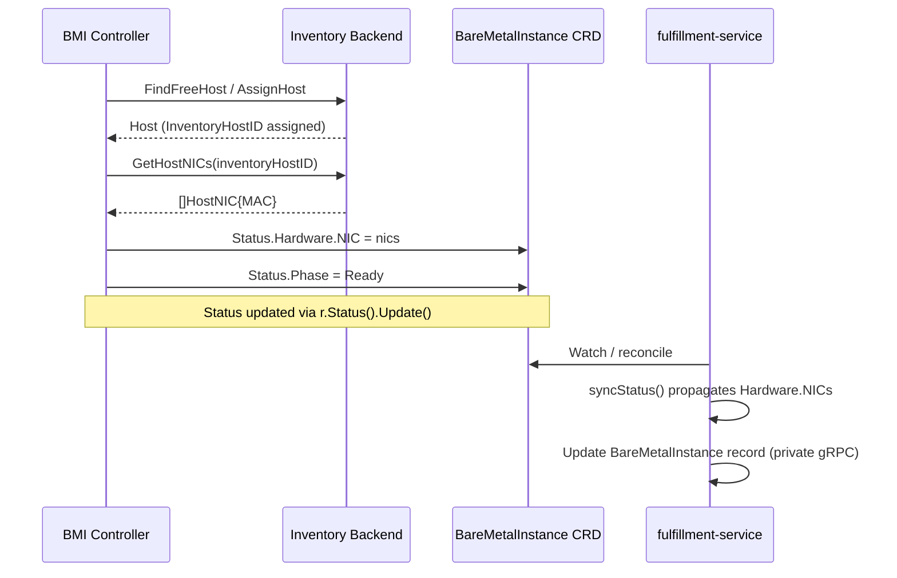

# Expose BareMetalInstance NIC MAC Addresses in Status

## Terminology

- **BareMetalInstance** — OSAC CRD representing a provisioned physical bare metal host, managed by the `bare-metal-fulfillment-operator`.
- **Inventory backend** — the system of record for physical host hardware. OSAC supports two backends: Metal3 (via Kubernetes `BareMetalHost` CRDs) and OpenStack/Ironic (via REST API).
- **Hardware inspection** — Metal3's automated process of enumerating a host's hardware (CPUs, RAM, NICs) before marking it `Available`. Inspection must complete before a host can be allocated.
- **NIC** — physical Network Interface Card; identified by its MAC address in both Metal3 and Ironic port records.

## Summary

This design extends `BareMetalInstance` status with physical network interface MAC addresses (`status.hardware.nics`) sourced from the bare metal inventory backend at allocation time. The primary driver is CaaS cluster installation: the Assisted Installer agent identifies itself by boot MAC address, and without that MAC on the `BareMetalInstance`, CaaS cannot programmatically correlate the agent to the provisioned host. MAC addresses are exposed via the fulfillment-service API, CLI, and OSAC web console. Both the Metal3 and OpenStack/Ironic inventory backends are supported. See [PRD](prd.md) for detailed requirements.

## Motivation

The `bare-metal-fulfillment-operator` allocates a physical host from an inventory backend (Metal3 or OpenStack/Ironic) and writes its identifier into `BareMetalInstance.spec.externalHostID`. The inventory backend already records the host's physical network interfaces — including MAC addresses — from its hardware inspection pass. This information is never surfaced to consumers.

The primary driver is CaaS cluster installation: when the Assisted Installer agent registers from a newly booted host, it identifies itself by its boot MAC address. Without that MAC address on the `BareMetalInstance` status, CaaS has no programmatic way to correlate the running agent to the provisioned instance, forcing manual lookup.

Secondarily, Tenant Users and administrators need basic host identity information (MAC addresses) to correlate physical hosts with network and hardware inventories.

MAC addresses are hardware-level identifiers. They do not change after a host is allocated. This makes the propagation problem a one-time fetch per `BareMetalInstance`, with no need for ongoing synchronization.

### Goals

- NIC MAC addresses are accessible to authorized consumers (CaaS, Tenant Users, admins) via the fulfillment-service API, CLI, and OSAC web console.
- NIC metadata is sourced from both Metal3 and OpenStack/Ironic inventory backends without backend schema changes.
- Tenant isolation boundaries are preserved: Tenant Users see only their own instances' NIC metadata.

### Non-Goals

- IP address tracking or IPAM (owned by the networking EP/design).
- Modifying the inventory backend schemas or APIs beyond reading existing data.
- Ongoing periodic re-synchronization of MAC addresses (they do not change post-allocation).
- Exposing full hardware specifications in status (covered by `BareMetalInstanceType`).
- Showing MAC addresses in `osac get baremetalinstances` list output (available via `osac describe baremetalinstance` only).

## Proposal

The feature extends `FindFreeHost` on both inventory backends to only return hosts that have NIC data available, then adds a `GetHostNICs` method to fetch those NICs after allocation. Because `FindFreeHost` guarantees NIC data exists for any selected host, an empty NIC list from `GetHostNICs` is not a valid operational state. If `GetHostNICs` returns a transient error, the instance stays in `Progressing` with a `Ready=False, Reason=NICMetadataUnavailable` condition and retries via controller-runtime's standard backoff. The fulfillment-service's existing controller reconciler function propagates the new status fields to the fulfillment-service database via the private gRPC API. New message types and fields are added to both the public and private proto `BareMetalInstanceStatus` messages. The `osac describe baremetalinstance` command renders a NIC table. MAC addresses are also accessible via the OSAC web console.

### Workflow Description

**Actors:** Cloud Provider Admin, Cloud Infrastructure Admin, Tenant Admin, Tenant User (read-only consumers of the status). The `bare-metal-fulfillment-operator` controller is the only writer.

**Starting state:** A `BareMetalInstance` CR has been created (by the fulfillment-service controller) and the `bare-metal-fulfillment-operator` is beginning reconciliation.

**Normal flow — NIC data available:**



The sequence above shows `GetHostNICs` called once immediately after allocation. The fulfillment-service controller reconciler picks up the updated CRD status on the next watch event and propagates the NIC fields to the fulfillment-service database, making them available via Get and List API calls and the CLI.

**Error flow — transient backend failure or missing NIC data:**

If `GetHostNICs` returns a transient error, the controller sets `Ready=False, Reason=NICMetadataUnavailable` on the instance and returns an error, keeping the instance in `Progressing`. controller-runtime's standard backoff requeue retries automatically. `FindFreeHost` guarantees NIC data exists on the backend for any selected host, so a transient error resolves when the backend recovers. An empty NIC list is not a reachable operational state — both backends now filter out hosts without inventory data in `FindFreeHost`.

**Idempotency:** If `Status.Hardware` is non-nil and contains at least one NIC, the controller skips `GetHostNICs` — MACs are immutable post-allocation. This avoids redundant inventory calls on re-reconciles of already-Running instances.

**Consumer read path:**

Any OSAC persona with access to a `BareMetalInstance` (tenant-scoped for Tenant Users/Admins, cross-tenant for Cloud Provider Admin and Cloud Infrastructure Admin) can read NIC metadata via:
- `GET /api/fulfillment/v1/baremetal_instances/{id}` → `status.hardware.nics`
- `GET /api/fulfillment/v1/baremetal_instances` → `items[*].status.hardware.nics`
- `osac describe baremetalinstance <name>` → Network Interfaces table
- OSAC web console → BareMetalInstance detail view

**CLI output example:**

`osac describe baremetalinstance my-bmi`:
```
ID:           abc-123
Catalog Item: gpu-node
State:        RUNNING

Network Interfaces:
  MAC
  aa:bb:cc:dd:ee:01
  aa:bb:cc:dd:ee:02
  aa:bb:cc:dd:ee:03
```

A `Running` instance provisioned by this EP's controller version has NICs populated. Pre-existing Running instances may have `hardware: null` until their next reconcile after upgrade. The `N/A` display applies to instances still in `Progressing` (NIC fetch pending) or not yet backfilled.

### API Extensions

**Inventory client interface:** A new `GetHostNICs` method is added, returning a list of lowercased MAC addresses for an allocated host. Existing methods are unchanged.

**BareMetalInstance CRD status:** Two new types — `BareMetalNICStatus` (a MAC address) and `BareMetalHardware` (a list of NICs) — are added. `BareMetalHardware` is modeled after Metal3's hardware details structure to allow compatible future extensions (CPU, RAM, storage). The CRD status gains an optional `hardware` field, absent until the inventory backend provides data.

**BareMetalInstance proto (public and private):** Both protos gain `BareMetalNICStatus`, `BareMetalHardware`, and an optional `hardware` field on `BareMetalInstanceStatus`. Field numbers must be assigned at implementation time based on the current proto state (the private proto has one additional existing field relative to the public proto, so the next available number differs). The schema is identical in both:

```protobuf
message BareMetalNICStatus {
  // Hardware MAC address, lowercased (e.g. "aa:bb:cc:dd:ee:ff").
  string mac = N;
}

message BareMetalHardware {
  // Physical network interfaces reported by the inventory backend.
  repeated BareMetalNICStatus nics = N;
}

// Added to BareMetalInstanceStatus in both public and private protos:
optional BareMetalHardware hardware = N;
```

**CLI:** `osac describe baremetalinstance` gains a "Network Interfaces" section showing MAC addresses, or "N/A" when unavailable.

**Operational:** All changes are additive and optional; no schema migration is required. NIC fetch is idempotent — if the operator restarts before it completes, the next reconcile retries it.

### Implementation Details/Notes/Constraints

**Metal3:** `FindFreeHost` is extended to skip hosts with the `inspect.metal3.io: disabled` annotation or with no hardware inventory data populated. This mirrors the OpenStack port-check approach and ensures any selected host has NIC data available. The additional check is a single field read on the `BareMetalHost` object already fetched during selection — no extra API call is needed.

**OpenStack/Ironic:** No equivalent inspection gate exists, so host selection is extended to skip nodes with no registered ports. This adds one Ironic API call per candidate evaluated, incurred once per instance lifecycle.

**Mock update:** The inventory client mock must be regenerated after the interface change; all tests using the mock must be updated in the same PR.

## UX Alignment

The osac-ui TypeScript types are generated from the public proto. After this EP ships and types are regenerated, `status.hardware.nics` will be available to the UI. A separate osac-ui implementation task is required to display NICs in the BareMetalInstance detail view; that task depends on this EP's API changes landing first.

### Security Considerations

NIC metadata (MAC addresses) is read-only status information. It is included in the `BareMetalInstance` status object, which is already subject to the existing OPA tenant authorization boundary: a Tenant User can only read `BareMetalInstance` objects belonging to their own tenant. Cloud Provider Admin and Cloud Infrastructure Admin roles have cross-tenant read access per existing policy.

No new OPA policies, RBAC roles, or authorization logic are required. The metadata does not expose credentials, private keys, or configuration secrets.

MAC addresses could theoretically aid network reconnaissance. The existing tenant isolation ensures they are only visible to authorized parties.

MAC addresses originate from the inventory backend (trusted source, not user-controlled) and are validated at the CRD level; no additional sanitization is needed.

### Failure Handling and Recovery

| Failure | System behavior | User observes |
|---|---|---|
| `GetHostNICs` returns error (inventory API transiently down) | `Ready=False, Reason=NICMetadataUnavailable, Message=<error>` condition set; controller returns error; instance stays `Progressing`; standard backoff requeue | Instance stays `Progressing`; condition visible via `kubectl describe` or API |
| Metal3 host with inspection disabled or no hardware data | `FindFreeHost` skips the host; it is never allocated | No `BareMetalInstance` assigned to that host; allocation retries other candidates |
| OpenStack node with no ports (misconfigured inventory) | `FindFreeHost` skips the node; it is never allocated | No `BareMetalInstance` assigned to that host; allocation retries other candidates |
| fulfillment-service controller restarts mid-propagation | On resume, the reconciler re-reads CRD and propagates NIC fields | No inconsistency; propagation is idempotent |
| BareMetalInstance deleted before NIC fetch completes | Deletion path skips NIC fetch | No impact |
| NIC fetch succeeds but CRD status update fails | Controller returns error; reconcile retries; idempotency guard skips re-fetch | Transient delay; eventual consistency |

### RBAC / Tenancy

No new resources are introduced. NIC metadata is part of `BareMetalInstanceStatus`, which inherits the existing tenant isolation model:

- `BareMetalInstance` CRs are annotated with `osac.openshift.io/tenant` at creation time by the fulfillment-service controller.
- OPA policies enforce that Tenant Users can only read `BareMetalInstance` objects for their own tenant.
- Cloud Provider Admin and Cloud Infrastructure Admin have cross-tenant read access.

No changes to OPA policies, `osac.openshift.io/tenant` annotations, or RBAC roles are required.

### Observability and Monitoring

One new `BareMetalInstance` status condition is introduced:

| Condition Type | Status | Reason | When |
|---|---|---|---|
| `Ready` | `False` | `NICMetadataUnavailable` | `GetHostNICs` returns a non-nil error (transient inventory backend failure) |

No new Prometheus metrics are added. `GetHostNICs` failures cause the controller to return an error, incrementing the standard controller-runtime reconcile error counter. The `Ready=False, Reason=NICMetadataUnavailable` condition gives operators a persistent, structured signal queryable via `kubectl describe` or the API without relying on event scraping.

### Risks and Mitigations

| Risk | Mitigation |
|---|---|
| Metal3 `FindFreeHost` inspection check cost | Hardware inventory data is already fetched as part of `BareMetalHost` retrieval — the check is a field read on an already-fetched object. No extra API call is needed. |
| OpenStack `FindFreeHost` port-check cost | One extra `ports.List` call per candidate node during allocation. Bounded by number of candidates evaluated; incurred only once per instance lifecycle. Acceptable given allocation already involves network I/O. |
| Inventory backend transiently unreachable during `GetHostNICs` | Controller stays in `Progressing` and retries via standard backoff. Resolves automatically when backend recovers. |
| Interface extension breaks existing test mocks | Adding `GetHostNICs` to `Client` breaks all existing mock implementations. Mitigation: the implementation PR must update all mock usages in one pass. The CI `make test` target will fail if any mock is incomplete. |

### Drawbacks

Adding `GetHostNICs` to the `Client` interface creates a synchronous inventory API call in the reconcile hot path (once per newly-allocated `BareMetalInstance`). For Metal3 this is a k8s API call (low latency, cached by controller-runtime informers). For OpenStack it is an Ironic REST API call (external network call, potentially higher latency). In both cases the call runs after the inventory backend has already completed host inspection and provisioning — `AssignHost` returns only `Available` hosts, so the hardware work is done before `GetHostNICs` runs — making the incremental latency negligible.

## Alternatives (Not Implemented)

### Alternative 1: Store MAC in `BareMetalInstance.spec` rather than status

MAC addresses could be written to a spec field by the controller, making them immutable Kubernetes resources. This would simplify change detection (no status subresource needed).

**Rejected:** The Kubernetes convention is that status reflects observed system state, not desired state. MAC addresses are discovered from the inventory at runtime, not specified by the user. Writing discovered data to `spec` violates the spec/status boundary and would make the field immutable even if the host were reallocated (which is possible in future).

### Alternative 2: Separate `BareMetalNICInfo` CRD per host

A dedicated CRD could hold NIC metadata, owned by the `BareMetalInstance`.

**Rejected:** The MAC address list is small (typically 2–8 entries), fits naturally in status, and is inseparable from the instance's identity. A separate CRD adds operational complexity (garbage collection, cross-resource joins in the API) without benefit.

### Alternative 3: Retrieve MACs on demand (server-side join at query time)

The fulfillment-service could query the inventory backend directly at Get/List time, bypassing the operator entirely.

**Rejected:** The fulfillment-service has no inventory client and should not gain one — inventory access is the operator's responsibility. This approach would require significant new infrastructure, duplicate the inventory client, and introduce availability coupling between the public API and the inventory backend.

### Alternative 4: Periodic re-sync of NIC metadata

The controller could re-fetch NIC data on every reconcile cycle or on a fixed interval to handle potential drift.

**Rejected:** MAC addresses are hardware identifiers burned into NIC firmware. They do not change after allocation. One-time fetch is sufficient and avoids unnecessary inventory API load.

## Test Plan

### Unit Tests

**bare-metal-fulfillment-operator:**
- NIC fetch (Metal3): returns correct MAC list from hardware inspection data; MACs are lowercased.
- NIC fetch (OpenStack): returns correct MAC list from port records; auth-retry applies on authentication errors.
- Metal3 host selection: hosts with inspection disabled or without hardware inventory data are skipped; hosts with NIC data are included.
- OpenStack host selection: nodes with no ports are skipped; port API errors are treated as a skip; nodes with ports are included.
- Controller NIC gate: fetch is skipped when hardware data is already present (idempotency); `Ready=False, Reason=NICMetadataUnavailable` condition is set on backend API errors.
- fulfillment-service status propagation: `status.hardware.nics` is populated when CRD hardware data is present; field is cleared when absent.
- CLI describe: NIC table displayed when data is present; "N/A" when absent.

**Interface mock:** Regenerate the inventory client mock after the interface change; update all test usages in the same PR.

### Integration Tests

**bare-metal-fulfillment-operator (envtest):**
- Provision a `BareMetalHost` with inspection data; run the controller to completion; assert `status.hardware.nics` matches the host's NIC list with correct MAC values.
- Simulate a backend error; assert the instance stays `Progressing` with `NICMetadataUnavailable` condition set.

**fulfillment-service (kind cluster / integration tests):**
- Pre-populate a `BareMetalInstance` CRD with hardware data; run the fulfillment-service reconciler; assert `status.hardware.nics` in the fulfillment-service database matches the CRD.

### E2E Tests

**osac-test-infra (pytest):**
- Provision a `BareMetalInstance` against a Metal3 backend with known host hardware details; poll until `state = RUNNING`; assert `GET /api/fulfillment/v1/baremetal_instances/{id}` returns `status.hardware.nics` as a non-empty list containing the known host MAC addresses.
- Assert that a newly provisioned `Running` instance always has `status.hardware.nics` populated.
- Assert that a Tenant User cannot read `status.hardware` for a `BareMetalInstance` belonging to a different tenant (403 response).
- Assert that a Cloud Infrastructure Admin can read `status.hardware` for any tenant's `BareMetalInstance`.
- CLI: run `osac describe baremetalinstance <name>` and assert "Network Interfaces:" section is present with at least one MAC address.

## Graduation Criteria

**Dev Preview:** `status.hardware.nics` is populated for `Running` instances against at least one inventory backend (Metal3) in a CI environment. Happy path E2E test passes. No regressions in existing `BareMetalInstance` unit and integration test suites.

**Tech Preview:** Both Metal3 and OpenStack/Ironic backends validated in E2E. Error paths tested (transient inventory failure stays `Progressing`, OpenStack portless node not allocated). Tenant isolation E2E (403 for cross-tenant) passes. CLI `describe` output validated.

**GA:** CaaS boot-MAC correlation validated end-to-end against a real Metal3 backend. `Running` → `status.hardware.nics` populated invariant holds for instances provisioned by the new controller version.

## Upgrade / Downgrade Strategy

This EP adds optional status fields to `BareMetalInstance` (CRD and proto). No migration is required:
- Existing `Running` `BareMetalInstance` resources will have `hardware: null` after upgrade until their next reconcile. The controller will attempt `GetHostNICs` on the next reconcile event (e.g., spec change, annotation update, or operator restart) and populate `Hardware` if the inventory backend returns NIC data. Until then, MAC addresses are absent from the API response and CLI output; this is expected post-upgrade behavior and does not affect provisioning state. To trigger immediate backfill for all existing instances, restart the operator pod — controller-runtime re-enqueues all watched resources on startup.
- Downgrading the operator removes the `Hardware` field from the CRD schema; the Kubernetes API server drops unknown fields from stored objects on the next write, which is safe.
- Downgrading the fulfillment-service drops the proto fields from API responses; existing stored data is not affected (JSON serialization ignores unknown fields in newer DB rows).

## Version Skew Strategy

The `hardware` field is additive. During a rolling upgrade where some fulfillment-service instances are on the new version and some are on the old:
- Old fulfillment-service instances ignore `hardware` in proto responses (unknown field, dropped).
- New fulfillment-service instances return `hardware` to clients that support it; old clients ignore the field.

The operator and fulfillment-service are upgraded independently. An updated operator may write `Hardware` to the CRD before the fulfillment-service is updated to propagate them — this is safe; the new proto field is simply not yet surfaced in the API until the fulfillment-service is also updated.

## Support Procedures

**Instance stuck in Progressing:** If a `BareMetalInstance` stays in `Progressing` after allocation, check the `Ready` condition on the object in the hub cluster (`kubectl describe baremetalinstance <name> -n <namespace>`). A `Ready=False, Reason=NICMetadataUnavailable` condition indicates a transient inventory backend error. Check the condition message, operator logs, and inventory connectivity.

**Metal3 host never allocated:** If a Metal3 host is never selected by `FindFreeHost`, verify hardware inspection has completed and NIC data is populated (`kubectl get baremetalhost <name> -o jsonpath='{.status.hardware}'`). Hosts with `inspect.metal3.io: disabled` annotation or without hardware inventory data are excluded from allocation.

**OpenStack node never allocated:** If an OpenStack node is never selected by `FindFreeHost`, verify it has ports registered: `openstack baremetal port list --node <uuid>`. Nodes without ports are excluded from allocation.

## Infrastructure Needed

None.

---

## Provenance

Authored: draft @ design 0.8.0 - 7efcedb, workspace main @ a4b128a
Final: revise @ design 0.8.0 - 7efcedb, workspace main @ 4120194

> Context changed between draft and revise.

<!-- ai-workflow-provenance:{"schema_version":1,"provenance_kind":"session","workflow":"design","workflow_version":"0.8.0","ai_workflows":"7efcedb","source_repo":"4120194","source_repo_branch":"main","commits_behind_main":0,"commits_ahead_main":0,"main_ref":"main","phases":["draft","respond","respond","respond","respond","respond","respond","revise","respond","respond","respond","revise","revise","revise","revise","revise","revise","revise","revise"],"authoring_modes":["skill"],"context_changed":true,"origin_untracked":false} -->
