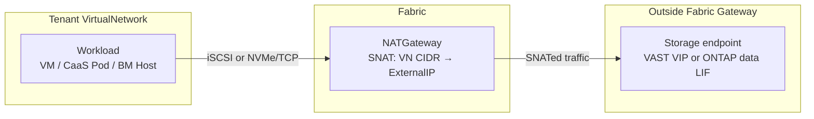

# Storage Networking (Phase 1)

## Summary

Provide network connectivity from OSAC tenant workloads (VMaaS, CaaS, BMaaS)
to VAST and NetApp ONTAP block-storage data endpoints outside the managed
network fabric gateway, using SNAT via the existing NATGateway primitive.
Introduce platform-level Storage CIDR reservations that prevent tenant
VirtualNetwork CIDRs from overlapping with VAST VIPs or NetApp ONTAP data
endpoints, ensuring storage-bound traffic routes externally rather than being
trapped in the fabric.

This design covers the VAST backend and NetApp ONTAP block storage through
Trident. NetApp connectivity in this IP-networking design uses iSCSI or
NVMe/TCP; Fibre Channel and other storage backends (such as Pure Storage and
Ceph) are out of scope. See [PRD](prd.md) for detailed requirements.

## Motivation

The storage subsystem (OSAC-1332, OSAC-1111) assumes "CaaS cluster nodes have
network reachability to the storage backend" without defining how that
reachability is achieved. Tenant workloads run inside isolated VirtualNetworks
on the OSAC fabric. VAST and NetApp ONTAP block data endpoints sit outside the
managed network fabric gateway. Without an explicit networking path, three
problems arise:

1. **No route to storage.** Tenant VirtualNetworks are fabric-isolated. Traffic
   destined for VAST VIPs or ONTAP data endpoints has no defined exit path.

2. **Silent IP overlap.** If a tenant's VN CIDR overlaps with a VAST VIP or
   ONTAP data endpoint range, the fabric routes those packets internally
   instead of externally. Storage access fails with no clear error.

3. **NAT capacity.** Block storage generates concurrent NVMe-TCP sessions and
   CSI operations through the NATGateway. There is no validation that the NAT
   pool supports this load.

The approach proposed here treats VAST and NetApp ONTAP block endpoints as
external services consumed via SNAT. It reuses existing networking primitives
(VirtualNetwork, NATGateway, ExternalIP) and avoids per-tenant VLAN
configuration on the storage arrays. Storage tenant isolation is not required
for the first phase.

### Goals

- Reuse existing networking primitives (NATGateway, ExternalIP, NetworkClass).
  No new CRDs or controllers for storage networking.
- Enforce Storage CIDR reservation via validation in the fulfillment-service,
  preventing VirtualNetwork CIDR overlap at creation time.
- Ensure the default tenant onboarding flow produces a storage-ready network
  configuration (NATGateway with external connectivity to VAST and NetApp
  ONTAP block data endpoints).
- Support all three consumer types: VMaaS (automatic via CSI), CaaS (automatic
  via CSI), and BMaaS (network path only, manual storage configuration).

### Non-Goals

- Storage tenant isolation at the network level (deferred to OSAC-5073).
  Per-tenant VAST VIP pools exist but are not network-isolated from each
  other in the first phase.
- Storage backends other than VAST and NetApp ONTAP, including Pure Storage
  and Ceph.
- Direct-attach, VLAN-based, SR-IOV, or RDMA storage networking paths.
- NFS or file storage — block storage only for the first phase.
- Per-subnet NAT granularity (NATGateway is per-VirtualNetwork).
- Network-level QoS or bandwidth reservation for storage traffic.
- East-west GPU-to-storage paths (deferred per OSAC-1382).

## Current Storage Architecture

This section describes how storage works today for each OSAC service type
and storage protocol, and what each path requires from the network.
Understanding the baseline motivates why the changes proposed in this design
are necessary — and why they are sufficient for the first phase.

This design covers VAST and NetApp ONTAP block storage. VAST-specific
examples below use the VAST CSI driver and VIP pools; NetApp ONTAP uses Trident
and its IP-based SAN data endpoints. The shared networking change reserves
and routes the data-plane destination ranges for both providers. Other
backends may require different networking considerations and remain out of
scope.

### Storage Protocols

VAST exposes block and file protocols. This design's connectivity scope is
block storage. NetApp ONTAP block storage uses Trident with an IP-based SAN
protocol:

| Provider | Protocol | CSI driver | Data transport | StorageClass Binding Mode |
|----------|----------|------------|---------------|---------------------------|
| VAST | **Block** | `block.csi.vastdata.com` | NVMe/TCP (TCP port 4420) | `WaitForFirstConsumer` |
| VAST | File (NFS) | `csi.vastdata.com` | NFS (TCP port 2049) | `Immediate` |
| NetApp ONTAP | **Block** | Trident `ontap-san` | iSCSI or NVMe/TCP | Configured by StorageClass |

VAST block volumes connect to VAST VIP addresses managed by the VAST cluster.
Each tenant receives a dedicated VAST VIP pool (e.g.,
`osac-<tenant>-vippool`). NetApp ONTAP block volumes connect to ONTAP data
endpoints through Trident. The Storage CIDRs defined in this design cover
both providers' block data-plane destination addresses. Trident documents
iSCSI and NVMe/TCP as block protocols for its ONTAP SAN driver; Fibre Channel
does not use this IP/SNAT path and is excluded ([NetApp Trident 25.10 ONTAP
SAN driver overview](https://docs.netapp.com/us-en/trident-2510/trident-use/ontap-san.html)).

For ONTAP, the Storage CIDR covers the data endpoints used by the node-side
initiator (including iSCSI LIFs discovered by Trident or configured NVMe/TCP
data LIFs). The ONTAP management LIF used by Trident's controller is a
separate control-plane endpoint; its reachability is configured separately
from this tenant data-plane path ([NetApp Trident 25.10 SAN configuration](https://docs.netapp.com/us-en/trident-2510/trident-use/ontap-san-examples.html)).

LVMS (node-local block storage via topolvm) is available for single-node
development VMaaS deployments. It uses local disks and has no network
requirements — it is excluded from this analysis.

### Storage Control Plane: OSAC CSI Meta-Driver

The OSAC CSI meta-driver (`csi.osac.openshift.io`, OSAC-2872) decouples
tenant clusters from vendor-specific storage drivers. Tenant clusters see a
single CSI identity; the meta-driver routes each CSI operation to the
correct vendor plugin based on `volume_context["osac.backend"]`:

- **Controller plugin** (Deployment on hub): CreateVolume calls the
  fulfillment-service Volume API, which creates a Volume CR on the hub.
  The osac-operator's VolumeReconciler calls the vendor CSI controller
  (e.g., VAST) to provision the actual volume. ControllerPublishVolume
  proxies to the vendor controller using opaque `vendor_context` (subsystem,
  vip_pool_name).
- **Node plugin** (DaemonSet on target cluster): NodeStageVolume and
  NodePublishVolume route to vendor node plugins via `--vendor-sockets`
  mapping. The VAST node plugin initiates NVMe/TCP connections for block
  volumes; the NetApp Trident node plugin initiates iSCSI or NVMe/TCP
  connections to ONTAP data endpoints on the node where kubelet runs.

**Storage data-plane traffic always originates from the node running the CSI
node plugin** — not from inside a VM guest. This distinction is critical for
understanding VMaaS networking requirements.

### Storage Onboarding: Two-Stage Model

All managed services follow a two-stage onboarding model:

- **Stage 1 — backend setup:** The StorageReconciler creates the tenant's
  VAST resources — tenant account, views, QoS policies, VIP pool,
  per-tenant Manager credentials. This runs on the hub cluster and
  communicates with the VAST management API. The results are stored in a
  hub Secret (`vast-tenant-config-<tenant>`). Stage 1 is a control-plane
  operation with no tenant-network dependency.

- **Stage 2 — cluster-side setup:** AAP installs the OSAC CSI meta-driver,
  VAST CSI backends (via the `csi-backends` Helm chart), a CSI Secret
  with per-tenant credentials, and per-tenant StorageClasses on the target
  cluster. StorageClasses are labeled with `osac.openshift.io/tenant`,
  `osac.openshift.io/storage-tier`, and `osac.openshift.io/storage-protocol`.

The trigger for each stage differs by service:

| Service | Stage 1 Trigger | Stage 2 Target | Stage 2 Trigger |
|---------|----------------|----------------|-----------------|
| **VMaaS** | Tenant `Phase=Ready` | VMaaS target cluster (shared) | Same as Stage 1 |
| **CaaS** | Tenant `Phase=Ready` | Per-tenant CaaS cluster | `ClusterOrder.Phase=Ready` (OSAC-1332) |
| **BMaaS** | — | — | — (tenant-managed) |

### VMaaS Storage

#### How It Works

VMaaS VMs run as KubeVirt pods on a shared VMaaS target cluster (the hub
cluster or a dedicated management cluster). Both storage stages run during
tenant onboarding. After onboarding, the VMaaS target cluster has the OSAC
CSI meta-driver, provider-specific CSI backends and credentials, and per-tenant
StorageClasses. VAST uses its CSI backend; NetApp ONTAP uses Trident.

**Block:** When a VM's PVC uses a block StorageClass, the OSAC CSI meta-driver
routes CreateVolume through the fulfillment-service to the selected backend
controller. At mount time, kubelet calls NodeStageVolume on the **OCP node**
where the VM pod is scheduled. The VAST node plugin connects to the tenant's
VAST VIP over NVMe/TCP; the NetApp Trident node plugin connects to ONTAP data
endpoints over iSCSI or NVMe/TCP. The resulting block device is presented to
the VM via virtio.

**File (NFS via CSI):** The flow is identical through volume creation. At
mount time on the OCP node, the VAST node plugin performs an NFS mount to
the tenant's VAST VIP. The mounted filesystem is projected into the VM pod.

**File (NFS via VM guest mount):** A VM can also mount NFS directly from
the guest OS using its tenant VirtualNetwork NIC, bypassing the CSI driver
entirely. The NFS traffic in this case originates from the VM guest, not the
OCP node.

#### Networking Requirements

VMaaS has **two distinct data-plane paths** depending on whether storage I/O
originates from the OCP node (CSI) or the VM guest (direct mount). For block
storage, the endpoint and IP protocol depend on whether VAST or NetApp ONTAP
is selected:

```
Block / NFS via CSI:
  OCP node (CSI node plugin)
    → backend block protocol to VAST VIP or ONTAP data endpoint
    → exits management cluster network via management SNAT
    → routes to storage backend (outside fabric gateway)

NFS via VM guest mount:
  VM guest (tenant VN NIC)
    → NFS to VAST VIP
    → exits tenant VirtualNetwork via NATGateway (SNAT)
    → routes to VAST (outside fabric gateway)
```

| Requirement | CSI path (block and NFS) | VM guest mount path (NFS only) |
|-------------|--------------------------|--------------------------------|
| **Traffic origin** | OCP node (management network) | VM guest (tenant VirtualNetwork) |
| **SNAT provider** | Management cluster's own NAT or direct routing | Tenant VN's NATGateway + ExternalIP |
| **Outbound TCP** | VAST NVMe/TCP, NetApp iSCSI or NVMe/TCP; NFS is existing architecture context only | NFS port 2049 (out of scope) |
| **No inbound from storage** | Yes — all connections client-initiated | Yes |
| **CIDR overlap risk** | Management network CIDR vs. backend data endpoints (admin responsibility) | Tenant VN CIDR vs. backend data endpoints (this design prevents it) |

The CSI path (used for PVC-based block storage) depends on the management
cluster's network having a route to the selected backend's data endpoints. This is an infrastructure
prerequisite configured at deployment time — the management cluster's
network is admin-controlled, not tenant-controlled.

The VM guest mount path depends on the tenant VN's NATGateway, which is the
path that the Storage CIDR reservation in this design protects.

### CaaS Storage

#### How It Works

CaaS clusters are Hosted Control Plane (HyperShift) clusters with
bare-metal worker nodes placed on tenant Subnets via the OSAC Networking
API. Stage 1 runs during tenant onboarding. Stage 2 is triggered when a
ClusterOrder reaches `Phase=Ready` — the StorageReconciler retrieves the
cluster's admin kubeconfig via the HostedControlPlane API and triggers AAP
to install the OSAC CSI meta-driver and per-tenant StorageClasses on the
CaaS cluster. A `ClusterStorageReady` condition on the ClusterOrder tracks
completion.

CaaS clusters use provider-specific StorageClass properties. The table shows
the existing VAST classes; NetApp ONTAP uses Trident with iSCSI or NVMe/TCP
for block volumes.

| Property | File (NFS) | Block |
|----------|------------|-------|
| Provisioner | `csi.vastdata.com` | `block.csi.vastdata.com` |
| Binding mode | `Immediate` | `WaitForFirstConsumer` |
| Reclaim policy | `Delete` | `Delete` |

**Block:** The OSAC CSI meta-driver routes CSI controller operations through
the fulfillment-service on the hub. At mount time on the CaaS **bare-metal
worker node**, the selected node plugin initiates the configured block
protocol (VAST NVMe/TCP or NetApp ONTAP iSCSI/NVMe-TCP) to the backend data
endpoint.

**File (NFS):** Same flow, with NFS mount instead of NVMe-TCP at the worker
node level.

#### Networking Requirements

CaaS worker nodes are bare-metal servers whose fabric ports are moved from
the provisioning network to the tenant Subnet during provisioning
(OSAC-2135). After provisioning, each worker node is directly on the
tenant's fabric segment within the VirtualNetwork. Unlike VMaaS, **there is
only one data-plane path** — all CSI traffic originates from the CaaS worker
node, which is on the tenant VN.

```
CaaS worker node (CSI node plugin, on tenant VN)
  → VAST NVMe/TCP or NetApp iSCSI/NVMe-TCP to backend data endpoint
  → exits tenant VirtualNetwork via NATGateway (SNAT)
  → routes to storage backend (outside fabric gateway)
```

| Requirement | Detail |
|-------------|--------|
| **Outbound block traffic** | VAST NVMe/TCP or NetApp ONTAP iSCSI/NVMe/TCP to configured data endpoints |
| **NATGateway on VirtualNetwork** | Worker nodes use the VN's NATGateway for egress. Storage data endpoints are outside the fabric gateway. |
| **No inbound from storage** | All storage connections are client-initiated. |
| **No VN CIDR overlap with storage endpoints** | If the VN CIDR overlaps, the fabric routes storage traffic internally — storage silently fails. |

### BMaaS Storage

#### How It Works

BMaaS provides bare-metal hosts to tenants. No automated storage onboarding
runs for BMaaS — there is no Stage 1 or Stage 2. BMaaS tenants are
responsible for all storage configuration on their hosts.

**Block:** The tenant configures the applicable initiator on the host. For
VAST this is NVMe/TCP to the tenant's VIP pool; for NetApp ONTAP it is iSCSI
or NVMe/TCP to the ONTAP data endpoints. The tenant manages storage credentials
and configuration.

**File (NFS):** The tenant mounts VAST NFS exports directly using standard
NFS client tools, pointing to the VAST VIP.

#### Networking Requirements

BMaaS hosts are provisioned on a tenant Subnet. During provisioning, the
bare-metal-fulfillment-operator moves the host's fabric port from the
provisioning network to the tenant network (OSAC-1437). After provisioning,
the host has a fabric IP on the tenant Subnet and uses the VN's NATGateway
for external connectivity.

```
BM host (tenant VN)
  → VAST NVMe/TCP or NetApp iSCSI/NVMe-TCP to backend data endpoint
  → exits tenant VirtualNetwork via NATGateway (SNAT)
  → routes to storage backend (outside fabric gateway)
```

| Requirement | Detail |
|-------------|--------|
| **Outbound block traffic** | VAST NVMe/TCP or NetApp ONTAP iSCSI/NVMe-TCP to configured data endpoints |
| **NATGateway on VirtualNetwork** | Same SNAT path as CaaS |
| **No inbound from storage** | All storage connections are client-initiated |
| **No VN CIDR overlap with storage endpoints** | Same risk as CaaS |
| **Tenant-managed configuration** | Unlike VMaaS/CaaS, the tenant installs and configures storage software. The platform provides the network path only. |

### Summary: Data-Plane Paths to Block Storage

File-protocol rows below describe existing architecture only; file storage is
out of scope for this phase.

| Service | Protocol | Traffic Origin | Network Path | SNAT Provider |
|---------|----------|----------------|--------------|---------------|
| **VMaaS** | Block (VAST NVMe/TCP or NetApp iSCSI/NVMe/TCP) | OCP node (CSI) | Management network | Management cluster NAT / direct routing |
| **VMaaS** | File (NFS via CSI) | OCP node (CSI) | Management network | Management cluster NAT / direct routing |
| **VMaaS** | File (NFS guest mount) | VM guest | Tenant VirtualNetwork | Tenant NATGateway |
| **CaaS** | Block (VAST NVMe/TCP or NetApp iSCSI/NVMe/TCP) | BM worker node (CSI) | Tenant VirtualNetwork | Tenant NATGateway |
| **CaaS** | File (NFS) | BM worker node (CSI) | Tenant VirtualNetwork | Tenant NATGateway |
| **BMaaS** | Block (VAST NVMe/TCP or NetApp iSCSI/NVMe/TCP) | BM host | Tenant VirtualNetwork | Tenant NATGateway |
| **BMaaS** | File (NFS) | BM host | Tenant VirtualNetwork | Tenant NATGateway |

CaaS, BMaaS, and VMaaS guest-mount paths share the same data-plane pattern:
tenant VirtualNetwork → NATGateway (SNAT) → upstream routing → backend block
data endpoint. The Storage CIDR reservation prevents tenant VN CIDRs from
overlapping with VAST VIPs or NetApp ONTAP data endpoints, ensuring this path
works by construction.

VMaaS CSI-based storage takes a different path through the management
cluster's network. The management cluster's route to the selected backend's
block data endpoint is an infrastructure prerequisite — the admin ensures this during
deployment, and the management network's CIDR is admin-controlled (not
subject to tenant VN creation). The Storage CIDR reservation does not
directly protect this path, but since the management network is not
tenant-managed, there is no risk of accidental overlap.

## Proposal

### Overview of Changes

The design introduces three changes to the existing platform:

1. **Storage CIDRs on NetworkClass** — a new field on the NetworkClass
   configuration that declares the IP ranges reserved for VAST VIPs and
   NetApp ONTAP block data endpoints. These are set once at installation time.

2. **VirtualNetwork CIDR validation** — the fulfillment-service rejects
   VirtualNetwork creation requests whose IPv4 CIDR overlaps with the Storage
   CIDR. This prevents tenants from creating networks that would trap
   storage-bound traffic in the fabric.

3. **Default networking validation** — the NetworkClass default VN CIDR is
   validated against the Storage CIDR at configuration time, ensuring
   auto-provisioned tenant networks are storage-ready.

No new controllers, CRDs, or networking resources are introduced. The existing
NATGateway (one per VirtualNetwork, auto-provisioned during tenant onboarding)
provides the SNAT path from tenant workloads to VAST and NetApp ONTAP block
data endpoints.

### Changes Per Component

All components live in the `osac` monorepo.

| Component | Changes |
|---|---|
| **fulfillment-service** | Add `storage_cidrs` field to NetworkClass. Add CIDR overlap validation to VirtualNetwork creation. Validate NetworkClass default VN CIDR against storage CIDRs. |
| **proto** | Add `storage_cidrs` to the NetworkClass proto definition. |
| **osac-operator** | No changes. NATGateway already provides SNAT for all egress from a VirtualNetwork. |
| **osac-aap** | No changes. This proposal changes network reachability and CIDR validation; provider-specific CSI provisioning remains with the existing storage integrations. |
| **osac-installer** | Update NetworkClass manifests to include the Storage CIDR for the deployment. |

### Workflow Description

#### Network Path: Tenant Workload → Block Storage Endpoint



This diagram shows the data-plane path for block storage access. A workload
inside a tenant VirtualNetwork initiates an IP-based block connection to a
VAST VIP or NetApp ONTAP data endpoint. Because the destination falls outside
the VN CIDR (enforced by the overlap validation), the fabric routes the packet
externally through the NATGateway. The NATGateway performs SNAT, replacing the
workload's private source IP with the NATGateway's ExternalIP. The storage
system sees the ExternalIP as the source and responds to it. Return traffic
follows the reverse NAT path back to the workload.

#### Personas

- **Cloud Infrastructure Admin:** Configures Storage CIDRs on
  NetworkClass at installation time. Provisions ExternalIPPools and
  ExternalIPs for NATGateways.
- **Cloud Provider Admin:** Validates that the deployment's default VN CIDR
  does not conflict with the Storage CIDRs. Coordinates with VAST and NetApp
  administrators to ensure block data endpoint addresses fall within the
  configured ranges.
- **Tenant Admin / Tenant User:** Creates VirtualNetworks (or uses defaults).
  Receives a clear error if the chosen CIDR overlaps with the storage range.
  CaaS and VMaaS block storage works through the selected VAST or NetApp ONTAP
  CSI integration once the network is provisioned.
- **BMaaS Tenant:** Has network connectivity to VAST or NetApp ONTAP through
  the fabric's external path. Configures storage on bare-metal hosts manually.

#### Prerequisites

1. NetworkClass is configured with Storage CIDRs. The ranges must cover the
   block data-plane IP addresses that tenant workloads or CSI node plugins may
   connect to:
   - The **VAST data-plane VIP pool range** — this is the
     `VAST_VIP_POOL_SUPERNET` configured on the storage-operations
     InstanceGroup (e.g., `10.100.0.0/22`). If VIP pools are pre-created
     by the cloud admin rather than carved from the supernet,
     `storage_cidrs` must cover those pool ranges as well.
   - The **NetApp ONTAP block data endpoints** — include the IP addresses of
     the iSCSI or NVMe/TCP data LIFs used by Trident. The ONTAP management LIF
     is a separate controller endpoint and is not part of this tenant
     data-plane range unless tenant nodes also connect to it.
   - The **VAST management endpoint** (VMS API) — if its IP is routable
     from tenant networks. The CSI node plugin on each target cluster
     contacts the VMS API (`X_CSI_VMS_HOST`) for volume publish/unpublish
     operations. If the management endpoint is on the same data network as
     the VIP pools, the supernet already covers it. If it is on a separate
     management network that is not routable from tenant VNs, it does not
     need to be included.
2. Tenant onboarding has completed, creating a default VirtualNetwork,
   Subnet, and NATGateway with an ExternalIP.
3. The ExternalIP used by the NATGateway is routable to the VAST and NetApp
   ONTAP block data endpoints covered by the Storage CIDRs (via upstream
   routing).

#### VMaaS and CaaS Storage Access

No additional steps beyond standard tenant onboarding and storage onboarding
(OSAC-1332). When the selected storage integration provisions its CSI driver
and StorageClasses on the tenant's cluster, block traffic connects to the
configured VAST VIP pool or NetApp ONTAP data endpoints. The storage traffic
exits the VirtualNetwork through the NATGateway and reaches the selected
backend. PersistentVolumeClaims work without tenant intervention.

#### BMaaS Storage Access

BMaaS hosts are provisioned on a tenant Subnet within a VirtualNetwork.
The NATGateway provides outbound connectivity to VAST and NetApp ONTAP block
data endpoints. The tenant must install and configure the applicable storage
client manually on the bare-metal host.

### API Extensions

#### NetworkClass: `storage_cidrs` Field

A new repeated field on the NetworkClass configuration:

```protobuf
message NetworkClassConfig {
  // ... existing fields ...

  // CIDR ranges reserved for storage backend addresses.
  // VirtualNetwork creation is rejected if the VN's IPv4 CIDR
  // overlaps with any of these ranges.
  // Configured at installation time. Immutable after initial set.
  repeated string storage_cidrs = N;
}
```

The field is a list of CIDR strings (e.g., `["198.51.100.0/24"]`). Using a
list rather than a single CIDR accommodates deployments where VAST VIPs and
NetApp ONTAP data endpoints span multiple non-contiguous ranges.

Validation rules:
- Each entry must be a valid IPv4 CIDR in canonical form.
- Entries must not overlap with each other.
- The field is immutable after initial configuration (preventing accidental
  removal that would allow conflicting VNs to be created).

#### VirtualNetwork CIDR Validation

The fulfillment-service's VirtualNetwork creation handler adds an overlap
check:

```
For each CIDR in NetworkClass.storage_cidrs:
  If VirtualNetwork.ipv4_cidr overlaps with CIDR:
    Reject with INVALID_ARGUMENT:
      "VirtualNetwork CIDR {vn_cidr} overlaps with storage range
       {storage_cidr}. Choose a CIDR that does not overlap with
       storage ranges."
```

This check runs alongside existing VN validation (CIDR format, immutability).
The error message names both CIDRs so the tenant can make an informed choice.

#### NetworkClass Default VN CIDR Validation

When a NetworkClass is created or updated, the fulfillment-service validates
that `defaults.virtual_network_cidr` does not overlap with any entry in
`storage_cidrs`. This prevents the auto-provisioned default VN from
conflicting with storage.

No existing resources are modified by this enhancement. The new field is
additive to NetworkClass, and the validation is a new precondition on
VirtualNetwork creation.

## UX Alignment

No `@temp-api` file exists for NetworkClass or VirtualNetwork in osac-ux.
Storage CIDR configuration is an admin-level installation concern with
no UI surface in the first phase.

### Implementation Details/Notes/Constraints

#### CIDR Overlap Detection

The overlap check is a standard prefix containment test: two CIDRs overlap if
either contains the other's first address or last address. Go's `net.IPNet`
provides `Contains()` for this. The check is O(n) in the number of
`storage_cidrs` entries, which is expected to be small.

#### Routing Guarantee

The Storage CIDR reservation ensures correctness by construction:

1. VAST VIPs and NetApp ONTAP block data endpoints are within the Storage CIDRs.
2. No tenant VirtualNetwork CIDR overlaps with the Storage CIDR.
3. Therefore, when a workload sends a packet to a storage data endpoint, the
   destination does not match the VN's local CIDR.
4. The fabric treats it as external traffic and routes it through the
   NATGateway (SNAT) to the upstream network.
5. The upstream network routes to the selected storage backend (standard IP
   routing).

This avoids any fabric-level routing table changes or special storage-aware
routing rules. The fabric's default behavior — route non-local traffic
externally — is sufficient.

#### NAT Capacity Considerations

Each IP-based block-storage session to VAST or NetApp ONTAP uses TCP
connections through the NATGateway. The exact number depends on backend,
protocol, and multipathing configuration. The NATGateway performs source NAT
using its ExternalIP. A single ExternalIP supports approximately 64k concurrent
connections (limited by the ephemeral port range).

For the first phase, the expected scale is:
- Single-digit tenants, each with a small number of clusters or VMs.
- Each cluster or VM mounts a small number of PersistentVolumes.
- Each PV produces one or more protocol-specific storage sessions.

A single ExternalIP per NATGateway is sufficient for this scale. If future
scale exceeds this, the NATGateway can be extended to support multiple
ExternalIPs (out of scope for the first phase).

#### BMaaS Connectivity

BMaaS hosts are provisioned on a tenant Subnet and have access to the
NATGateway for external connectivity. The same SNAT path that provides
internet access also provides access to VAST and NetApp ONTAP block endpoints.
No BMaaS-specific networking changes are needed.

The BMaaS tenant is responsible for installing and configuring the chosen
storage client, identifying the VAST VIP or NetApp ONTAP data endpoint, and
managing storage credentials for their workloads.

#### Interaction with Storage Onboarding

The storage onboarding flow (OSAC-1332) installs provider-specific CSI
components and connection parameters on tenant clusters. VAST uses a tenant
VIP pool; NetApp ONTAP uses Trident with its configured data endpoints. This
design does not change either provider's CSI provisioning or credentials. It
ensures the block data-plane network path (NATGateway → external routing →
backend endpoint) is available.

### Security Considerations

This design inherits the existing security model without changes:

- **Network isolation.** VirtualNetworks remain fabric-isolated. The
  NATGateway provides controlled egress. No new ingress paths are created.
- **Storage credentials.** Provider-specific credentials and CSI setup remain
  unchanged by this network design.
- **No DNAT.** Storage backends do not initiate connections to tenant
  workloads. All block data connections are outbound (client-to-server), using
  SNAT only.
- **Storage CIDR.** The CIDR is configured by the Cloud Infrastructure
  Admin at installation time and is immutable. Tenants cannot modify or
  bypass it.

### Failure Handling and Recovery

| Failure Mode | Behavior | Recovery | User Observes |
|---|---|---|---|
| NATGateway not provisioned on VN | No external connectivity from VN. Storage unreachable. | Default tenant onboarding creates NATGateway. If missing, admin provisions one manually. | Connection timeouts on PVC mount. |
| NATGateway ExternalIP not routable to storage endpoints | SNAT succeeds but packets do not reach VAST or NetApp ONTAP. | Admin fixes upstream routing to ensure ExternalIP pool can reach the Storage CIDRs. | Connection timeouts on PVC mount. |
| Storage CIDRs not configured on NetworkClass | No overlap validation. Tenants can create VNs that conflict with VAST VIPs or ONTAP data endpoints. | Admin configures the field before tenant onboarding. VNs created before configuration are not retroactively validated. | Storage may or may not work depending on whether the tenant VN CIDR happens to overlap. |
| NAT port exhaustion | New NVMe-TCP / NFS sessions fail. Existing sessions continue. | Reduce concurrent PV count, or (future) expand NAT pool. | PVC mount hangs for new volumes. Existing volumes continue working. |
| VAST or NetApp ONTAP data endpoint unreachable | Storage connections time out. CSI operations fail. | Restore the storage endpoint or upstream network path. | PVC provisioning fails. Existing mounted volumes may hang. |

### RBAC / Tenancy

No RBAC or tenancy changes required. The Storage CIDR is a
platform-level (NetworkClass) configuration managed by the Cloud
Infrastructure Admin. VirtualNetwork CIDR validation is enforced by the
fulfillment-service for all tenants uniformly. Storage tenant isolation is
explicitly not required for the first phase.

### Observability and Monitoring

No new metrics, events, or alerts are introduced. The existing fulfillment-service
request metrics cover the VirtualNetwork creation path (including rejection
due to CIDR overlap). The existing NATGateway and ExternalIP status conditions
provide visibility into the NAT path health.

Operators debugging storage connectivity issues should check:
1. VirtualNetwork has a NATGateway in Ready state.
2. NATGateway's ExternalIP is Allocated and routable.
3. Upstream routing allows ExternalIP → Storage CIDR.
4. VAST VIP pools or NetApp ONTAP data endpoints are healthy and reachable.

### Risks and Mitigations

| Risk | Mitigation |
|---|---|
| Admin forgets to configure Storage CIDR before tenant onboarding | Document as a required installation step. Future: add a preflight check that warns if storage backends are registered but no Storage CIDR is configured. |
| Existing VNs (created before Storage CIDR is configured) have overlapping CIDRs | The validation applies only to new VN creation. Existing VNs are not retroactively checked. Document that the Storage CIDR must be configured before the first tenant is onboarded. |
| VAST VIP addresses change after deployment | The Storage CIDR is a superset range, not the exact VIP list. As long as new VIPs are allocated within the same CIDR, no platform changes are needed. If the range changes entirely, a new NetworkClass with updated storage_cidrs is required. |
| NetApp ONTAP data endpoint addresses change | Keep ONTAP data LIF addresses within the configured Storage CIDRs and update upstream routing when endpoints change. |
| Single ExternalIP per NATGateway limits NAT capacity | Sufficient for the first phase scale. Monitor connection counts. Future: extend NATGateway to support multiple ExternalIPs. |

### Drawbacks

The approach assumes VAST and NetApp ONTAP block endpoints are external and
reachable via SNAT. This adds latency compared to direct-attach or VLAN-based
storage paths, and NAT adds a throughput constraint. For the first phase this is acceptable — performance-critical
storage networking (GPU-to-storage, RDMA) is explicitly deferred.

The Storage CIDR is a blunt instrument: it reserves an entire range from
all tenants, even those that don't use storage. For the first phase with
single-digit tenants this is not a problem, but a more granular approach may
be needed at scale.

## Alternatives (Not Implemented)

### 1. Per-Tenant VLAN to Storage

Provision a dedicated VLAN per tenant on each storage array, giving each
tenant direct L2 connectivity to its block data endpoints.

**Pros:** No NAT overhead. True network isolation per tenant.
**Cons:** Requires VLAN configuration on the VAST or NetApp ONTAP storage array
for each tenant.
Significantly more complex operationally. Does not scale within the first
phase timeframe.
**Rejected:** The JIRA feature description explicitly calls for "the simplest
viable connectivity solution." Per-tenant VLANs are the opposite.

### 2. Direct-Attach Storage Network

Use a dedicated storage NIC (the `storage` role on HostType/BareMetalInstanceType)
to connect workloads directly to the VAST network without NAT.

**Pros:** Best performance. No NAT port limits. Suitable for high-throughput
storage workloads.
**Cons:** Requires dedicated NICs, switch configuration, and a separate
storage network fabric. Not available in all deployments. Much more complex.
**Rejected:** Deferred to a future enhancement for performance-sensitive
workloads. Not viable for the first phase.

### 3. No CIDR Reservation (Documentation-Only)

Document that admins must choose non-overlapping CIDRs but do not enforce it
in the platform.

**Pros:** No code changes required.
**Cons:** Silent failures when CIDRs overlap. Debugging storage connectivity
issues caused by routing conflicts is extremely difficult.
**Rejected:** The failure mode (storage silently unreachable) is too severe
and hard to diagnose. Platform-enforced validation is worth the small
implementation cost.

### 4. Fabric-Level Static Routes

Configure static routes in Netris to force traffic destined for VAST VIPs to
exit the fabric, regardless of VN CIDR overlap.

**Pros:** No CIDR reservation needed. Works even with overlapping ranges.
**Cons:** Requires fabric-manager-specific configuration. Breaks the
abstraction that the fabric manager handles all routing. Different fabric
managers would need different implementations.
**Rejected:** Adds fabric-specific complexity. CIDR reservation is simpler
and fabric-agnostic.

## Open Questions

None. All questions resolved during drafting.

## Test Plan

### Unit Tests

- VirtualNetwork CIDR overlap validation: reject creation when VN CIDR
  overlaps with any entry in `storage_cidrs`. Accept when no overlap.
  Cover partial overlap, containment in both directions, adjacent
  non-overlapping ranges, and empty `storage_cidrs`.
- NetworkClass validation: reject default VN CIDR that overlaps with
  `storage_cidrs`. Accept non-overlapping defaults.
- `storage_cidrs` field validation: reject malformed CIDRs, reject
  overlapping entries within the list, accept valid non-overlapping CIDRs.
- Immutability: reject attempts to modify `storage_cidrs` after initial
  configuration.

### Integration Tests

- End-to-end tenant onboarding with Storage CIDR configured: verify
  default VN is created with non-overlapping CIDR, NATGateway is provisioned,
  and the network path to an external endpoint is functional.
- VirtualNetwork creation rejection: configure Storage CIDR, attempt
  to create a VN with overlapping CIDR, verify rejection with descriptive
  error message.

### E2E Tests

- Provision a CaaS cluster on a tenant VN with NATGateway, install VAST CSI
  via storage onboarding, create a PVC, verify the PV mounts and storage
  traffic reaches VAST through the NATGateway.
- Same for VMaaS: provision a VM, verify VAST CSI PVC mounts.
- BMaaS: provision a bare-metal host, verify network path to VAST VIP is
  reachable (ping or TCP connect test).
- Repeat the CaaS, VMaaS, and BMaaS block connectivity checks with NetApp
  ONTAP through Trident, using the configured iSCSI or NVMe/TCP data endpoint
  and verifying the expected network egress path.

## Graduation Criteria

N/A. OSAC is in active development and has not been released to customers.

## Upgrade / Downgrade Strategy

Pre-GA change. The `storage_cidrs` field is additive to NetworkClass.
Existing deployments upgrading to this version have no `storage_cidrs`
configured, which means no overlap validation is enforced — the behavior is
identical to before the change. The admin configures the field with the VAST
VIP and NetApp ONTAP data endpoint ranges as part of the first phase
deployment.

## Version Skew Strategy

The `storage_cidrs` validation is entirely within the fulfillment-service.
No operator or AAP changes are required. The fulfillment-service can be
deployed independently. If the field is configured before either storage
backend is set up, the only effect is that tenants cannot create VNs
overlapping with the reserved ranges — a safe precondition.

## Support Procedures

To diagnose storage connectivity issues:

1. Verify NetworkClass has `storage_cidrs` configured:
   check via the fulfillment-service admin API.

2. Verify the tenant's VirtualNetwork CIDR does not overlap:
   compare VN CIDR against storage CIDRs.

3. Verify NATGateway is Ready:
   `kubectl get natgateway -n <tenant-ns>` — check Phase=Ready.

4. Verify ExternalIP is Allocated:
   `kubectl get externalip -n <tenant-ns>` — check State=Allocated.

5. Verify upstream routing:
   from a host with the ExternalIP, verify TCP connectivity to the configured
   VAST NVMe/TCP VIP or NetApp ONTAP iSCSI/NVMe/TCP data endpoint.

6. Check the selected CSI node driver's logs on the tenant cluster for
   backend-specific block connection errors (VAST NVMe/TCP or NetApp Trident
   iSCSI/NVMe/TCP).

## Infrastructure Needed

None.

---

## Provenance

Authored: revise @ design 0.11.3 - 2bd6607, workspace main @ 1f3b63b82 (52 behind origin/main)

> This document's phase history does not include an initial /draft — structure was not verified against the template from origin.

<!-- ai-workflow-provenance:{"schema_version":1,"provenance_kind":"session","workflow":"design","workflow_version":"0.11.3","ai_workflows":"2bd6607","source_repo":"1f3b63b82","source_repo_branch":"main","commits_behind_main":52,"commits_ahead_main":0,"main_ref":"main","phases":["revise"],"authoring_modes":["skill"],"context_changed":false,"origin_untracked":true} -->
